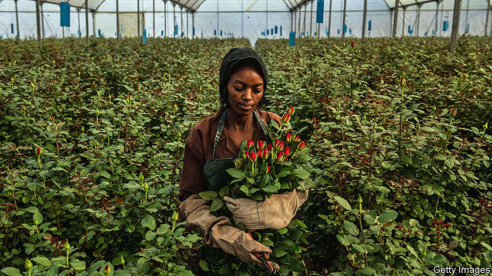

###### Roses rise again

# Kenya’s floral exports are blooming once more 

##### Covid-19 wilted them; lockdown love has revived them 

 

> Feb 13th 2021 


IVAN FREEMAN runs a 20-hectare rose farm at the foot of Mount Kenya right by the equator, where the soil is fertile and the sun shines all the year round. His business, Uhuru Flowers, exports to some 49 countries, including China, Nigeria and parts of eastern Europe. Some of his buds reach the shop window within four days of being cut.


That finely tuned business came to a halt when the pandemic struck. Celebrations were cancelled, florists shut and aeroplanes were grounded. Uhuru halved workers’ hours and destroyed 1.2m unsold stems, about a month’s harvest. Supply chains have slowly been rebuilt since then, and the 350 staff are back full-time. Now Mr Freeman, like many farmers, is speeding up production, hoping to recoup last year’s losses with sales on February 14th. “Valentine’s Day for most farms is a huge deal,” he says. “Everyone is feeling positive and ready to take advantage of it.”


After the initial disruption, countries have reopened their borders. Florists have gone online and Kenya’s flower industry has come up roses. The sector employed more people last month than before covid-19 began to spread, according to a survey of producers in the Rift Valley by Kenya’s central bank. Production and exports are at 90% and 95% of their levels in February last year, respectively.


Farmers say demand has recovered surprisingly well. The global economy may have wilted and consumers may be penny-pinching, says Anna Barker at the Fairtrade Foundation, but “a bunch of flowers on the table does wonders when you’re in lockdown.”


That is good news for Kenya’s economy. The flower industry usually contributes around 1% of GDP and is a source of foreign exchange. It employs more than 500,000 people, including 100,000 directly in farms. Debate about flower farms once focused on poor conditions for workers, who are on their feet all day and exposed to all sorts of chemicals. The focus now is on keeping these workers, including lots of unskilled women, in jobs.


A big problem that hasn’t gone away is transport. Fewer passenger flights than usual ply the crucial route from Africa into Europe. And freight capacity has fallen as planes have been redirected to moving medical equipment around. Richard Fox at Flamingo Horticulture, a big flower producer with farms in Timau, reckons the cost of air freight has jumped from $1.90 to almost $3 per kilo in the past year.


Such disruption has hurt the smaller farms a lot more. Flamingo, which processes a mammoth 780m stems every year, has a long-term agreement with a logistics provider. Its supply chain has barely been disrupted. But smaller farms are busy negotiating with freighters. Competition for slots on planes is particularly fierce ahead of the peak season, which begins with Valentine’s Day and extends to Mother’s Day weeks later. “The big guys always win,” sighs Mr Freeman.

