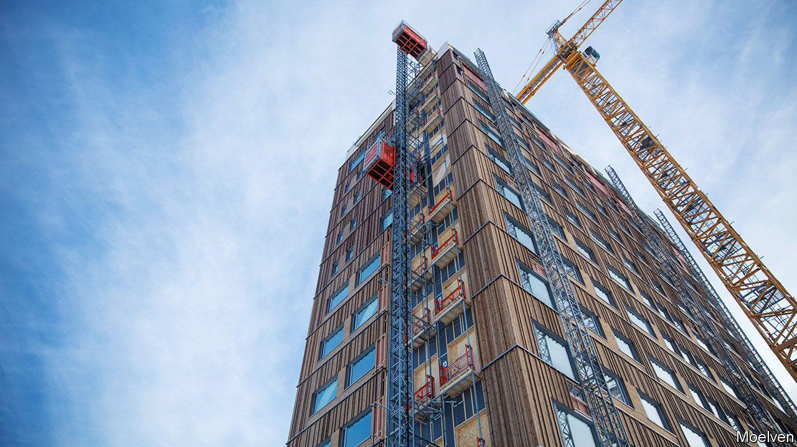

###### Green construction

# Building sustainable cities with wooden skyscrapers 

##### The AAAS heard how cities with lower carbon emissions could be built 

 

> Feb 13th 2021 


MORE THAN half the world’s population dwell in cities, and by 2050 the UN expects that proportion to reach 68%. This means more homes, roads and other infrastructure. In India alone, the equivalent of a city the size of Chicago will have to be developed every year to meet demand for housing. Such a construction boom does, though, bode ill for tackling climate change, because making steel and concrete, two of the most common building materials, generates around 8% of the world’s anthropogenic carbon-dioxide emissions. If cities are to expand and become greener at the same time, they will have to be made from something else.


As it happens, Chicago might become part of the answer. In recent years, as architects have become increasingly interested in modern timber-construction methods, wooden buildings have been getting steadily taller. The current record is held by the 85-metre-tall Mjostarnet building in Norway (see picture), completed in 2019. But this would be dwarfed by the River Beech Tower, a 228-metre edifice proposed for a site beside the Chicago river.


As the AAAS meeting heard this week, wood is one of the most promising sustainable alternatives to steel and concrete. It is not, however, everyday lumber, chipboard or plywood that is attracting the interest of architects. Rather, it is a material called engineered timber. This is a composite of different layers, each designed to meet the requirements of specific components such as floors, panels, cross-braces and beams. Besides engineering the shape of a component, designers can align the grains in the layers to provide levels of strength that rival steel, in a product that is up to 80% lighter. Engineered timber is, moreover, usually prefabricated into large sections of a building in a factory. That cuts down on the number of deliveries that have to be made to a construction site.


All this makes a big difference to carbon-dioxide emissions. Michael Ramage of the University of Cambridge told the meeting of a 300-square-metre four-storey wooden building constructed in that city. Erecting this generated 126 tonnes of CO. Had it been made with concrete the tally would have risen to 310 tonnes. If steel had been used, emissions would have topped 498 tonnes. Indeed, from one point of view, this building might actually be viewed as “carbon negative”. When trees grow they lock carbon up in their wood—in this case the equivalent of 540 tonnes of CO. Preserved in Cambridge rather than recycled by beetles, fungi and bacteria, that carbon represents a long-term subtraction of CO from the atmosphere.


If building with wood takes off, it does raise concern about there being enough trees to go round. But with sustainably managed forests that should not be a problem, says Dr Ramage. A family-sized apartment requires about 30 cubic metres of timber, and he estimates Europe’s sustainable forests alone grow that amount every seven seconds. Nor is fire a risk, for engineered timber does not burn easily. According to a report by the Potsdam Institute for Climate Impact Research, in Germany, large structural timbers are fire resistant because their inner cores are protected by a charring layer if burnt. It is therefore hard for a fire to destroy them. And, for extra incombustibility, fireproofing layers can be added to the timber. All in all, then, it looks as if wood as a building material may get a new lease of life. ■


For more coverage of climate change, register for The Climate Issue, our fortnightly , or visit our 

