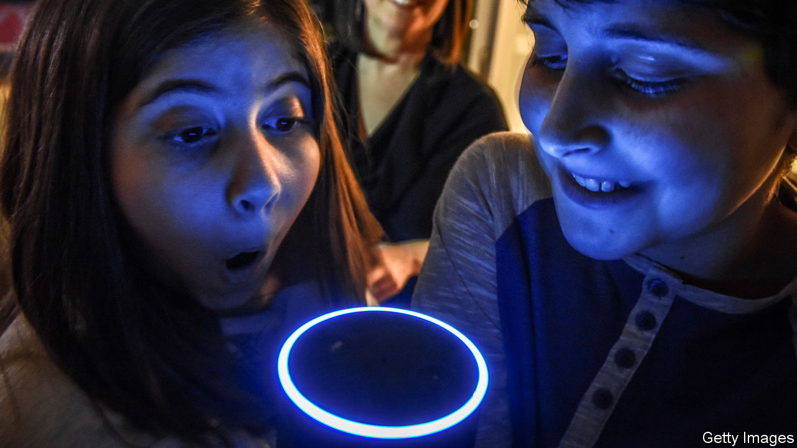

###### Silicon chats

# Conversational computers have come a long way 

##### But still have a long way to go 

 

> Feb 11th 2021 


PEOPLE HAVE been conversing with computers since the 1960s, when Joseph Weizenbaum of the Massachusetts Institute of Technology created a “chatbot” called Eliza. Eliza was designed as both an electronic parlour trick and as a gentle mockery of psychotherapists. Its chief conversational gambit was repeating its interlocutors’ statements back to them in the form of questions. Yet Weizenbaum was surprised to discover that some of Eliza’s human interlocutors began to treat it as if it truly understood what they were telling it.


A great deal of progress has been made since Eliza’s day. Every modern smartphone ships with a built-in voice assistant. Big computing firms such as Amazon and Google sell “smart speakers”—digital helpmeets that users can ask to provide everything from weather forecasts to film trivia. At the annual meeting of the American Association for the Advancement of Science participants were treated to a discussion of the present state of the art—and to a demonstration of its limitations.


Marilyn Walker of the University of California, Santa Cruz, described a system called ATHENA, one of five finalists in the 2020 iteration of the annual “Alexa Prize Socialbot Grand Challenge”, run by Amazon. The Challenge’s challenge, as it were, is to design conversational programs that users of Amazon’s Alexa smart speakers can have a conversation with, as opposed simply to asking the system to perform tasks.


By exploiting Amazon’s scale, conversational-AI researchers get access to hundreds of thousands of test subjects, and a wealth of user data. ATHENA itself was involved in 118,000 conversations that users had rated afterwards. For its part, Amazon got hold of more than 240,000 hours of conversations between its customers and the various entrants.


Unlike Eliza, which ran on a self-contained computer, ATHENA relies on the internet. It has different conversational modules that can chime in with possible replies to a user’s words. Some are generalists, and based on web-search engines. Others are specialists, pulling their knowledge from online sources such as WikiData, a volunteer-edited source of machine-readable information on everything from film stars to astronomical ones.


The result, said Dr Walker, was a system with access to a broad but shallow set of knowledge. One strategy for mimicking a real conversation was to sprinkle in related trivia. In the middle of what was supposed to be a reflective discussion about the Moon, for instance, ATHENA volunteered that, on that particular day, it was a waxing crescent, and offered to calculate when it would next be full.


The researchers found, though, that conversations involving such trivia were not as engaging as ones in which the system tried to provide more of its own opinions, and to elicit similar responses from its interlocutors. That is hard. Most such opinions have to be hand-crafted by human programmers, said Dr Walker, which is time-consuming. (ATHENA, after all, runs on a piece of silicon in a server rack somewhere, and thus has no understanding of the world it is being asked to opine about.) Dr Walker hoped that improvements to the system’s response ranker—which tries to select appropriate responses from among those generated by its various conversational modules—might improve things. But she conceded that, for now at least, the state of the art produces systems with responses that are “fluent, but may not be very relevant”.


Nancy Cooke, of Arizona State University, presented evidence about the implications of such limitations in practice. Working with America’s air force, she had been conducting experiments into what happens when one member of a team operating a reconnaissance drone is replaced by a computer.


The silicon replacements are designed to understand natural language, and to use it to interact with their biological brothers-in-arms. But, compared with all-human teams, the computer-aided drone operators performed poorly. The problem, said Dr Cooke, was that the computers behaved as “selfish teammates”. They were happy to ask their human compatriots for information, such as where the next stop on a mission was. But they did not share alike in turn. Over time, the humans adapted by becoming brusquer themselves, and the amount of information being shared fell.


Susan Brennan, a psychologist at Stony Brook University, offered one explanation. Conversation, she pointed out, is not simply a case of actors taking turns to speak. Instead, it is a process between participants who use contextual clues to solve ambiguities, and which relies on their understanding of each other’s minds and intentions to fill in gaps, to know when to interrupt, when to volunteer information, and when to yield.


Computers—at least for now—can do none of these things. The most powerful AI language models are trained on vast corpuses of text running to billions of words. However, written words, as Dr Brennan observed, are but a limited and incomplete record of a spoken conversation. This sort of contingent interaction is vital when children are first learning languages, she said. “AI knows words. But not how to interact.”

