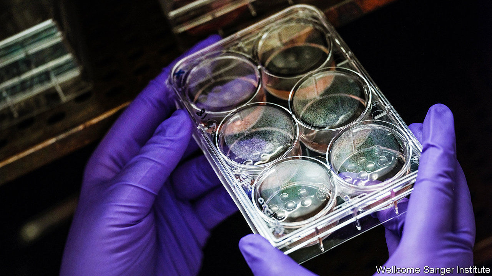

###### Oncology

# Studying cancer genomes gene by gene could improve treatment 

##### It is a new approach to precision medicine 

 

> Feb 13th 2021 


PRECISION MEDICINE holds that, because people are unique, so too are their diseases. It aims to prescribe treatments tailored to the genetic and biochemical characteristics of individual patients. Achieving this, in the context of oncology, is the purpose of the Cancer Dependency Map (DepMap), which is being developed jointly by the Wellcome Sanger Institute, near Cambridge, in Britain, and the Broad Institute in the city in Massachusetts of that name. Cancer is a good candidate for the application of precision medicine. because it arises when previously well-behaved cells start reproducing uncontrollably, usually as a result of a mutation in their genetic code. Numerous mutations can have this result, so many tailored treatments may be possible. DepMap seeks to find both mutations and treatments.


The first step, as Jesse Boehm, who runs the Broad’s side of the project, explained to this week’s AAAS meeting, is to grow cancerous tissue in laboratories, where it can be studied at researchers’ convenience. Before DepMap began, around 1,700 lines of lab-grown cancer cells were available. To try to increase this number, the project’s scientists turned to social media. Working with American cancer charities they encouraged patients across the country to send in biopsies of their tumours. That has given them more than 2,000 new samples, from which they have been able to create more than 400 extra cell lines. Encouragingly, 30% of these represent cancers that are either rare or occur mostly in children—both groups that researchers need more examples of.


Once the cancerous cells have been persuaded to start growing in DepMap's Petri dishes, the next step is to examine them for weaknesses. So far, the teams have tested around 6,000 drugs—about half the number ever licensed for any disease—against more than 500 cancers. They have already turned up some promising candidates. Tepoxalin, an arthritis medicine for pets, appears to kill cancers in which a gene called ABCB1 is overactive. Disulfiram, used to treat alcoholism, seems toxic to certain tumours that lack genes involved with the processing of heavy metals.


New technology means it is not only drugs which can be analysed systematically. Matthew Garnett, of the Sanger Institute, discussed using CRISPR-CAS9 to do the same for genes. CRISPR-CAS9 is a set of chemical scissors employed by bacteria to chop up and deactivate DNA introduced by viruses that prey on them. Repurposed as an all-purpose DNA-cutting device, it has become one of biology's most useful tools.

Cut to the chase


Dr Garnett described how researchers at the Sanger had used CRISPR-CAS9 to disable, one by one, nearly every gene in hundreds of cancer-cell lines. This permitted them to discover which genes are essential for a tumour's survival and might therefore make promising targets for new drugs. He gave the example of WRN, a gene involved in fixing damaged DNA. Cancer cells are often already deficient in DNA-repair mechanisms, and some seem reliant on WRN for survival. Based on those results, Dr Garnett said, drug companies are already developing drugs designed to suppress either WRN itself, or the protein it produces.


Deconstructing cancer cells’ genomes has yielded other insights, too. Dr Boehm noted that examining the rate at which genes are expressed—that is, used to make proteins—is often more useful for predicting vulnerabilities than looking for mutations in the genetic code. This, he said, is especially true of some childhood cancers, which often exhibit few mutations.


An encouraging start, then. But there is a long way to go. Dr Boehm estimated that, despite having analysed all the genes and thousands of drugs for around 1,000 different sorts of cancer, the project remains about 90% unfinished. This may be an underestimate. As Fiona Behan, another of the Sanger’s DepMap researchers, pointed out, besides examining individual genes in isolation, disabling several at once may also yield useful insights. In that case, though, the number of possible combinations would be astronomical.


Moreover, not all results in Petri dishes bear fruit in human beings. Andrea Califano of Columbia University observed that cancer cells which have adapted to grow in laboratories often have different patterns of gene expression from those that grow in bodies. Nevertheless, as Dr Garnett told the meeting, the success rate for developing new cancer drugs is, at the moment, depressingly low. If DepMap can uncover plausible targets for developers to aim at, that may start to change. ■

