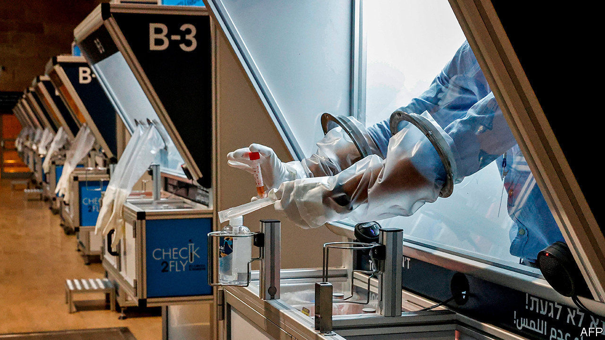
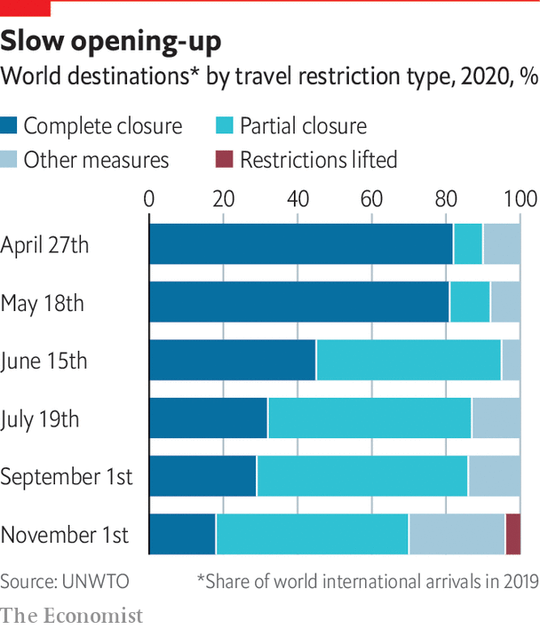

###### Well travelled

# New health and other apps may make travel easier 

##### Restarting international travel means reassuring travellers than they are safe. Technology can help 

 

> Feb 11th 2021 


VENETIANS CAN be credited with one significant intervention in the history of travel and one near miss. Disgruntlement over the constant din led them to consider a ban on wheelie-bags in Venice’s alleyways in 2014, though it was never enacted. Seven centuries earlier the city pioneered the use of international borders to stop an infectious disease. The word quarantine is derived from a requirement for ships to anchor offshore for 40 days if plague was suspected. Perhaps inconvenient for ancient mariners, the impact on the travel business of attempts to keep covid-19 at bay has been greater. Efforts to restore confidence have accelerated moves to make travel more digital, contactless and seamless.


Reinstating international travel depends on reassuring people that it is safe and finding ways acceptable to health authorities to let passengers fly. Long quarantines are almost as much of a deterrent to travel as a ban, says Andrew Charlton of Aviation Advocacy, a consultancy. “The public are not scared of flying, they are scared of arriving.” Getting people back onto planes is not a problem, if the rebound in domestic markets where covid-19 persists is a guide. A poll in July 2020 by UBS found that only 10% of European leisure travellers and 9% of businessfolk would refuse to fly in the foreseeable future. In October data collected by IATA found that only 44 out of 1.2bn passengers since the start of 2020 were known or thought to have contracted covid-19 on a plane. IATA’s medical adviser notes that, even if 90% of cases went unreported, that implies just one infection for 2.7m passengers.


Commercial jets are fitted with a grade of air filter found in operating theatres. The air on board is replaced 20-30 times an hour. Seating arrangements help. Boeing reckons that sitting side by side in an aircraft facing a seat back is equivalent to sitting seven feet apart indoors on the ground. New measures make flying safer still. Some airlines are keeping middle seats in economy free. Hygiene practices go far beyond the cabin crew sauntering down the aisle collecting rubbish. Queuing for the toilet is banned on some flights and airlines have introduced rules to keep passengers apart by ensuring they get on and off in strict row order. Planes are thoroughly disinfected between flights.


The main obstacles to a rapid rebound are closed borders and ever-changing regulations for entry, as covid-19 ebbs and flows. Out of 220 countries monitored by Kayak, a travel firm, 50 remain closed to air travel, and most of the rest have some restrictions. Effective vaccines give hope, but Gloria Guevara, boss of the WTTC, says the travel industry “cannot wait”. Her organisation says that 198m jobs are at risk if current restrictions remain in place until the summer.

 


The aviation industry has pushed testing to get planes back in the air. But agreement on how, where and when to test is covered by such a mish-mash of different requirements as to make flying even more troublesome. The Centres for Disease Control and Prevention recommends that Americans should have a test one-to-three days before flying and three-to-five days after a trip abroad, and also isolate at home for seven days. It also requires travellers to America to have evidence of a negative test. Many other countries require a test as a condition of entry. This is often accompanied by checks on arrival and a period in quarantine, sometimes in a hotel at the traveller’s expense. A PCR test, often required by countries that insist on a test before travelling, can cost $50-150.


Until fast, accurate and cheap tests are available or vaccinations are widespread, the hope is that a standard pre-departure regime could allow a restart of international travel. Airlines think trials of different systems may provide evidence that pre-flight testing is enough to dispense with quarantine rules. IATA and ACI World, a global airports association, have called for an internationally recognised pre-flight testing regime to replace quarantine.


If such systems are to work, mutually agreed standards and some way of showing that passengers are covid-free and/or vaccinated will be needed. Qantas’s boss, Alan Joyce, reckons a valid vaccination “passport” may become a general pre-boarding requirement. This has led to a flurry of activity to develop digital-health passes. IATA is promoting Travel Pass, a digital-health app, that allows governments to verify tests and identities of passengers presenting a result issued by a recognised laboratory. Free to travellers, airlines will pay a small fee. A more recent vaccination credential initiative, backed by tech giants including Microsoft and Oracle, has a similar aim.


Such technology will become common, reckons Arnaud Vaissié of International SOS, the world’s biggest travel-security firm. AOKpass, its digital-health pass, is secure and easily readable using blockchain technology. Apps like this will be the basis for a new focus on health in travel. Mr Vaissié notes that, after 9/11, security went from being an obscure corporate function to the main priority in many boardrooms. Health information will become as vital to international travel as a passport is today.


The experience of electronic tickets for airlines, which went from 20% of the total in 2004 to 100% by 2008, shows that digital data-sharing can cut costs and make travel easier. Technical hurdles remain to making different health systems interoperable with each other and with airlines’ passenger-information systems. Jeffrey Goh, boss of Star Alliance, the world’s biggest airline alliance, says the industry is resigned to living with multiple passes. Personal data will need to be secure but systems must also be flexible enough to reveal what health data is required where—lots on arrival in snooping Singapore but little apart from covid-free status in America, say. And a way needs to be found not to discriminate against passengers who are unable to take a vaccine.


It helps that the travel industry has long been working on how to make journeys more seamless. Steve Peterson of IBM, another company working on a digital-health pass, says such systems could be the “backbone” for storing more data, allowing a new level of personalisation in travel. He cites the example of a passenger with a trip from London to New York that includes a plane ticket, hotel and transport on arrival. If something changes, such as a delayed flight, an app loaded with personal preferences can automatically rebook all these elements. It may eventually book the entire trip, with a traveller just entering where and when to go and letting details of past journeys and personal preferences guide the choice of flight, hotel and so on.


Passage through airports may be about to get easier as well. Jeff Lennon of Vision-Box, a Portuguese operator of automated border controls, argues that “biometrics is the enabler…the face is the key”. An app will store a person’s credentials, cameras can then recognise the traveller at security and boarding gates will automatically open. Travel may thus become a more seamless, even personalised experience, with business customers greeted by name and even given their favourite drink. Nina Brooks of ACI World reports that some 50 airports are trying out biometrics. The ideal outcome would be continued travel without most of today’s hassles.■

