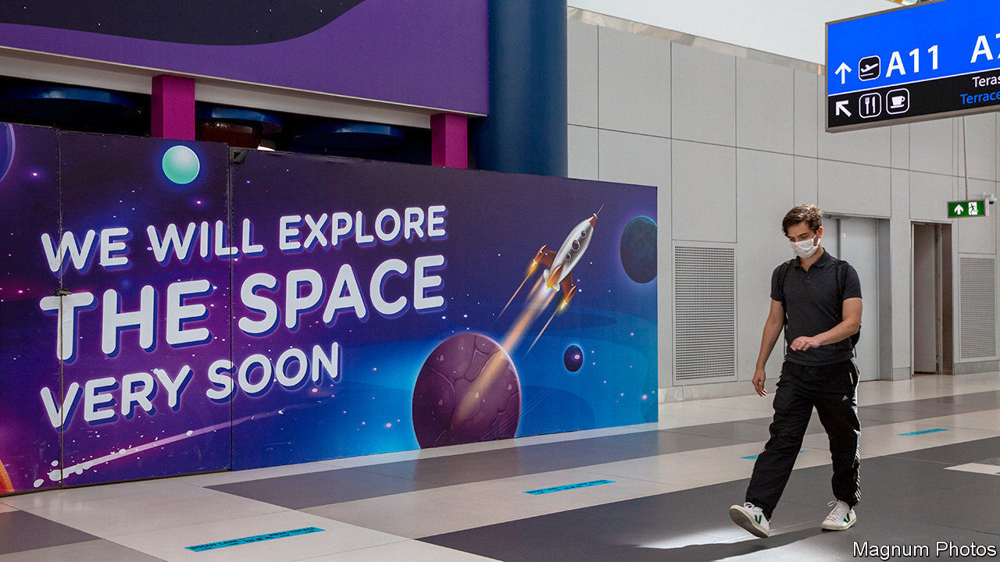

###### The future

# Travel will return, more exotically than ever 

##### But it will look different, both in the short term and the long term 

 

> Feb 11th 2021 


INTERNATIONAL TRAVEL is sure to recover, not least because its benefits have long been appreciated. “Travel and change of place impart new vigour to the mind,” is a quote attributed to Seneca, a first-century Roman philosopher of the Stoic school. That is as true of the relaxation of a package trip to the seaside or a trek in the Himalayas as it is of visiting a close friend abroad or of a business leader seeking new opportunities. The goal of stoicism was to encourage virtue and maximise happiness. Travel often brings both virtue and happiness. It could be a bigger part of the bargain when the wheelie-bag era resumes.


The urge to travel is unlikely to be permanently dimmed by covid-19 even if the means to do it suffers a long-lasting hit and some destinations take years to recover. All forecasts reckon on travel and tourism returning to prepandemic levels over the next few years and then continuing on a path of growth. Looking back, there will appear to have been a “blip in demand but no impact over 20 years,” says Michael Khan of Oliver Wyman, a consultancy. Underlying motives and the longer-term factors of growing wealth and increasing leisure time seem certain to reassert themselves. The rapid growth of Chinese tourism shows the importance that the newly wealthy place on taking a well-earned break. A growing global middle class will see the Chinese joined by Indians, Malaysians and Indonesians. This could bring significant shifts. Asia’s burgeoning middle class and the preference for regional travel could mean that South-East Asia overhauls the Mediterranean as the world’s preferred holiday destination.


The hope is that vaccines will bring a return of something approaching normality despite the emergence of a more transmissible form of covid-19 in the final weeks of 2020, bringing another round of travel restrictions as countries rapidly banned visitors from affected countries. For all such setbacks, a recovery could begin in earnest in the second half of this year as vaccines start to tame the virus and those in lockdown for many months take advantage of cheap tickets to get away, events delayed by families spread around the world are rescheduled and executives take to the air again. Yet how will travel look different, in both the short and longer term?


More airlines, the main means of foreign travel, will fail and others will remain under closer state control. Some long-haul fares will rise and short-haul carriers go bust. But this should create new opportunities for low-cost competitors, helping keep prices in check. Health will become as central to travel as an airline ticket and passport. The apps and platforms that will keep people safe by allowing sharing of health status should also help make travel easier and smoother. Safety will become more of a selling-point alongside visitor attractions, making for better-trained staff and richer experiences. Holiday destinations will start to look more carefully at the drawbacks as well as the benefits of tourism. New technology and pressure from governments and more environmentally aware passengers will eventually result in net-zero-emissions aircraft.


Despite recent rapid growth, foreign travel is still an experience for the few, not the many. As the world gets richer and populations age, the numbers with the time and the means to take a holiday abroad will keep growing. As aviation bosses are quick to point out, there is a vast untapped market: around 80% of the world’s population has never set foot on an airliner. A trip abroad is still a rarity for most. A study by Stefan Gossling at Linnaeus University in Sweden finds that only 11% of the world’s population took a flight in 2018 and at most 4% flew abroad. Even in rich countries less than half the population caught a plane. A huge swathe of the world’s population could be preparing for a holiday.


Further step changes in the price and speed of travel, opening up more out-of-the-way places and allowing more choice, will change the whole business yet again. This could come most obviously from supersonic travel, which despite the commercial failure of Concorde seems likely to return, lopping several hours off long flights. Some startups are already developing small supersonic corporate jets. And there is potential scope for even speedier jaunts if space tourism can be successfully brought into play. The technology to take passengers to the edge of space could produce hypersonic flights, with the possibility of flying people around the world in next to no time. The price of travel may not have much further to fall, but greater speed is certainly on the horizon. And that will doubtless require another step change in luggage technology beyond the wheelie-bag.■

