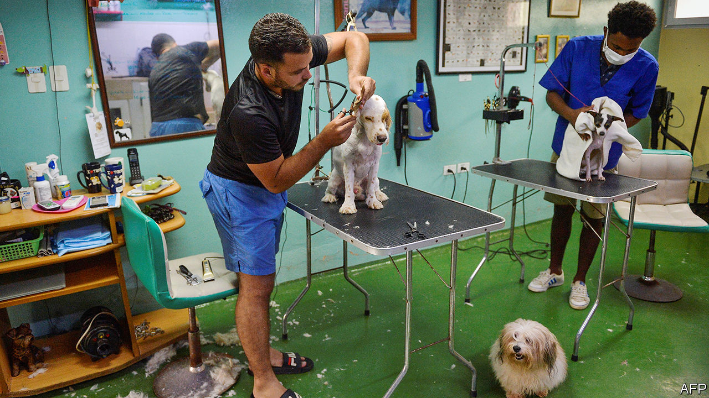
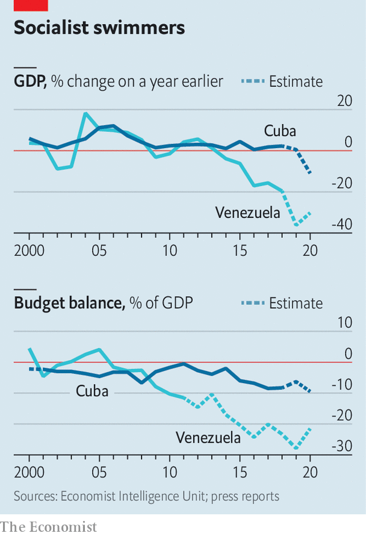

###### Practically perfect

# Cuba and Venezuela open up, hesitantly, to the market 

##### Latin America’s most socialist countries are becoming less so 

 

> Feb 13th 2021 


“DEEP DOWN, we are one single government, one single country,” said Venezuela’s loquacious president, Hugo Chávez, of the relationship with Cuba in 2007. Fidel Castro, Cuba’s ailing revolutionary leader, was like a father to him. Venezuela provided millions of barrels of subsidised oil to shield Cuba from the economic consequences of its socialist system. Cuban doctors served Venezuela’s poorest neighbourhoods, boosting Chávez’s popularity and providing Cuba with extra cash. Cuban spies schooled Chávez and Nicolás Maduro, who became president after he died in 2013, in the dark arts of perpetual rule. Their political and economic alliance was the strongest in Latin America.


 Now the allies are discreetly sharing another experience: adoption of free-market practices to rescue their moribund economies. Neither admits this. The goal, each claims, is “perfeccionamiento”—perfection—of socialism, not its abolition.


On February 6th Cuba’s council of ministers expanded the number of trades open to self-employed entrepreneurs, called cuentapropistas. A list dating from 2010 (and twice revised) permitted private enterprise in 127 professions. Cubans could be horse-cart drivers and birthday clowns but not computer programmers or pet veterinarians. A new list, published on February 10th, specifies 124 sectors reserved for the state (or entirely banned). Everything else is to be permitted for entrepreneurs. Some finicky rules, like those that bar hairdressers from offering manicures, are expected to be scrapped.


This follows another long-awaited reform. On January 1st, after more than a decade of debate, Cuba’s government ended its economy-distorting dual-currency system. The CUC, a supposedly hard currency that Cuba introduced 1994 after the collapse of the Soviet Union, is being phased out. The surviving Cuban peso has been pegged at 24 to the American dollar (but is now trading at 50 in the black market). State enterprises, which could hide their losses by valuing each of their Cuban pesos at $1, will no longer have that luxury. That will probably lead to lay-offs. The government hopes that sacked workers will become newly liberated cuentapropistas. 


Venezuela, which sabotaged private enterprise with expropriations and price controls but did not outlaw it, has been on a similar journey. Mr Maduro scrapped its bewildering system of multiple exchange rates in 2018. The American dollar, formerly the “criminal dollar”, has recently been allowed to circulate freely. It is much more common on the streets of Caracas than bolívar banknotes, of which the government is not printing enough to meet demand. The government no longer enforces price controls. It has even raised the price of petrol for the first time since 1996; state-run petrol stations take dollars. In November Santa Teresa, a private maker of rum, issued the country’s first corporate bond denominated in dollars in two decades.


Shops, once emptied by price controls, are now well stocked. A semi-dormant Ferrari dealership plans to open a showroom in Caracas. In the countryside, vast tracts of land that Chávez once promised to give to impoverished campesinos are being bought by people who got rich from the crony capitalism practised by his successor. One farmer in Bolívar state, in eastern Venezuela, says that he was offered $5m in cash to sell. He declined.


Parts of the state sector are shrinking, as is about to happen in Cuba. PDVSA, the decrepit oil monopoly, which in 2012 employed 150,000 people, now has a workforce of 111,000, according to Iván Freites, secretary of the FUPTV oil union. PDVSA has reportedly offered small domestic contractors rights to operate its oilfields. Many ex-PDVSA workers are among the 5.4m Venezuelans, 18% of the population, who have left the country since 2014. (On February 8th Colombia offered residency rights for ten years to nearly 1m Venezuelans who migrated to the country.)


Cuba and Venezuela are acting out of desperation. Venezuela has been in recession for more than six years (see chart). Its debt soared under Chávez, mismanagement at PDVSA caused oil production to slump and sanctions imposed by the Trump administration in 2019 clobbered oil exports. Rampant corruption boosts the market for supercars but bankrupts the state. “This government is doing the sort of things that would be demanded under a classic IMF restructuring, and sanctions have made it politically possible,” says a Venezuelan businessman.

 


Cuba’s graft does not match Venezuela’s. Its officials “are mostly punctilious administrators. Corruption tends to be an afterthought,” says a Western businessman. But its economy is similarly blasted. GDP shrank by more than 11% in 2020, according to the government. Exports of sugar are close to their historic lows. In 2019 the Trump administration restricted travel by Americans to Cuba and the sending of money by Cuban-Americans to family members on the island. The United States has imposed sanctions on operators of tankers that carry oil from Venezuela to Cuba. Last year it forced Western Union, an important conduit for remittances, to shutter its shops in Cuba.


Sanctions plus covid-19 cut the number of tourists from an expected 4m to 80,000 last year. Luxury hotels in Havana, built by the army with help from mysterious (perhaps Venezuelan) loans, stand empty. For ordinary Cubans, food is in short supply.


Neither regime is planning to leap free of socialism in a single bound. The IMF does not lend to Venezuela and Cuba is not a member of it, which means they will not get the sort of aid available to most countries that undertake painful reforms. Venezuela’s government will continue to finance its massive budget deficit by getting the Central Bank to create money.


Cuba’s president, Miguel Díaz-Canel, is more constrained than Mr Maduro. He is “at best a closet reformer”, says the Western businessman. Soviet-era officials still have powerful jobs. They include Raúl Castro, Fidel’s brother, who is secretary-general of the Communist Party. Mr Díaz-Canel will try to avoid antagonising them at least until April, when he is expected to take over from Mr Castro.


For now, the government is maintaining control of all large industries and wholesale shops, which will restrict cuentapropistas’ options for obtaining supplies. The state will continue to monopolise professional services such as architecture and accountancy, a big disappointment. Talk of a law to enable entrepreneurs to incorporate has gone quiet.


The pandemic and American sanctions mean that neither Cuba nor Venezuela is likely to enjoy a market-led boom anytime soon. Ventures requiring large investments will have to wait. Cuba’s continued restrictions on entrepreneurship in vast areas of the economy will blunt its growth. But ingenious Cubans will exploit to the full the new opportunity to enter any profession that is not specifically prohibited.


Mr Maduro and Mr Díaz-Canel will not offer their citizens political freedoms to match their new economic ones. They look to China and Vietnam, where repression and rising prosperity co-exist, rather than to democratic neighbours. “Both countries are changing their economic policies to certain degrees. But they are not changing their political regimes,” says Orlando Ochoa from Economista Consultor, a consultancy in Caracas. “That is the whole point.” Deep down, Cuba and Venezuela will continue to have much in common. ■

