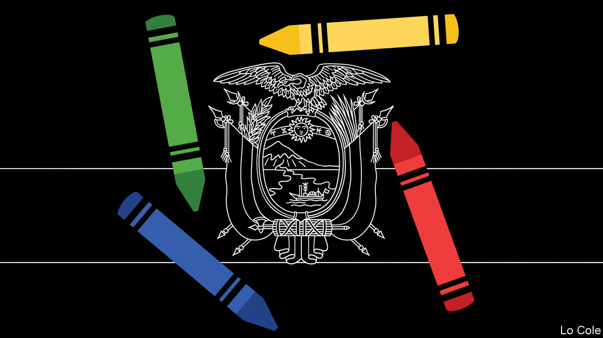

###### Bello

# Heir, banker, cyclist: Ecuador’s high-stakes election 

##### Anti-incumbency, anti-correismo—and a positive newcomer 

 

> Feb 13th 2021 


FOR A DECADE Rafael Correa, a leftist populist, ruled Ecuador as an autocrat. Enjoying an oil boom, he doubled the size of the state, built roads and hospitals, curbed the media, harassed opponents and presided over corruption. As money got tight, he lined up a proxy: Lenín Moreno, his former vice-president, narrowly won a presidential election in 2017 against Guillermo Lasso, a conservative banker. But then Mr Correa’s plan unravelled.


Faced with an oil bust, Mr Moreno broke with his predecessor in both economics and politics. Since Ecuador adopted the dollar in 2000, it cannot devalue when exports fall. Instead of saving part of the oil windfall Mr Correa had piled up debt. Mr Moreno had little choice but to adopt austerity. An ill-managed attempt to withdraw fuel subsidies prompted widespread protests in October 2019 and, with the pandemic, left his government deeply unpopular.


That has offered Mr Correa, who is in Belgium, another chance for a comeback. Sentenced in absentia to eight years in jail for corruption, he picked a new proxy for the presidential election on February 7th. Andrés Arauz, a loyal former minister but dull campaigner, promises to convoke a constituent assembly with the seeming purpose of taking control of the judiciary, overturning Mr Correa’s sentence and allowing him in effect to run the country.


Whether Mr Correa’s gambit works turns in part on whom Mr Arauz, who won 33% of the vote, faces in a run-off on April 11th. For 60 hours after the polls closed it looked as if that would be Yaku Pérez of Pachakutik, an indigenous party. After a review of votes that had been set aside because of administrative errors by polling officials—many in Guayaquil, the main port—Mr Lasso squeezed ahead with 19.7% to Mr Pérez’s 19.6%.


On his Twitter account Mr Correa had been rooting for a fight with Mr Lasso once again. This would be a straightforward left-right contest, and two-thirds of voters backed candidates to the left of centre. Mr Lasso is tarred not just by being “the banker candidate”, as Mr Arauz calls him, but also by his support for Mr Moreno’s government. In much of Latin America today, disdain for incumbents trumps all else.


However, Mr Correa’s appeal is waning. Mr Arauz’s share of the vote was seven points lower than Mr Moreno’s in the first round in 2017. As Mr Lasso put it, two-thirds “have voted no to the totalitarian and populist model that is trying to return”. Mr Pérez, who claimed fraud, had a better chance of harvesting anti-correismo. He grew up in a house without running water. He studied law, became an environmental activist and changed his first name from Carlos to Yaku, meaning “water” in the Quechuan languages of the Andes. He abhors Mr Correa, whose government detained him five times for opposing mining projects. Campaigning partly on a bicycle, he has a reputation for honesty. Whereas Mr Correa is an ally of the dictators in Venezuela and Cuba, Mr Pérez is not. His political affinities look more green than red. Will he now endorse Mr Lasso?


The next president faces some unforgiving realities. Hit hard by the pandemic and its recession, Ecuador’s economy is recovering only slowly after contracting by 9% last year. A $6.5bn loan from the IMF, of which $4bn has already been disbursed, requires the government to cut the fiscal deficit from 7.8% of GDP last year to 2.8% this year. That will be less hard than it looks: tax revenues are recovering and Mr Moreno’s debt renegotiation saved 1.5% of GDP in interest that would have fallen due this year. Even so, the new government will have to cut spending or raise taxes—and probably both—fairly soon.


Mr Arauz promises a $1bn giveaway to families in his first week. He wants to pay for this by using the Central Bank’s reserves. Since their function in a dollarised economy is to back bank deposits, that risks a bank run. Mr Lasso opposes raising VAT, but otherwise supports the IMF programme and fiscal restraint.


The next government will not have a majority in the parliament. Mr Correa’s allies will form the largest bloc and his sister Pierina may be the legislature’s speaker. Ecuador’s drama is that the dollar has given it stability, but can bring rapid growth only if governments undertake sweeping reforms. When president, Mr Correa squandered an oil-fuelled opportunity to do that. History suggests that with less money, populists become more authoritarian. To prevent that, anti-correismo will need to overcome anti-bankerism.

