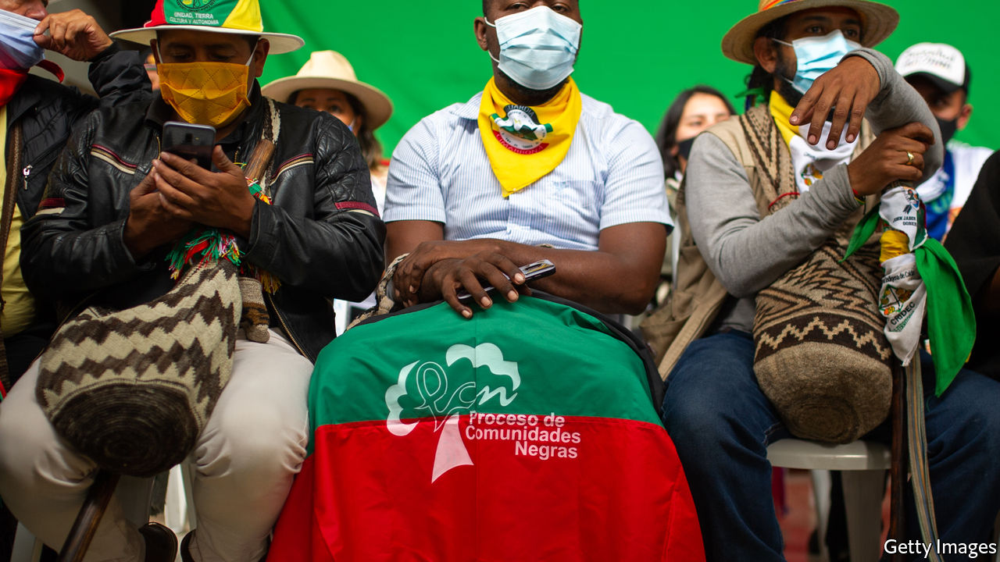

###### Activists amid anarchy

# Why Colombia’s social leaders are being murdered 

##### The state is absent from large parts of the country 

 

> Feb 13th 2021 


YORDAN EDUARDO GüETIO championed the rights of the Nasa people, an indigenous group in Cauca, in western Colombia, to which he belonged. On February 2nd men in military fatigues stopped him and his father on their motorcycle on the outskirts of Corinto, in northern Cauca. They let Mr Güetio’s father go, but shot the son dead. He was less than 30 years old.


Activism has long been a dangerous vocation in Colombia. From the 1980s to the early 2000s right-wing paramilitary groups murdered trade unionists, Communists and peasant leaders. The FARC, a guerrilla group that demobilised after a peace deal with the government in 2016, kidnapped farmers who opposed them.


Peace, it was thought, would bring safety for social leaders, as Colombians call activists. In fact, it has brought more peril. At least 400 rights-defenders have been killed since 2016, according to the UN’s human-rights commissioner. Colombia’s ombudsman has documented 710 such murders during the same period. Last month 19 activists were killed or went missing, according to Indepaz, a think-tank.


One reason may be that peace has encouraged more activists to make more demands, says Juan Carlos Garzón of the Ideas for Peace Foundation, a think-tank. They campaign for causes that were overshadowed by war, such as the rights of indigenous and Afro-Colombian people, land reform, protecting the environment and corruption-free government.


A more obvious reason is the rise of armed groups that are fighting for control of territories vacated by the FARC. These include the ELN and the EPL guerrilla outfits and gangs composed of FARC and paramilitary fighters who refused to disarm. In Nariño, in south-western Colombia, drug-trafficking groups attack advocates of a government programme that encourages farmers to switch from growing coca, used to make cocaine, to legal crops like cacao.


Most activists slain in Cauca were indigenous or Afro-Colombian leaders trying to expel armed groups from territories reserved for them. In Norte de Santander, in the north-east, the ELN and the EPL are at war with each other and with local worthies, such as football coaches, whom they suspect of supporting their foes.


The state remains absent from large swathes of Colombia’s territory. The government sends soldiers to kill drug-traffickers and other troublemakers. But it has not set up institutions needed to enforce the law consistently. Without order, it is left to protect social leaders one by one.


Iván Duque, Colombia’s conservative president, has made an effort. In 2018 he created the “timely action plan” to come up with policies to protect social leaders. The government holds meetings to discuss alerts issued by the ombudsman about specific risks to social leaders. A “national protection unit” has given hundreds of leaders cell phones, bulletproof vests and even bodyguards and armoured vehicles.


These are half-measures. When the ombudsman identifies threats, officials rarely propose action to head them off, says a person who attended their meetings. The interior ministry, which has no enforcement powers, is in charge of the timely action plan. Other agencies, such as the defence ministry, are supposed to protect social leaders. But they do not co-ordinate with each other outside Bogotá, says Mr Garzón.


Another problem is mistrust. Activists are cynical about a government that is largely absent from their regions. Left-wing parties have used the murders as a cudgel against Mr Duque’s government. Some of his allies dismiss their outrage as an expression of castrochavismo—socialist ideas from Cuba and Venezuela. Activists sometimes refuse to meet officials to discuss how to protect them.


On February 10th Human Rights Watch, a global pressure group, urged the government to establish police forces and law courts in regions where social leaders are being slaughtered. Mr Duque, whose term ends in 2022, is running out of time to do that. Meanwhile, tragedies like the murder of Mr Güetio will keep occurring.■

