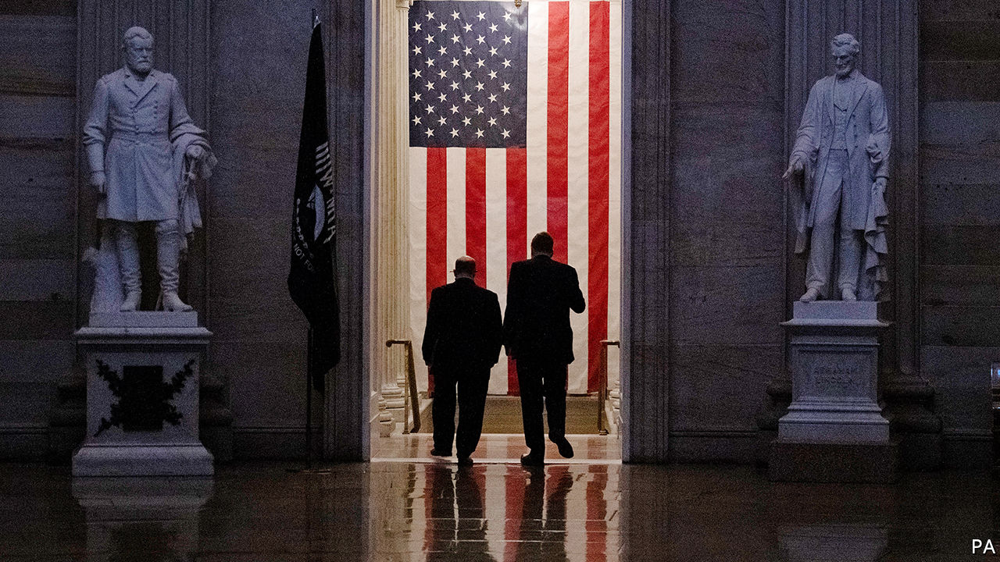
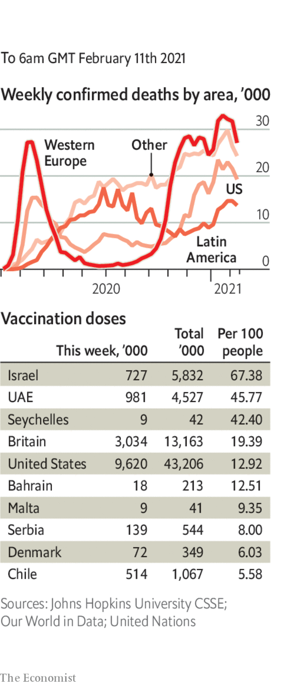

###### 

# Politics this week 

#####  

 

> Feb 11th 2021 


The impeachment trial of Donald Trump got under way in the Senate. Six Republicans joined Democrats in voting to reject the defence’s argument that Mr Trump should not be tried as he has left office, but it is unlikely that the prosecution will get the two-thirds majority of votes needed to convict Mr Trump of inciting the mob that stormed the Capitol on January 6th. The proceedings are expected to be quick, certainly not as long as the three weeks of Mr Trump’s first impeachment trial a year ago.

Darker Summers


The Senate approved a budget blueprint for Joe Biden’s $1.9trn stimulus bill. The vote was 50-50 along party lines; Kamala Harris cast her first tie-breaker as vice-president. The House is crafting the details of the legislation. Democrats, meanwhile, were furious at Larry Summers, a former economic adviser to Barack Obama, who warned that the bill’s hefty spending tag might lead to “inflationary pressures” and financial instability. See . 


In his first big foreign-policy speech, Mr Biden said he would end American support for the Saudi-led campaign against the Houthi rebels in Yemen. His administration also moved to delist the Houthis as a terrorist organisation, making it easier for aid to reach areas under their control. The war, now in its seventh year, has caused a humanitarian disaster. See . 


Libyan delegates at UN-sponsored talks chose a new interim government. Muhammad al-Menfi, a former diplomat, will head a three-man presidency council, while Abdulhamid Dbeibeh, a wealthy businessman, will become prime minister. Their main task is preparing the country for elections in December. See . 


Thousands of people gathered in Tunis, the capital of Tunisia, to mark the killing in 2013 of Chokri Belaid, a popular politician, and decry police abuses. It was the country’s biggest protest in years.


Loujain al-Hathloul, a prominent women’s-rights activist in Saudi Arabia, was released from prison after serving three years for supposedly harming national security. Her release was seen as an effort by the kingdom to curry favour with the Biden administration. 


A deadlock between clan leaders and the government in Somalia meant that a deadline passed to elect a president before the end of Mohamed Abdullahi Mohamed’s term in office. The country was meant to hold its first direct elections in 50 years last year, but these were postponed because of a jihadist insurgency and the covid-19 pandemic.


Ethiopia gavethe UN permission to allow 25 foreign staff to provide humanitarian aid to the northern region of Tigray. Ethiopia has barred outsiders from the region since fighting started in November. Millions of Tigrayans are hungry.

Allowed to settle


Colombia is togive protected status for ten years to 1m migrants from Venezuela. Some 5.4m Venezuelans have fled their country’s economic disaster; 1.7m are in Colombia. The UN high commissioner for refugees called the decision a “historic gesture”. 


Andrés Arauz, an ally of Ecuador’s former president, Rafael Correa, led the first round of a presidential election. He will advance to the second round in April. Mr Correa, a left-wing authoritarian, has been convicted of corruption. See . 


Cuba’s communist government expanded the scope for private enterprise. An old list of 127 professions open to entrepreneurs has been replaced with a list that reserves 124 activities for the state, allowing entrepreneurs to enter the other fields. The state still bars them from professions they were eager to enter, such as accountancy. See . 


Haiti’s government ordered the arrest of at least 23 people whom it accused of attempting to stage a coup against the president, Jovenel Moïse.


Chinese officials formally arrested an Australian journalist, Cheng Lei, about six months after she was detained in Beijing. Ms Cheng, a presenter on CGTN, a Chinese state broadcaster, has been charged with supplying state secrets to “foreign forces”.


Crowds gathered in cities across Myanmar to protest against the army’s coup and to demand the release of Aung San Suu Kyi, the leader of the ruling party. The security services used water cannons and rubber bullets to disperse the protesters. See . 


After the Indian government started legal action against it, Twitter reimposed blocks on some 500 accounts, including those linked to ongoing farmers’ protests. But it refused to impose blocks on journalists and media firms, which the government had requested.


Assailed from all sides over its lax covid-19 checks on international arrivals, the British government announced that passengers returning to Britain who have visited any country on a “red list” will be required to pay for a “quarantine package” costing up to £1,750 ($2,420). This mandates ten-day isolation at a designated hotel and covers transport costs and two covid-19 tests. Fines reaching £10,000 or up to a decade in prison will be put in place for those who disobey. It is unlikely that any court will impose such a draconian term. See . 

Coronavirus briefs

 


The World Health Organisation recommended the AstraZeneca vaccine for all adults, even in places where more virulent strains of the disease have appeared.


Earlier, South Africa’s health minister said he might try to sell or swap the AstraZeneca vaccine for other types, after a paper found that it gave “minimal protection” against mild-to-moderate cases of the South African variant. 


The number of Americans in hospital with covid-19 and the number of patients in intensive care dropped to their lowest levels since November. New cases continue to fall.


Diners in New York state are able to eat inside restaurants again from February 12th. The date was brought forward to accommodate romantics looking for a Valentine’s Day meal. Canoodling couples can expect more privacy; restaurants are only allowed to operate at 25% capacity.

