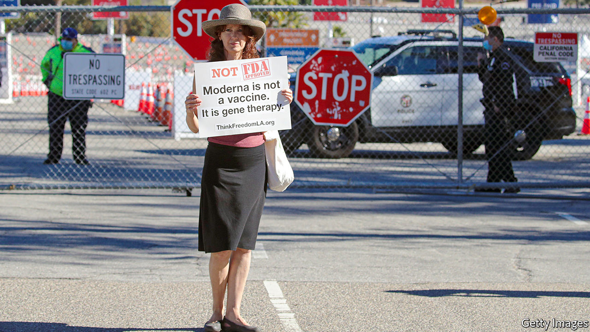

###### Likes and protein spikes

# Facebook tries to pre-empt regulation by squeezing anti-vaxxers 

##### The social-media platform simultaneously does and does not want to be the arbiter of truth 

 

> Feb 13th 2021 


“I JUST BELIEVE strongly that Facebook shouldn’t be the arbiter of truth of everything that people say online,” Mark Zuckerberg, the social-media boss, said last year. Yet despite Mr Zuckerberg’s hope, that is what Facebook has become. Like a power company, Facebook can illuminate certain voices, while pushing others off the grid. The most high-profile example of the social-media firm wielding its might was in January, when Facebook kicked Mr Trump off for stoking the riots at the Capitol. (Twitter also suspended him.) Facebook’s decision is currently under review by the social-media firm’s internal jury, the Oversight Board, which advises the company on thorny content issues, of which there are plenty more.


On February 8th Facebook announced that it was taking another stand on what could not appear on its platform: falsehoods about vaccinations. The company will now remove posts and block groups that claim vaccines make people ill or cause autism; previously the company had only demoted such claims, giving them less prominence in users’ feeds and in search results. Facebook and other internet companies have been under pressure by politicians and the press to do more to police anti-vax content since 2019, when measles outbreaks in New York prompted a flurry of nonsense. Covid-19 has given the subject new urgency and attention.


In America social-media platforms are not only tools for spreading misinformation but also for co-ordination. The anti-vax campaigners who briefly halted immunisations at Dodger Stadium in Los Angeles used a Facebook page to organise, says Allison Winnike, boss of the Immunisation Partnership, a non-profit that raises awareness of vaccinations. Campaigners are also employing social media to push anti-vax bills in many American states, says Joe Smyser, who runs Public Good Projects, a non-profit focused on public health. For example, one proposed bill circulating in Kentucky tries to eliminate all vaccine requirements for employees. Another aims to create a pre-emptive opt-out in case covid-19 vaccinations are ever required.


Just how much Facebook will actually curb vaccine misinformation is an open question. Showing users truthful content in their feeds and searches will help, but removing problematic content could also drive users to other platforms. After Facebook and Twitter cracked down on accounts promoting QAnon conspiracies, those users just went elsewhere, says Renee DiResta of the Stanford Internet Observatory. “Social-media companies run the risk of turning what should be something that could be easily addressed with a label into forbidden knowledge,” she says. Nor is everyone comfortable with Facebook’s employees, contractors, Oversight Board and the 80 external firms that do various degrees of fact-checking suggesting what should be erased. “Censoring speech and pretending you can make it go away is really problematic,” says Matt Perault, a former director of public policy at Facebook who now runs Duke University’s Centre on Science and Technology Policy.


The decision to combat anti-vax propaganda may have as much to do with Facebook’s own public-relations problems as its desire to cleanse its platform of life-threatening fabrications. In Washington, Democratic leaders are putting the squeeze on platforms to do more to police content. In January three Democratic senators, including Amy Klobuchar, sent a letter to internet companies demanding action to combat vaccine misinformation.


Facebook may be reading today’s political mood correctly, since Democrats control the House, Senate and White House. But its actions risk further alienating conservatives who are concerned about the censorship of free speech, and revive discussion about antitrust enforcement among the many politicians who worry about the dominance of big tech.


Already politicians and regulators are grappling with how and whether to change the liability shield that internet companies have when hosting users’ content under section 230 of the Communications Decency Act, an internet law passed in 1996. By taking more proactive action to police content on its own platform, Facebook may be hoping to head off discussions of tweaking or entirely doing away with section 230.


That is optimistic. Support for repealing section 230 was a rare point of agreement between Donald Trump and Joe Biden, although they favour doing so for very different reasons. Rather than repealing section 230, though, several Senate proposals are circulating to reform it. Facebook and other internet firms worry that tweaking section 230 could lead to a deluge of lawsuits from people who consider them responsible for material posted on their sites. Having once declared that Facebook should not be an “arbiter of truth”, Mr Zuckerberg is acting more like one, and hoping that works in his favour.■


Dig deeper


All our stories relating to the pandemic and the vaccines can be found on our . You can also listen to , our new podcast on the race between injections and infections, and find trackers showing ,  and the virus’s spread across  and .

