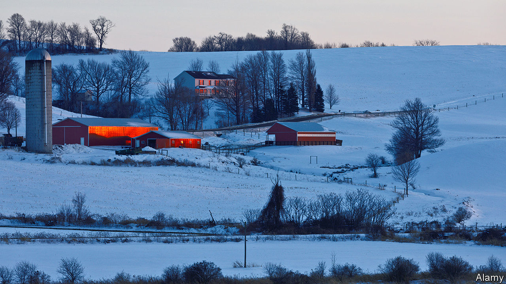

###### Count-22

# Why is New York so bad at running elections? 

##### After 100 days of counting, suing and recounting, NY-22 has a congresswoman 

 

> Feb 13th 2021 


ONE HUNDRED days after November’s election, New York’s 22nd congressional district (NY-22) has a representative in Washington. On February 5th a state judge ordered Oneida County in upstate New York and the state’s boards of elections to certify their results. Claudia Tenney, a Republican, beat Anthony Brindisi by 109 votes. It was the last undecided congressional race in the country. The lengthy delay meant the district’s constituents did not have a voice in votes on impeachment and the House leadership or on a presence on committees. Yet NY-22 is far from the only district with election problems. For New Yorkers across the state, dysfunction at the board of elections is par for the course and a perennial problem.


Despite its conservative leanings, NY-22, which spans rural areas and rustbelt cities in central New York state, was among the most competitive races in the country. That was mainly a reflection on Mr Brindisi, the Democratic incumbent, who was fairly popular in an area where registered Republicans outnumber Democrats by 30,000. His challenger, Ms Tenney, had a convincing lead at first, but Mr Brindisi narrowed the gap when absentee and affidavit ballots were counted. Both candidates called for a judicial review of the ballots. After Scott DelConte, the presiding judge, noted several errors, he ordered the district’s boards of elections to review votes again. “It is more important that this election is decided right, than that it is decided right now,” he said in December.


Errors were made in seven of the district’s eight counties. Oneida County’s mistakes were especially egregious, said Mr DelConte. More than 2,400 electronic voter registrations in Oneida were not processed in time for November’s election. Oneida labelled challenged votes with Post-it notes. The notes did not stick, making it impossible to know which votes were disputed. Despite the record of voter suppression in Republican states, David Wasserman of the non-partisan Cook Political Report says that “probably one of the most egregious examples of voter suppression that I’ve seen this cycle was in [New York] a state that’s pretty firmly blue”.


Mr DelConte was scathing about election commissioners, who are responsible for administrating boards of elections in each county. Commissioner selection “is the last vestige of patronage politics in New York state”, says Luke Perry, a political scientist at Utica College. Some counties have deadlocked boards with Republicans and Democrats sniping at each other. And every county has different standards. Susan Lerner of Common Cause, a voting-rights group, says NY-22 has shown that “if you have eight different counties in a congressional district, you have eight different ways to approach counting absentee ballots, and eight different ways to make mistakes”. The covid-19 epidemic didn’t help—election officers across the state were overwhelmed and overworked because of outbreaks and social distancing.


NY-22 is far from alone in its chaos. The New York Civil Liberties Union sued Rockland County in the autumn to extend early voting hours. New York City is plagued with problems, from broken voting machines to long queues. In 2019 the city’s board of elections bizarrely sued City Hall to stop it offering translation services at the polls unless they were provided by the board. State government is little better. New York City has been waiting a year to get approval for new vote-counting software.


On February 8th Mr Brindisi conceded, ending the uncertainty in NY-22. Had he pursued and won an appeal, it is not clear if the court could have removed Ms Tenney from her Congressional seat once she had been sworn in. “Sadly, we may never know how many legal voters were turned away at the polls or ballots not counted due to the ineptitude of the boards of election, especially in Oneida County,” Mr Brindisi says. He hopes an investigation will be conducted. “What’s so disturbing about what happened in Oneida County is that if it weren’t for this incredibly close election, we would have not even known,” says Sean Morales-Doyle of the Brennan Centre for Justice. What errors, New Yorkers may wonder, occurred in less competitive races? ■

