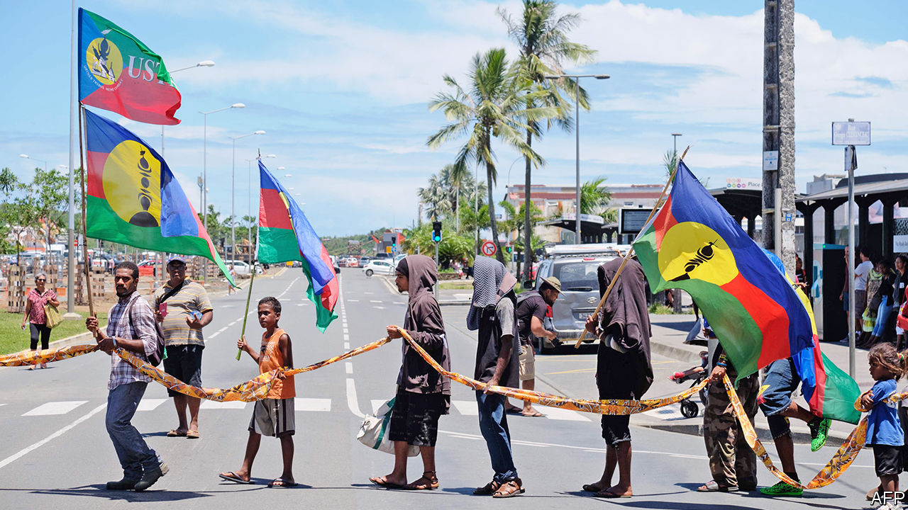

###### Les Kanaks en marche

# A French Pacific territory gets a pro-independence government 

##### New Caledonia is likely to get its first indigenous president 

 

> Feb 18th 2021 


GOVERNMENTS COME and go in New Caledonia, a French territory of 270,000 in the south Pacific. There have been 16 since 1998, when the French government and local politicians signed the Nouméa Accord, a power-sharing deal that aimed to end violent agitation for independence. The new government named this week, however, stands out. It is the first dominated by pro-independence parties, with six of 11 ministers. That, in turn, means New Caledonia should soon have its first indigenous and first pro-independence president.


The indigenous Kanaks, although the largest ethnic group, are less than half the population. (Europeans and migrants from other parts of the Pacific are most of the rest.) In two successive referendums on independence, in 2018 and 2020, the islanders chose to remain part of France, although the outcome of the most recent ballot, in October, was a narrow 53%-47%. The territorial congress reflects the same division, with a loyalist coalition holding a slim majority. The congress elects the 11 members of the government, although a proportional system means that both pro- and anti-independence forces are represented. Hitherto, the loyalists’ majority in the congress had allowed them to dominate the government, and thus control the presidency.


After a squabble about the sale of a big nickel mine caused the previous government to fall, a small party, L’Éveil Océanien (Oceanian Awakening), supported by migrants from France’s other Pacific territories (French Polynesia and Wallis and Futuna), withdrew its support for the loyalist coalition. Instead, it backed the ministerial slate put up by a pro-independence coalition, the Front de Libération Nationale Kanak et Socialiste (FLNKS). Further partisan manoeuvring prevented L’Éveil from winning a portfolio itself, but its support gave independence parties a majority.


Further horse-trading is to come. Each of the two main pro-independence coalitions, FLNKS and UNI, has a candidate for president. But with six of 11 votes, independence forces should be able to elevate one of their own. That could matter a lot. The third and final referendum on independence under the Nouméa Accord will probably be held next year. The government can do much to shape the campaign. And the feeling that independence is nigh may prompt some Europeans to move away, altering the shape of the electorate. The parliamentary wrangling is arcane, but the consequences for New Caledonia are likely to be profound. 

