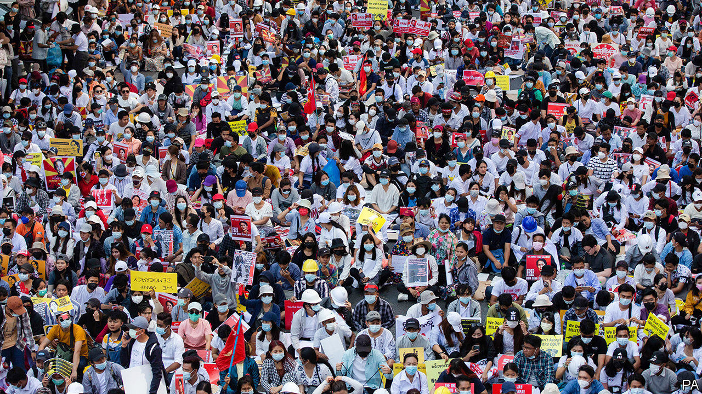

###### General strike

# A boycott by bureaucrats is undermining the coup in Myanmar 

##### The machinery of government is grinding to a halt 

 

> Feb 18th 2021 


YANGON HAS its share of traffic jams, but the congestion on February 17th was unusually bad. At busy intersections across the commercial capital, cars were parked with their bonnets raised, as if they had broken down. By late morning the city was paralysed. Yet few seemed to mind. When the police tried to shunt some vehicles to the side, residents of houses lining the road rushed out to stop them. The gridlock was intentional. Activists protesting against a military coup on February 1st were attempting to prevent troops from entering the city and civil servants from going to work. Many government employees were shirking anyway. 


For almost two weeks, tens of thousands of Burmese, and sometimes hundreds of thousands, have taken to the streets to protest against the coup. But it is a subtler form of protest that is causing the generals the most grief. Thousands of public-sector workers, from at least 245 districts and 21 ministries, are on strike, according to Kim Jolliffe, an analyst. Government offices are deserted. So too are classrooms. Many public hospitals have in effect shut. Those that have not are so understaffed they are turning new patients away. “Operations at many government departments all but halted this week,” reported the Irrawaddy, a news website, on February 16th. 


The banking system is also seizing up. Online banking remains possible, at least when the army allows the internet to operate, but most branches are closed. Reports suggest lending has dried up and most administrative work has stopped. “A dysfunctional financial sector would definitely hurt the regime,” says Ko Ko (not his real name), a manager at a branch of AYA bank in Yangon. He and almost all his colleagues have been on strike since last week.


The government pays bills and salaries and disburses pensions via Myanma Economic Bank (MEB). But so many of its employees are on strike that it is at a “near standstill”, says Mr Jolliffe, who is studying the civil-disobedience movement. With many tax collectors on strike, too, the coup leaders may end up with neither the infrastructure nor the money to pay staff. “This is a real pressure point and is something the military probably did not include in their game plan,” says Mr Jolliffe.


The army commander and junta leader, Min Aung Hlaing, seems to be getting skittish. State newspapers warn that those who encourage “dutiful civil servants” to go on strike will be “seriously punished legally”. Security services have begun a campaign of intimidation to try to force public-sector workers back to their posts. On February 14th protesters outside a branch of MEB in Mandalay, Myanmar’s second city, were urging the remaining employees to abandon their desks when soldiers and police began firing ball bearings at them from airguns. At least three people were injured.


The commander-in-chief probably hopes that the protests will quickly peter out. “At the end of the month, people will need to draw their salaries,” points out Khin Zaw Win, director of the Tampadida Institute, a think-tank in Yangon. But if other civil servants are as determined as Mr Ko Ko, the regime will need to think again. “We aren’t afraid of losing our jobs,” he says, noting that many mutual-aid funds are being set up to support workers who are sacked for their activism. “We want our freedom back.” ■

