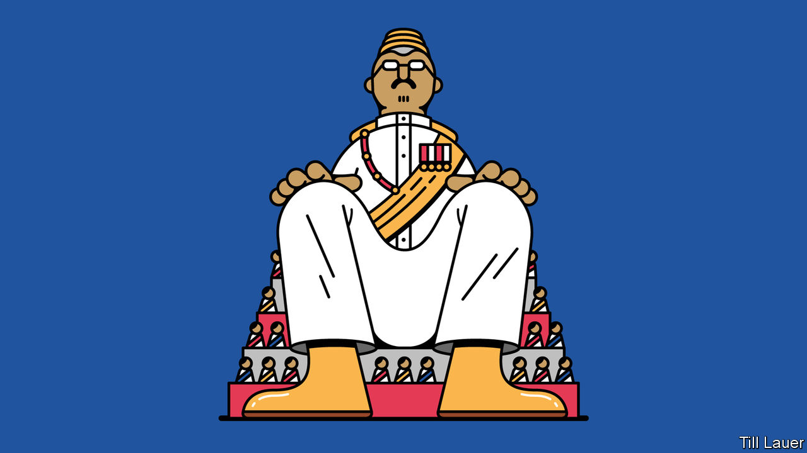

###### Banyan

# As Malaysia’s politicians bicker, its royals gain authority 

##### Nine hereditary rulers take turns to be king—and kingmaker 

 

> Feb 18th 2021 


IN A LANDMARK election in 2018, Malaysians voted for change. Instead, they got upheaval. Appalled by the growing venality of the ruling United Malays National Organisation (UMNO), in power since the country’s founding, they plumped instead for Pakatan Harapan (“Alliance of Hope”). Yet bickering within the new government led, a year ago, to its collapse, and the emergence of a different coalition, including UMNO, that is itself perpetually rumoured to be on the brink of implosion.


Few are happy. Malaysians voted for Pakatan Harapan’s promises of good governance, enhanced democracy and an end to racially divisive politics. Yet the new prime minister, Muhyiddin Yassin, hounds critics and spreads patronage about like manure—just like the good ex-UMNO man he is. Ordinary folk grumble at the government’s handling of the coronavirus pandemic, at once arbitrary and repressive.


The country’s royals, by contrast, are in clover. Nine of Malaysia’s 12 states have monarchs: seven sultans, a raja and, in Negeri Sembilan, a ruler-for-life elected by four local grandees. The nine royals take turns to serve five-year terms as Yang di-Pertuan Agong (“He Who is Made Lord”)—the constitutional head of the Malaysian federation.


In their states, the sultans exercise considerable theoretical power: approving the chief minister, controlling the civil service and, in Johor, even commanding the palace guard. But at the federal level, recent kings have taken a back seat in politics. Their role in the appointment of prime ministers had been considered largely ceremonial.


Last year’s political turmoil thrust the current agong, the sultan of Pahang, into prominence. Pakatan Harapan fell as the nonagenarian prime minister, Mahathir Mohamad, and Anwar Ibrahim, who hoped to succeed him, feuded. Dr Mahathir resigned as prime minister, apparently hoping to form a new government that excluded Mr Anwar. But the agong instead turned to Mr Muhyiddin, who then took ages to prove his majority in parliament. As William Case of the University of Nottingham Malaysia puts it, the king became the kingmaker.


A few months later Mr Anwar sought time with the agong, claiming that he had “convincing” evidence that he could command a parliamentary majority. For several days the monarch found himself conveniently incapacitated. Even Mr Muhyiddin failed last year to persuade him to declare a state of emergency to tackle the pandemic (and helpfully forestall a vote of no confidence in the prime minister). Only in January, on the second request, when Mr Muhyiddin again looked like losing his shaky majority, did the king accede.


As political power fragments, royal influence will only grow, says James Chin of the University of Tasmania. The rulers are officially the guardians both of the culture of Malaysia’s Malay majority and of their religion, Islam. They still have considerable constitutional powers, although Dr Mahathir, during a previous stint as prime minister, took some away.


There is a commercial dimension to their authority. The sultans influence how land is used in their states. They can also benefit from property developments accompanying federal projects, such as a planned high-speed railway. In Johor the royal family has prospered from deals with nearby Singapore and from a China-backed boondoggle, Forest City. Critics make the comparison to the Thai royal family’s prodigious if opaque holdings. Patron-client business networks run through Malaysian royal circles, as they do through its politics. No aspiring prime minister would be foolish enough to ignore the sultans’ interests.


Not all Malaysians are happy. In Selangor, the sultan’s heir is behind an unpopular bid to turn a tract of protected forest over for development. A daughter of the agong is chairman of a company involved in a bitter land dispute with durian farmers.


Many want the royals to stick to Instagram. There, one of them touchingly touts inelegant baking efforts, another her sonic healing and, in the case of the crown prince of Johor (once involved in a nightclub brawl with another royal), a rather naff polo-and-private-plane lifestyle. Someone who is acquainted with several royals calls them, on balance, “a gruesome bunch”. Yet few will denounce them in public. As in Thailand, the royals are protected by draconian laws, including the one against sedition. While they kept away from politics, why cross them? Cross them now, says one politician, and it could be jail.

