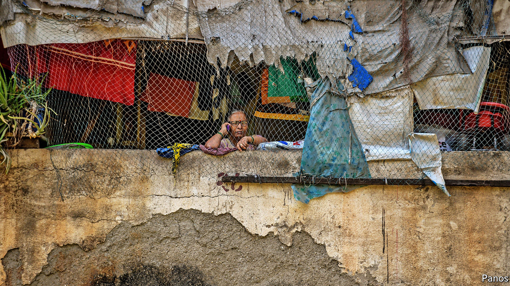
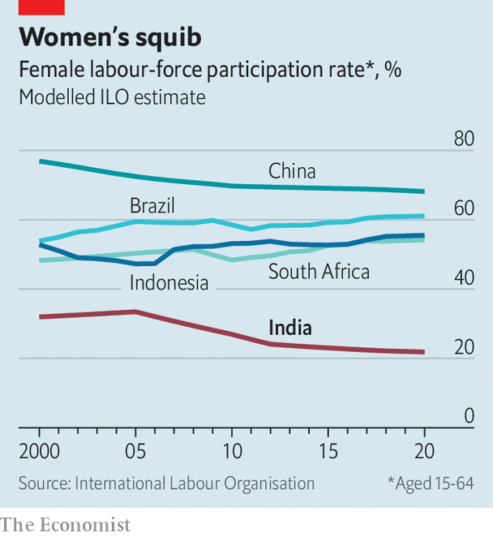

###### 200m jobs short

# Hardly any women in India are in paid employment 

##### One survey finds that only 7% of working-aged women have jobs 

 

> Feb 18th 2021 


BEFORE COVID-19, Ashwini Pavde’s small family was doing fine. She worked as a cook for as many as six households. Her husband was the driver for a company boss. A combined monthly income of $300 tidily covered fees at a local “English-medium” school for their 14-year-old son, as well as the $75 rent on their single-room cement house in Gandhi Nagar, a dense slum wedged between bristling tower blocks in the outer suburbs of Mumbai. 


The pandemic has been tough, though. Ms Pavde’s husband lost his job when his employer started working from home last March. He has found the odd job as a taxi driver. Mostly he has been idle. During weeks of heavily enforced lockdown, just two of Ms Pavde’s clients kept paying her, and only half her normal wage. 


Similarly stricken neighbours have fled to their villages of origin, but the Pavdes have no land to go back to. So they have stuck it out, although with Ms Pavde’s earnings reduced to barely $50 a month, they rely heavily on subsidised rice and lentils. To pay school fees she has borrowed $680 through a savings pool that she joined with women friends. But when will she find work enough to repay the loan? “People tell me we’ll call you if we need you; we’re working from home and can manage,” Ms Pavde says. She reckons it will take two years for her family to get back to where they were a year ago.


In terms of health, India appears to have escaped relatively lightly from covid-19, with a toll of reported deaths per million people that is less than a tenth of those in America or Britain. In terms of jobs, Indians have suffered worse. Like the Pavdes, millions have lost work, or been forced to accept less money and harsher conditions. With only the thinnest cushion of government support, it is the poor who are hit hardest. A household survey in Mumbai in January found that 9% of those in the top socioeconomic quintile had lost their jobs. Their average daily income had dropped from $22.30 to $17.40. Among those on the bottom rung, 47% had lost their jobs. Daily income had fallen by nearly half, from $6 a day to just $3.35.


Women have been squeezed especially hard. The same survey in Mumbai found that while three-quarters of men said their jobs had been adversely affected by the crisis, the proportion among women was 89%. And whereas most men have now either returned to old jobs or found new ones, joblessness among women appears to have lingered. The Centre for Monitoring the Indian Economy (CMIE), a private research firm that closely tracks employment, reckons that back in 2019 some 9.7% of adult women in Indian cities considered themselves part of the labour force. That number dropped to 7.4% during the lockdown last spring, but disturbingly seems to have sunk still lower by November, to just 6.9%. CMIE’s surveys, which cover 170,000 households across India, found that men who lost their job during the lockdown were eight times more likely to find another within a few months than women who had lost theirs.


There are simple reasons why covid-19 has been a particular shock to female employment. One is that more women have lower-paying, precarious jobs to start with, such as in domestic service. Many women are teachers, and India’s 450,000 private schools have been hard-hit by mandatory closures that are only now lifting, state by state. Hemalatha, a 46-year-old high-school computer teacher in Salem, a city of 1m in the state of Tamil Nadu, considers herself lucky: although she suffered a 50% cut to her salary in June and is still paid less than before, most teachers in the junior school got fired. Far more women than men have also pulled out of jobs in order to look after children who have been stuck at home. And meanwhile men have found it easier to shift into fields boosted by the pandemic, such as delivery services. In Chennai, Raj Suresh abandoned a local travel magazine he had run for 20 years when advertising crashed, but found a new career peddling “immunity-boosting” herbal remedies. 


In many ways, however, the pandemic has simply exacerbated labour-market trends that were already in motion. The proportion of women in the workforce has been falling for some time, in part owing to structural changes such as mechanisation on farms and the decline of traditional craft industries. Relatively small improvements in living standards also prompt women in many families to stop working, both as an emblem of their status and out of fears for their safety outside the home. According to the International Labour Organisation, the female participation rate fell from almost 26% in 2010 to less than 21% in 2019. CMIE uses a more exacting definition of participation, which requires people to have been working or actively and recently looking for work. By its measure participation sank from 16% in 2016 to 11% by the end of 2019 because of the slowing economy and a series of harmful policies, such as “demonetisation” (the withdrawal of most paper currency, which led to a nationwide cash crunch). 

 


Largely because of the dismal level of female participation, India’s overall workforce has failed to grow. It was 420m in 2016, and is now just 400m by CMIE’s count. It would be around 600m if India had a similar labour participation rate to, say, China or Indonesia (see chart). Just as worrying as the failure to generate jobs, says Mahesh Vyas, CMIE’s boss, is the failure to generate good ones. Despite long efforts to “formalise” the economy, a government survey in 2018 found that 77% of workers were either self-employed or casual labourers. That proportion has stayed stubbornly fixed, as companies have grown used to skirting onerous labour laws by subcontracting, hiring temporary workers or doling out tasks to freelancers. This practice is what led to clashes at an iPhone assembly plant near Bangalore in December, where thousands of subcontracted workers had been infuriated by poor pay and long hours compared with the plant’s far smaller number of pukka salaried employees.


Mr Vyas does not think this trend will change soon. During the pandemic, he notes, a lowering of corporate taxes and of interest rates was intended to boost investment and hiring. But many companies simply boosted dividends while continuing to trim payrolls. Even as unemployment has risen, corporate profits and stock prices have hit record levels. “Quite simply, the terms of trade have turned against labour,” says Mr Vyas. ■

