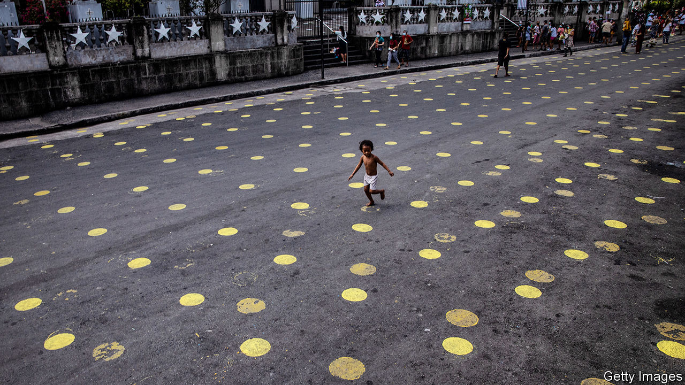

###### Suffer the little children

# Kids in the Philippines have not left their homes for a year 

##### The authorities fear they will give their grandparents covid-19 

 

> Feb 18th 2021 


OFELIA ABO has not left home for 11 months. In the mornings the six-year-old attends school online. The rest of the time she eats lots of snacks, plays Uno with her mother or, when it isn’t raining, runs around on the roof of her building. She doesn’t mind: “I can play all day.” Then again, she admits, “I sometimes get bored.” If she were allowed, she would like to go to a mall or the beach.


Ofelia and the 32m other Filipinos under the age of 15 (a third of the population) are “required to remain in their residences at all times” as part of the government’s efforts to curb the spread of covid-19. Even as quarantine restrictions have been loosened for working-age adults, they have remained in place for the youngest and oldest members of society, who are deemed most vulnerable. “She tells me how much she wants to go out,” says Ofelia’s mother, Iris, who asked that she and her daughter not be identified by their real names. All the same, Iris considers the rules “OK and reasonable”, since the disease remains such a risk. Known new infections, having peaked at more than 4,000 a day in August, are still running at around 1,600 a day, despite limited testing.


The Philippines is not unique in keeping children at home. Spain did the same thing for several weeks at the start of the pandemic. But it is an outlier in keeping them confined for this long. “Everyone accepts that it could result in poor psycho-social effects on children,” says Bernadette Madrid of the Child Protection Unit at the University of the Philippines. But she, along with many paediatricians, psychiatrists, epidemiologists, public-health specialists and parents, believes that the benefits of keeping children at home outweigh the risks, in part owing to the nature of Filipino households. 


It is rare for children to suffer serious cases of covid-19. But they can still catch the virus and transmit it to others. That is a problem given the preponderance of multi-generational households in the Philippines. Less than a tenth of elderly Filipinos live alone. And more than 10% of people older than 60 live with their grandchildren but not their children, who are often working elsewhere.


As a result, the loudest opposition to the lockdown of children comes not from outraged parents, but from businesses. Cities in the Philippines, and especially Manila, the capital, are not over-endowed with parks and playgrounds. For many families, shopping malls are the closest thing to a public space. Banning kids from malls means adults visit less often too, dragging down consumer spending. GDP contracted by 9.5% last year, the worst of any large South-East Asian country.


For the most part, Filipinos gripe about the haphazard rulemaking rather than the rules themselves. A senator complains that cock-fighting pits have been allowed to operate again even as schools remain closed. Others think the blanket lockdown should be replaced with local restrictions determined by the case rate in each area. The workings of the Inter-Agency Task Force for the Management of Emerging Infectious Diseases, the country’s covid-19 response unit, are opaque. In January it said it would allow children aged ten and older to go to shopping malls. President Rodrigo Duterte abruptly reversed the decision. The U-turn had “nothing to do with incompetence, not at all”, he explained. ■

