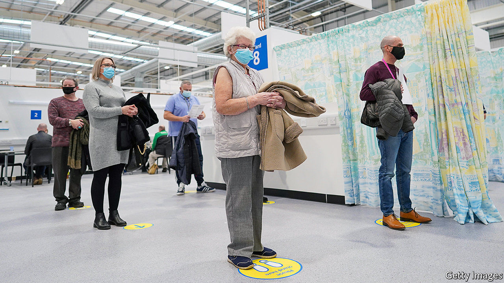
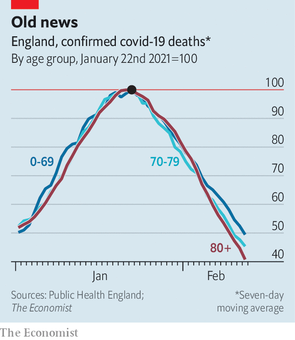

###### Here we go

# Britain’s vaccination campaign begins to show results 

##### But ministers remain cautious about lifting lockdown 

 

> Feb 20th 2021 


ON FEBRUARY 14TH, a day ahead of schedule, the government met its target: 15m people had been vaccinated by the middle of the month. Shortly after Boris Johnson hinted the vaccines were beginning to have an impact. “We don’t today have all the hard facts we need,” the prime minister cautioned. Nevertheless, he said, there are “interesting straws in the wind.”


Deaths in England peaked on January 22nd, with a seven-day average of 1,163. They have since fallen by 57% across the population. But they have fallen fastest among the old, who were inoculated first: down by 59% among the over 80s, compared with 51% among the under 70s (see chart). A similar trend is visible in hospital admissions and across regions.

 


It is nearly two and a half months since the country started its vaccination programme. That may seem a long time for an effect to emerge, but it was not until January that things really got going. Since it takes three weeks or so for someone infected with covid-19 to die, and since vaccines do a better job of reducing deaths than cases, it is about now that officials had hoped to spot an impact. 


Other data are similarly promising. Some 41% of over-80s in England assessed by the Office for National Statistics in January possessed antibodies, compared with 16% of those aged 50-69. Researchers at the University of Oxford have published results showing a good response to a single dose of the AstraZeneca vaccine in trials; data from Israel suggests the same is true of the Pfizer jab. Early evidence also suggests that both will reduce transmission, although it is not yet clear by how much—something which matters a great deal to the course of the pandemic.


Higher-quality data will compare those who have received vaccines to those who have not, removing the need for the use of proxies like age. The government is expected to publish them soon. Anticipating good results, Tory lockdown sceptics—a dwindling band—have urged Mr Johnson to accelerate the lifting of restrictions.


Instead, the government has delayed doing so. When the current lockdown was introduced in January, Mr Johnson suggested restrictions would be eased as deaths fell, with the aim of opening schools after the half-term break in February. Worried about the emergence of new variants and about the continued potential for a surge in illness that could overwhelm the health service, the prime minister has switched his focus to case numbers. Unlike deaths, cases are not concentrated among the elderly, so will take longer to fall. The government is due to lay out its plans on February 22nd. Schools are not expected to return until March 8th.


Research by Savanta ComRes suggests that, if public opinion determined policy, saying no to a jab would be illegal and vaccine passports would be checked on entry to a pub. The government does not plan to take up either option. It will, though, make much more use of lateral-flow tests. According to the Times, it is preparing to send up to 400,000 a day for people to administer themselves in areas which see an uptick in cases. It will provide a regular supply to schools, for use by pupils and teachers, and may employ them later in the year to allow entertainment venues to reopen.


These tests, which provide results in less than half an hour, are controversial. Opponents argue that they miss lots of infected people, and so should not be used to lift restrictions. But that risk can be cut by frequent testing. In situations where people are going about their normal business—in schools, for instance, once they are open again—they can be useful. Their great advantage is that they offer a rare way to catch asymptomatic cases. That is why they have been embraced by a government which is desperate to make this lockdown the last. ■


Dig deeper


All our stories relating to the pandemic and the vaccines can be found on our . You can also listen to , our new podcast on the race between injections and infections, and find trackers showing ,  and the virus’s spread across  and .

