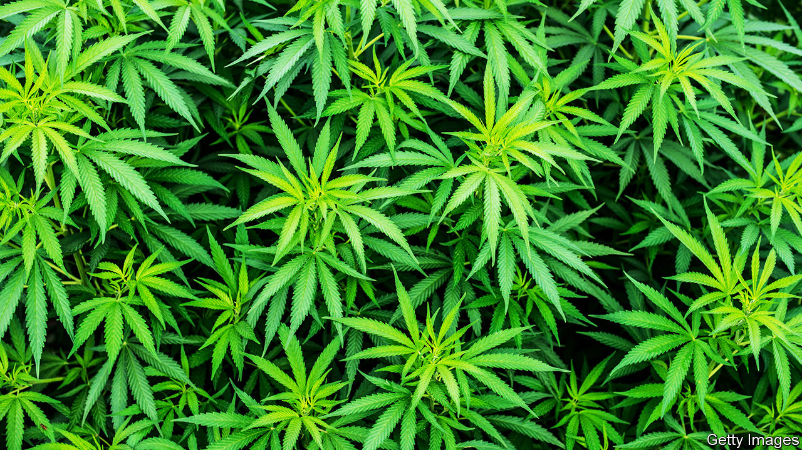

###### Pot luck

# Growing cannabis on Britain’s smallest islands 

##### Increasing demand fertilises supply 

 

> Feb 20th 2021 


THE ICE-CREAM parlours and music halls of the Isle of Man were once packed each summer with workers who travelled ten hours on a steamer to a Manx beach to escape the cotton mills of Lancashire for a week. “You see the best of the working class of the north away from their factories and workshops,” The Spectator informed its readers in 1880. “Their loud provincial tones are heard in boisterous merriment.”


Since the Costa del Sol destroyed the island’s tourist trade, there is much less merriment, provincial or otherwise. But Man has reinvented itself, first as an offshore financial centre and most recently also as a hub for online gaming firms. Finance accounts for about a third of GDP; e-gaming 17%. Tourism makes up less than 1%.


Now Manxmen want a slice of another fast-growing industry: cannabis cultivation. And they need not beg permission from Whitehall. The island is a crown dependency, meaning that though the queen is head of state, it is self-governing. Last month its parliament approved a plan to sell licences to grow and export cannabis for medical use.


It is not the only outcrop to spot an opportunity. The channel island of Jersey, another crown dependency, also smells something in the air. It issued its first cannabis-production licence in December, to a firm that plans to grow the plant in a 75,000-sq-ft greenhouse. Its minister for economic development even flew to Canada to address a cannabis industry conference.


Why the sudden interest? Legal cultivation of cannabis was unheard of outside America until recently; it has leapt about 200-fold globally since 2000, according to the International Narcotics Control Board, an independent monitoring agency. And rules on its medical use are being relaxed across Europe. Britain followed suit in 2018, permitting limited prescription by registered specialists. Brightfield Group, a research firm, reckons the British medical-cannabis market will grow from a relatively paltry £9.6m in 2020 to £293m in 2025.


Britain is already a big player in the global market. It exports more medical cannabis than anywhere else, thanks to GW Pharmaceuticals, a company that uses the plant to make drugs for patients with multiple sclerosis and epilepsy. Yet new players grumble that the Home Office, which grants cultivation licences, is risk-averse. GW and its suppliers are the only firms permitted to grow cannabis potent enough for medical use. The department’s “starting point is effectively to treat anyone making an application as a criminal”, claims a lawyer who advises cannabis firms.


Both islands hope to outmanoeuvre the mainland. Laurence Skelly, the Isle of Man’s enterprise minister, promises the sort of business-friendly regulation that helped lure gaming firms to the island. And the 0% standard rate of corporation tax in both places—compared with 19% on the mainland—will help ensure that the islands don’t blow their chance.

