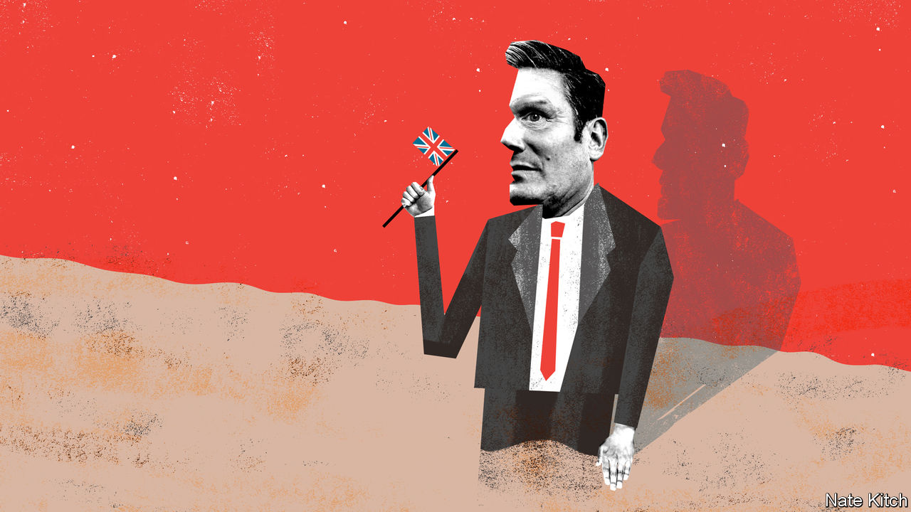

###### Bagehot

# How Keir Starmer got stuck 

##### The Labour leader is Perfect Peter to Boris Johnson’s Horrid Henry 

 

> Feb 20th 2021 


WHEN HE WON the leadership of a shattered Labour Party in April 2020, Sir Keir Starmer got off to a blistering start, wresting control of his party from the far left, rebuilding bridges with a Jewish community that had been alienated by anti-Semitism and impressing middle England with his smart suits and nice manners. Ten months later he is stuck. He swats at the government without ever landing a blow. He has appointed a shadow cabinet that has done the seemingly impossible and underperformed the worst cabinet since the second world war. After months of level-pegging in the opinion polls, the Conservatives have established a solid lead.


There are lots of excuses for this. Sir Keir got off to such a strong start that a loss of momentum was inevitable. The pandemic makes life easier for governments than oppositions because people rally behind their leaders. Sir Keir’s sensible attempt to deal with this problem by focusing on competence was fatally undermined by the government’s world-beating vaccine programme. But Labour is gripped by the fear that Sir Keir’s current doldrums also point to troubling weaknesses in his political abilities.


The most obvious of these is his formulaic approach to his job: he identifies obvious problems and presents solutions to them with a mechanical precision that lacks style or panache. Not patriotic enough? Display a flag. Too London-centric? Go on about “the North''. Too left-wing? Expel the chief lefty, the former party leader Jeremy Corbyn. Too anti-business? Unveil “an unashamedly pro-business agenda”. The danger is that this paint-by-numbers politics alienates core supporters (who were particularly incensed by the flag business) without convincing the target audience that he means what he says. It’s all uncomfortably reminiscent of Michael Dukakis’s attempt to de-wimpify himself by sitting in a tank.


The second is excessive caution. Labour’s talent pool is necessarily limited following the departure of rising stars such as Tristram Hunt and Andy Burnham during Mr Corbyn’s nuclear winter and the reduction of MPs as a result of losses in the 2019 election. But the leader’s defensiveness is preventing him from making the best of what material he has. His insistence on leaving established talents such as Yvette Cooper and Hilary Benn on the back benches while keeping the few stars that he has such as Angela Rayner and Lisa Nandy in the cupboard suggests either an obsession with control or, worse, fear of being overshadowed.


These two weaknesses add up to a bigger problem: a failure to produce a vision of the future. The most successful Labour governments have all been powered by a distinct idea: think of 1945 (New Jerusalem), 1964 (White Heat of Technology) and 1997 (Cool Britannia). Sir Keir tried to provide a hint of this on February 18th in a speech full of references to “a new chapter for Britain”, a “partnership between government and business” and a willingness to embrace “the change that’s coming in science, technology and work”. But who these days doesn’t believe in new chapters, partnerships with business and embracing change?


The current doubts on the left about Sir Keir’s leadership may blow away as quickly as they have blown in. A victory, let alone two, against Tory mayoral incumbents in Birmingham or Teesside in the local elections in May would panic the Tories. The government’s successes—getting Brexit done and rolling out the vaccine—conceal deeper failures: the economic damage Brexit is doing and one of the highest death rates in the world from covid-19.


Yet what if Sir Keir is stuck because he’s got nowhere to go? What happens if, for all his positive qualities of decency and determination, he just doesn’t have what it takes? Natural politicians are storytellers and preachers: they not only hold their audiences in the palm of their hands but also persuade them to see the world through their eyes. The three great lawyer-politicians of recent years—Tony Blair in Britain and Bill Clinton and Barack Obama in the United States—changed the political world precisely because of their ability to turn the political stage into a pulpit. Messrs Clinton and Blair preached about civilising capitalism (the Third Way), Mr Obama about blue and red America melting happily together. Sir Keir, by contrast, is a lawyer first and foremost—brilliant at tearing down an opponent but mediocre when it comes to creating a compelling narrative.

Boris’s scrapes


The contrast with the man in Number 10 is particularly worrying for the Labour Party. Mr Johnson is Horrid Henry to Sir Keir’s Perfect Peter. He’s forever getting himself into terrible scrapes—likening Muslim women to post boxes, for example, or finding himself stuck on a zipwire because he had lied about his weight. His career sometimes looks like a series of disasters: getting sacked from his first job in journalism and from one of his first political jobs for lying about an affair, messing up his first few months as mayor and making a hash of his time as foreign secretary. But he’s also a natural politician who thrives on the whirligig of events. He has never missed an opportunity, from Eton onwards, to get stuck into the fray, the dirtier the better. He knows how to tell a compelling story: indeed, his career was built on an embroidered tale of the pompous incompetence of the EU, which he dreamed up as a journalist in Brussels. Perfect Peter, by contrast, enjoyed his greatest success doing the strictly apolitical job of director of public prosecutions and spent four years criticising the government’s Brexit policy without changing the debate, or even coming up with a single phrase to match “take back control” or “get Brexit done”.


Mr Johnson has learned from his mistakes: despite messing up when he became mayor he got his act together and won a second term with an enhanced majority. The Conservative Party’s biggest worry is that he has many more mistakes in him. The Labour Party’s biggest worry is that Sir Keir will go on being competent, and not much more than that. ■

