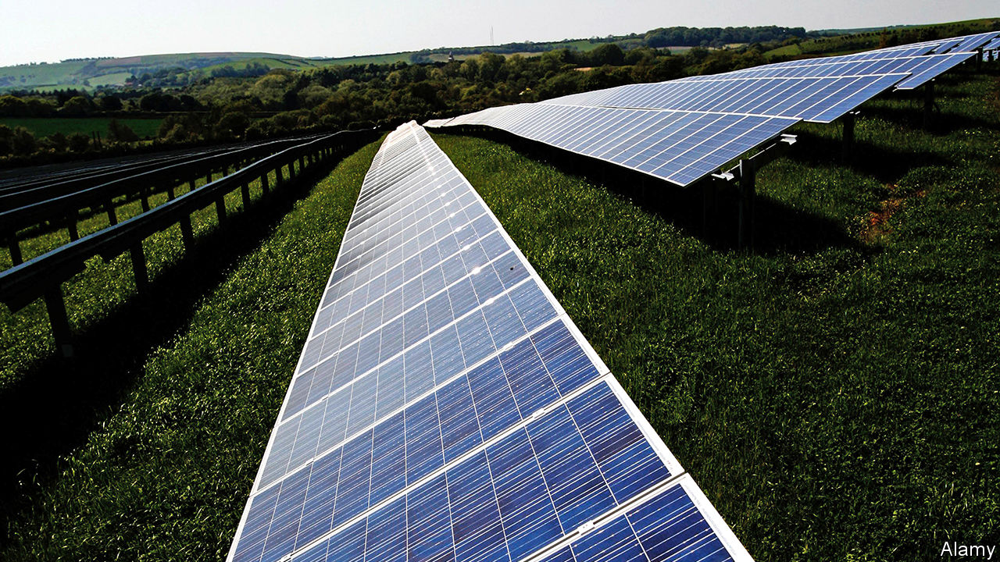

###### Climate change

# Solar power’s NIMBY problem 

##### The farms are getting bigger, and the objections louder 

 

> Feb 20th 2021 


LAST AUTUMN, a woman in Freckenham, a pretty Suffolk village, accepted a bid for her house from a London couple who had looked around it. After researching Sunnica Energy Farm, a proposed solar farm of 2,700 acres—the size of over a thousand football pitches—the couple came down for another visit and stopped off at the pub, where the farm was the main topic of conversation. They backed out. The following week, as she was preparing for another viewing, the estate agent rang to say the prospective purchasers had arrived in Freckenham, but after seeing a high street plastered with “Say No to Sunnica” posters, had kept on driving. 


A solar boom started in 2010 and came to an abrupt end in 2015 when subsidies were cut. Now solar is growing again. In 2020 there was 13.4GW in the development pipeline, the capacity installed in the past decade. The falling cost of solar technology—set to drop by another 27% by 2030, according to Aurora Energy Research—is one reason. Most councils have declared a climate emergency, and want to promote renewable energy. Some big energy consumers, such as Budweiser and Anglian Water, are building solar farms to prove their green credentials.


Economies of scale mean that massive farms make sense. Cleve Hill Solar Park, a 350MW site spread across 900 acres in Kent, was approved in May 2020. It is the first to be classified as a “nationally significant infrastructure project”. Three more applications for super-sized projects are pending—Sunnica’s, one for 1,000 acres in Essex and one for 558 acres in Lincolnshire. Matt Hazell, co-founder of PS Renewables, an investor in Sunnica, reckons there could be another ten in England within the next decade.


England’s energetic NIMBYs have been out in force. Polling by No Sunnica, a protest group, found that 98% of Freckenham’s residents are against the plan. They do not deny that climate change is a problem, but dislike projects that will take up so much land. Their concerns range from biodiversity loss and worries about where they will walk their dogs to fears that batteries might go up in flames.


Developers say that solar farms, which produce no pollution and need little maintenance, are the perfect neighbours. But for Neil Beedie, who is protesting against a proposed 200-acre solar farm at Derry Hill in Wiltshire, that is part of the problem. He would prefer a nuclear power station, which would at least bring jobs to the area. Solar farms, once installed, create little work for locals. Damage is often monitored by drones, and engineers dispatched from miles away by distant office workers.


The government sees boosting solar power as one of the ways of meeting its commitment to carbon neutrality. Developers can bid for “contracts for difference”, that top up the earnings of renewable projects when power prices fall below a certain level. But some Tories are unhappy with the consequences of that commitment. Matt Hancock and Lucy Frazer, two ministers in whose constituencies Sunnica Energy Farms wants to build, have come out against the development. Meanwhile the government is getting support from unusual quarters. One of the few local supporters of the Derry Hill proposal is an Extinction Rebellion activist. ■


For more coverage of climate change, register for The Climate Issue, our fortnightly , or visit our 

