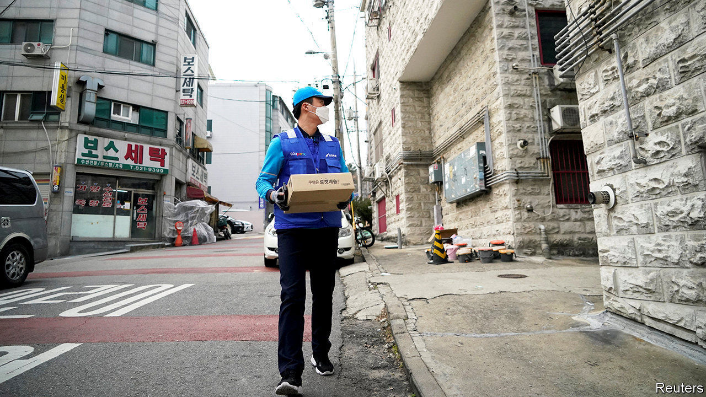
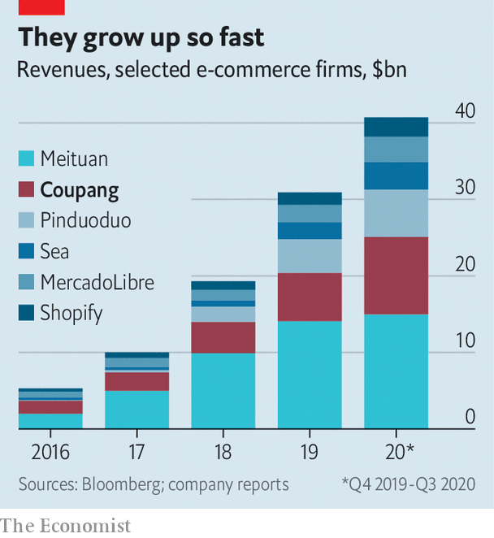

###### Online shopping

# Coupang hopes to be the next successful baby Amazon 

##### South Korea’s tech darling is the latest second-generation e-commerce group to set investors’ pulses racing 

 

> Feb 18th 2021 


WANDER AROUND Seoul’s residential neighbourhoods at dawn and you will invariably encounter a Coupang delivery van. In the past few years South Korea’s mini-Amazon has parked itself in a choice spot amid a crowded e-commerce market by steadily expanding the range of products it offers to deliver in time for breakfast, so long as customers order before midnight. Some items arrive the same day. The strategy looked sensible before the covid-19 pandemic. After 2020 it looks inspired. Coupang’s revenue nearly doubled from $6.3bn in 2019 to $12bn last year. It employs 50,000 people, twice as many as a year ago, and controls a quarter of South Korean e-commerce, up from 18% in 2019, according to Digieco, a research firm.


The 11-year-old firm has yet to make money—its cumulative $4.1bn loss so far has been bankrolled by venture capital, notably SoftBank’s $100bn Vision Fund, which owns a 37% stake, according to estimates by Bloomberg. Cashflow has improved, says Kim Myoung-joo of Mirae Asset Daewoo, an investment firm in Seoul. But it needs more capital to grow.


Happily for Coupang, investors’ appetite for startups seems insatiable, as the boom in blank-cheque companies created to merge with them shows (see ). So on February 12th it filed the paperwork for an initial public offering (IPO) on the New York Stock Exchange. It may go public as soon as next month, at a market capitalisation that could surpass $50bn.

 


Coupang is the latest in a generation of young e-commerce stars nibbling at the heels of Amazon and Alibaba, a Chinese titan. The incumbents are being challenged at home (by Shopify in Amazon’s American backyard, and Meituan and Pinduoduo in Alibaba’s), as well as in places like Latin America (by Argentina’s MercadoLibre) or South-East Asia (by Sea, a Singaporean group). The upstarts’ sales have soared of late (see chart ). In the past 12 months they have more than quadrupled their combined stockmarket value, to $1trn.


With no known plans to expand abroad, Coupang’s prospects depend on fending off local rivals. These range from the e-commerce arms of big conglomerates such as Lotte and Shinsegae to internet platforms like Naver and upstarts like Baemin, a food-delivery service backed by Germany’s Delivery Hero. To extend its dominance Coupang must thus continue to nurture the customer goodwill it has garnered thanks to those pre-dawn deliveries. The firm prides itself on employing delivery workers directly, and has a newsroom section dedicated to correcting allegations, for instance over working conditions, that it deems false or distorted. But it has not escaped scrutiny of the e-commerce industry. Earlier this month it had to apologise after a government commission classified the death of a young contract worker at one of its logistics centres as an industrial accident.


Even if it manages to keep consumers on its side, as seems likely, long-term growth could require looking beyond fulfilment and logistics, thinks Ms Kim. MercadoLibre and Sea owe significant chunks of their rich valuations to adjacent businesses, from e-payments to gaming. To thrive in South Korea’s isolated online ecosystem, Coupang may need to occupy more than one niche. ■

