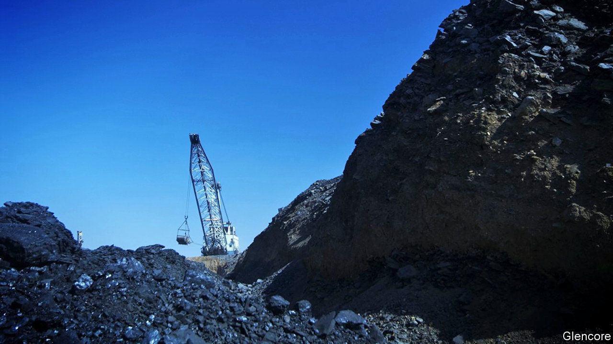
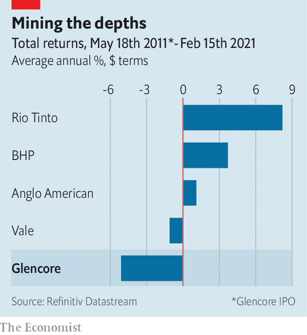

###### Pit stop

# Glencore’s new boss takes the reins at a good time for commodities 

##### He looks a lot like his predecessor 

 

> Feb 20th 2021 


MINING BOSSES often leave under a cloud, ousted after a profit slump, a public-relations disaster or pit-hole calamity. Not so Ivan Glasenberg. For his last set of results on February 16th the boss of Glencore offered shareholders—including himself—a reinstated dividend and an upbeat outlook. Leaving on a high after 19 years in the top job will not make life easier for his anointed successor, Gary Nagle.


All miners have had a bull run of late as commodity prices have surged. China’s appetite for natural resources is unabated. America and Europe are planning infrastructure pushes that will juice demand. The green tinge of such stimulus spending is especially good news for Glencore, a big producer of the cobalt, copper and nickel needed for electric cars and the like.


Investors on the earnings call were as focused on life after Mr Glasenberg. It may not be so different. Those used to seeing the Swiss firm run by a fast-talking South African accountant who has spent much of his career on the coal side of the business might not notice the handover, due to happen in the next few months. Like his predecessor, Mr Nagle is all those things. He will become only the fourth boss to lead the company since its founding in 1974.

 


Investors expect continuity in the business. Mr Glasenberg has re-engineered a pure commodities trader into a firm that also digs the stuff up. The model has not delivered stellar returns, at least since the firm went public in 2011 (see chart). But trading profits last year were fat and Mr Nagle says the set-up is fit for purpose.


Three thorny dossiers will keep him busy. The first is coal, of which Glencore is the biggest shipper. The banks that fund its trading arm are under pressure to cut ties to polluters. Glencore has some green credentials and says it is running down coal assets gradually. But a more radical move, like a spin-off, may be needed.


Then there is the Democratic Republic of Congo. A big source of copper and cobalt profits, it is also in the sights of America’s Department of Justice. Glencore denies any wrongdoing. After the Congolese elected a new president in 2018 some faces that helped Glencore thrive are being replaced. Dan Gertler, who teamed up with Glencore to develop assets in the DRC, recently earned a partial reprieve from American sanctions (he also denies wrongdoing). The copper belt is rife with rumours that Mr Gertler may be looking to cash out.


Perhaps the trickiest dossier is Mr Glasenberg. He will not upgrade himself to chairman, as some CEOs are wont to do. But he intends to keep his 9% stake, making him the second-biggest shareholder. And, potentially, its biggest back-seat driver.■

