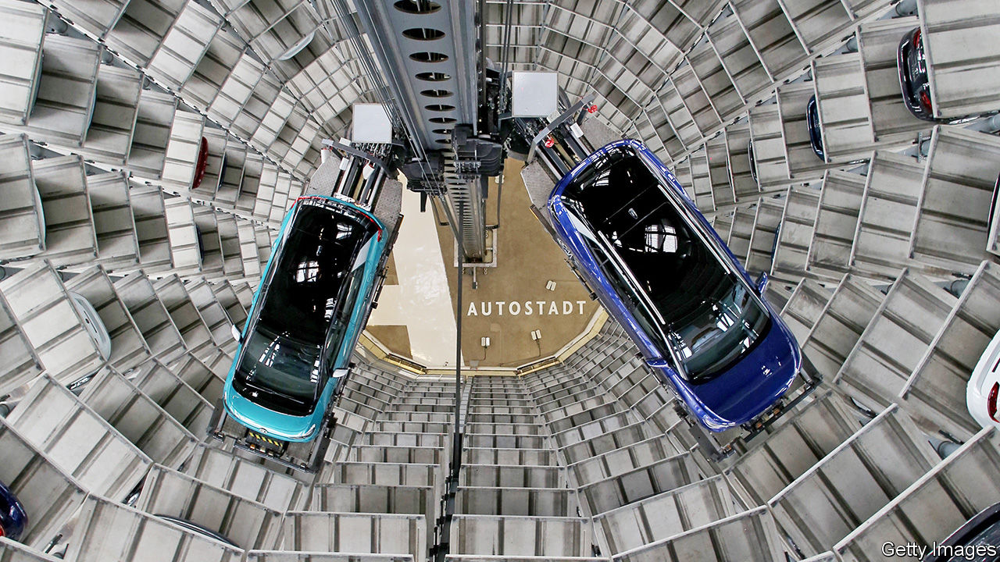

###### VW

# Volkswagen’s boss lays out his electric plans 

##### But he will not kill the internal combustion engine 

 

> Feb 20th 2021 


THE SCRAMBLE to electrify motoring resembles a car race. Tesla and like-minded startups, unencumbered by the legacy of the internal combustion engine (ICE), are surging up the straight. Behind them, jostling for position at the first corner, are the established carmakers, urged on by ever-tightening government deadlines for clean power to supersede fossil fuels. Many are calling time on the ICE. On February 17th Ford’s European division said that it would go all-electric by 2030. Days earlier Jaguar Land Rover (JLR), an Indian-owned firm based in Britain, announced that the posh Jaguar brand would become fully electric by 2025. In January General Motors (GM) promised it would make only zero-emissions cars after 2035.


No one is dedicating more resources to electrification than Volkswagen Group, says Herbert Diess, the German giant’s boss. The company plans to spend around €73bn ($88bn) over the next five years on battery power and digitisation, he says. “The competition is now taking the same decisions,” Mr Diess notes, alluding to rival firms’ pledges.


Among the old guard, vw is indeed firmly in the driving seat. A fifth of the millions of cars it sells will be electric by 2025. Some analysts think that by then VW will churn out more electric cars than Tesla, today’s market leader. Mr Diess is more circumspect. A year ago he was confident his firm would lead the world in electric vehicles in ten years’ time. Now he is less sure, admitting that Tesla’s surging shares give it the resources to grow fast. Although Apple’s talks with carmakers such as Hyundai and Nissan did not go anywhere, the tech giant’s evident interest in an iCar could yet make it a force to be reckoned with, Mr Diess admits. But he still thinks that the electric race is Volkswagen’s to lose, not least because the cashflow from its traditional business gives him the money to invest in the future.


Indeed, despite all the noise about electrification the old ICE technology has plenty of mileage left in it. Unlike his counterparts at Ford Europe, JLR or GM, Mr Diess is unwilling to set a date for the demise of the fossil-fuel engine. His electric plans for 2025 still leave four-fifths of his firm’s cars powered by petrol or diesel. Volkswagen is a global company and, he says, many markets will not be ready for electric cars by 2035. Coal-fired power stations will still provide part of the electricity that might charge batteries, making electric cars a moot proposition. In places such as Latin America ICE-friendly biofuels will be the prevailing green alternative to petrol.


Scratch the surface and the ICE seems to be lurking even at firms which claim to be forsaking it. GM says its target is an aspiration. Citigroup, a bank, notes that the majority of investment by established carmakers is still directed towards conventional power trains. BloombergNEF, an energy-analysis firm, reckons that more than one in three cars sold in 2040 will be powered by petrol and diesel. Some will sport the Volkswagen logo. ■


For more coverage of climate change, register for The Climate Issue, our fortnightly , or visit our 

