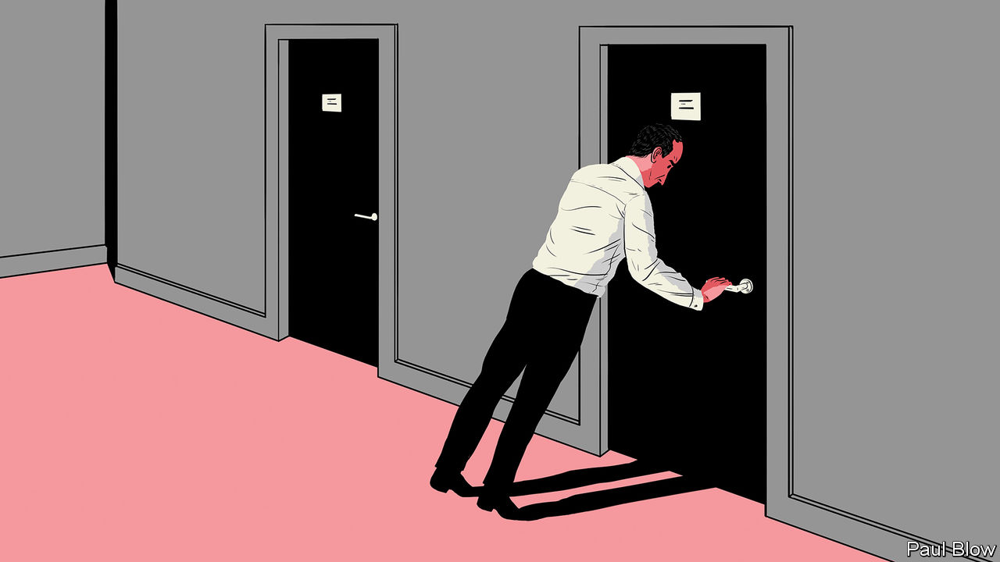

###### Bartleby

# When will office workers return? 

##### Getting back to normal will involve a host of challenges 

 

> Feb 18th 2021 


WHEN WILL most people be back at the office? As with Tantalus and the fruit tree, the prize seems to be close, only to recede out of reach. A survey conducted by Morgan Stanley, an investment bank, found that employees have adjusted their expectations for when they are likely to repopulate their desks, moving the date back from April to June. Given the slow pace of vaccinations in some countries, even that may be optimistic.


Companies have also had to adjust their expectations. Brian Kropp of Gartner, a research and advisory firm, says that businesses have gone through three phases. In the first, during the spring of 2020, they thought that the pandemic would be short-lived and that corporate life would soon return to normal. In the second, economic restrictions seemed set to last indefinitely and companies figured there was little point in planning for a post-pandemic world. In the third, current, stage the vaccines have brought hope of a reversion to normality, and businesses are trying to work out what the new world will look like.


Interestingly, Mr Kropp observes that views have switched since the start of the pandemic. A year ago, many executives were dubious that productivity could be maintained if employees worked from home. Staff, meanwhile, enjoyed the greater flexibility. Now managers are much more comfortable with the idea. But employees are hankering after the office, at least for part of the time.


This employee restlessness seems to relate to the sheer length of the lockdown. The novelty has worn off and working from home seems much less appealing in winter. And the time spent on screen has led to a feeling of fatigue.


It has also led to increased stress. A study of 1,500 workers in 46 countries by the Harvard Business Review found that 85% said their well-being had declined and 55% felt they had not been able to balance their work and home lives.


The problems are physical as well as mental. A survey of Italian workers found that 50% reported greater neck pain, and 38% increased lower-back pain, while working remotely. This is probably because home furniture is not designed to accommodate extensive computer use.


This does not mean that workers want to go back to the old days entirely. The Morgan Stanley survey found that employees said that, in future, they would like to work from home for two days a week, on average, compared with just one day a week before covid-19.


When people do come back, mask-wearing and social distancing will have to continue for a while. Even if they legally can, few employers will force their employees to get vaccinated, not least because of the furore this might arouse. Gartner surveyed 116 human-resources professionals and only 9% were planning to mandate vaccination. This may mean that 30-35% of American worker will not be vaccinated, Gartner says. They will be vulnerable to catching the virus at work.


Another problem for companies is that employees have become less loyal as the pandemic has progressed. Mr Kropp says that workers are spending more time looking for jobs online and updating their LinkedIn profiles. Since few businesses are hiring at the moment, not many employees have left. But when the economy opens up again, there might be a rush for the exit.


The urge to depart may not be universal. As Bartleby has argued before, the pandemic has divided workers into slackers and Stakhanovites. The first group are getting away with the minimum effort. The second are working even longer hours than before. It is the Stakhanovites who are more likely to leave, Mr Kropp argues, if they feel their efforts are not adequately rewarded.


All this presents challenges for managers who are planning a return to normal. They may have to redesign their offices to create more distance between desks, and come up with a system for allocating space to employees who may turn up for just three days a week. They need to recreate camaraderie within their teams and make sure their best employees do not head out the door.


Issues of equity may be trickiest of all to deal with. Women appear to be keener on working from home than men are. But Mr Kropp warns that managers have a tendency to reward those employees whom they can see, at the expense of those with whom they have reduced contact. That could widen the existing gender pay gap. In short, when the all-clear finally sounds, that may be just the start of managers’ problems.

