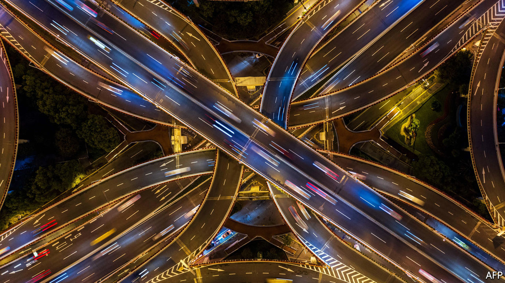
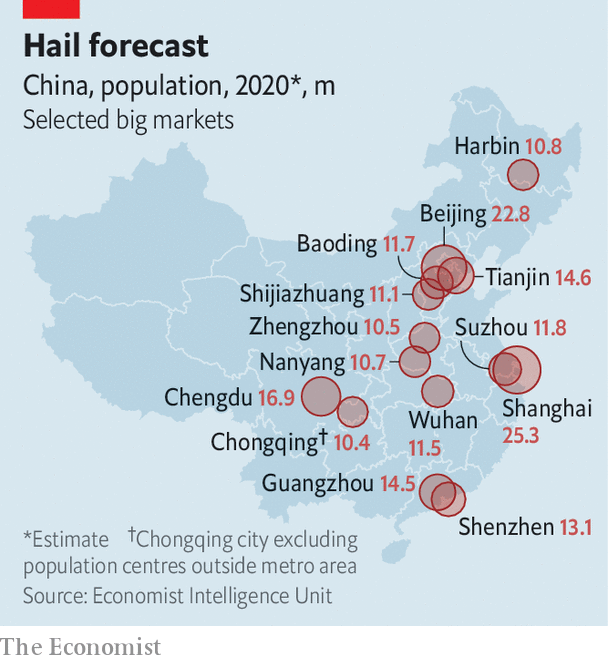
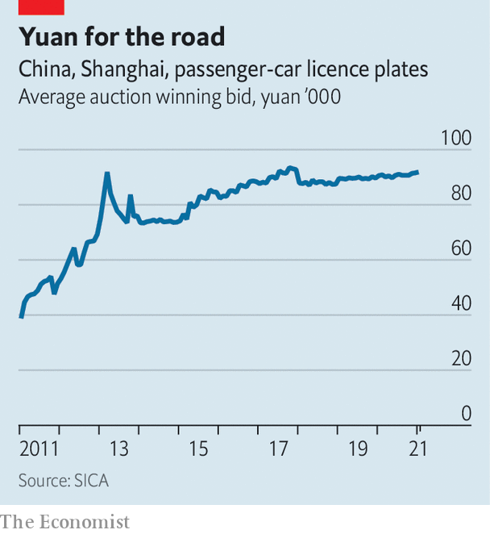

###### Trafficking dreams

# Why China’s Didi can succeed where Uber has struggled 

##### To glimpse the future of the ride-hailing business, look east 

 

> Feb 20th 2021 


“WE INVEST A lot of money here in China,” proclaimed Travis Kalanick, founder and then boss of Uber, at a confab in Tianjin in June 2016. But, he added with foreboding, “we have a competitor who is investing even more.” Two months later the American ride-hailing giant threw in the towel, selling its Chinese operations to its Beijing-based rival, Didi. Uber lost some $2bn over two years in China. Its retreat paved the way for Didi to grow into China’s undisputed ride-hailing champion, which today processes over four-fifths of all domestic orders. The Chinese titan is widely expected to go public in the next few months, eight years after its launch. It could fetch a valuation of $60bn.


That Uber was willing to burn through so much cash, at least for a time, is a testament to the size of the prize. China boasts the world’s biggest ride-hailing market. According to its transport ministry, 21m trips were booked on ride-hailing platforms each day, on average, last October. That is double the figure in pre-pandemic America, when travel was safer. Until it sold its Chinese business, Uber received more orders in China than in any other country, including its home market. The gross transaction value of China’s ride-hailers reached 221bn yuan ($32bn) last year, up by more than half since 2017, reckons Frost and Sullivan, a consultancy.


America may have invented ride-hailing. But it is in China where the conditions are most fertile for it to flourish. The reasons go deeper than the size of the market. Didi has the most to gain. But its dominance will increasingly be contested.

 


Ride-hailing firms depend disproportionately on customers in big cities, where population density is highest. Around a quarter of Uber’s gross bookings by value in 2019 came from just five metropolises: Chicago, Los Angeles, New York, San Francisco and London. China has 14 metropolitan areas with a population of over 10m (see map), more than any other country.

 


Most of these cities, keen to reduce rage-inducing congestion, discourage private car ownership by restricting the supply of licence plates. In Beijing’s most recent bi-monthly lottery 3.6m applicants competed for 6,370 number plates. Shanghai, China’s most populous city, puts a small number of plates up for auction each month. The average winning bid at the auction in January was 91,863 yuan, more than double what it was a decade ago and costlier than many mid-range cars (see chart). The southern boomtowns of Guangzhou and Shenzhen have hybrid models whereby some plates are allocated via lottery and the rest sold to bidders. All that leaves millions of disappointed wannabe motorists for ride-hailing firms to cater to.


Moreover, high urban density and the absence of American-style suburban sprawl turn parking space into a prized (and pricey) commodity. The number of public parking spaces per car in Beijing, China’s second-most populous city, is a fifth of that in its American opposite number, Los Angeles. China’s extensive high-speed rail network, the world’s longest, blunts the benefits of car ownership for long-distance travel. And cheaper labour means rides can be offered at low prices, making them accessible to a wider group of customers. More than 340m Chinese booked a ride-hailing service at least once in the first half of 2020, notes the Ministry of Industry and Information Technology.


In 2019 Didi disclosed that it was losing an average of just 2% of the total fare on each ride. The company now says its “core ride-hailing business in China is already profitable”. It is coy about the details; Uber also insists it makes money from ride-hailing but continues to report vast operating losses, of $4.9bn last year. Yet most analysts in China take Didi at its word. The question for Didi, they say, is not whether it can break even but rather how well it can sustain profits, maintain its near-monopoly in China and expand abroad.


In recent years the firm has expanded into new business lines, from bike-sharing and food delivery to financial services. The aim is to build up a convenient “ecosystem” to make it costlier for customers to switch to a rival platform. Those rival platforms are not standing still, however. Jack Wei, boss of Shouqi Yueche, Didi’s closest domestic competitor, is sanguine about the challengers’ prospects. He sees room for “multiple firms”, perhaps three or four, to thrive in China in the long term.


One way to carve out a bigger slice of the market is through differentiation, Mr Wei suggests. Shouqi prides itself on premium customer service (as Lyft, Uber’s domestic rival, tries to). Its ambition is to become the “leader” in upscale rides while “keeping up” with Didi in the mass market. China is large enough that serving this niche is big business. Shouqi expects to turn a net profit this year on revenues of 8bn yuan.


Another path is to forge strategic alliances. Shouqi has one with Meituan, a rising Chinese e-commerce star that offers, among other things, food-delivery and bike-sharing services. The agreement allows Meituan’s 477m annual active users to book Shouqi rides directly in its super-app. In return Shouqi pays Meituan a small commission on each booking. Crucially, Meituan excludes Didi, which it views as a threat, from its platform.


Despite its advantages, the Chinese market presents some obstacles. As in the West, the authorities are concerned about big tech. In December the markets regulator summoned six online giants, including Didi, and lectured them on how not to abuse their dominant positions. At the local level, more than a hundred municipalities have drafted stricter rules on who can drive for ride-hailing firms over the past four years. The aim appears to be to appease embattled local taxi industries. The rules typically set a high bar, such as requiring existing residency status in the city where a driver wants to work. Yet most drivers are migrant workers who lack the proper papers. In 2016 Didi complained that only 3% of its 410,000 drivers in Shanghai would have passed the test.


The arrival of self-driving cars, which Didi has been developing since 2016, may one day solve this problem, though probably not imminently (last year Uber called it quits and spun off its autonomous-vehicle arm). In the meantime, Didi is hedging its bets by diversifying. In 2017 it set up an international division. A chunk of the $4.5bn it raised a year later was earmarked for foreign expansion. Today it operates in 13 overseas markets, mainly in Latin America. Three years ago it acquired a controlling stake in 99 Taxi, which competes with Uber in Brazil, in a deal that valued the Brazilian startup at around $1bn.


But China remains the biggest opportunity, which explains why Shouqi has chosen to lock in on its home market for the time being. It helps that local authorities have, for the most part, turned a blind eye to rule-bending by the ride-hailing firms. Perhaps they calculate that unemployment resulting from tougher enforcement imperils social stability, not least as economic growth slows and good manufacturing jobs are harder to come by. One in eight drivers for Didi in China are military veterans, a group known for staging small-scale protests when their interests are harmed. Given Beijing’s harmony-obsessed leaders, it is a good bet that ride-hailing in China has plenty of road left to run. ■

