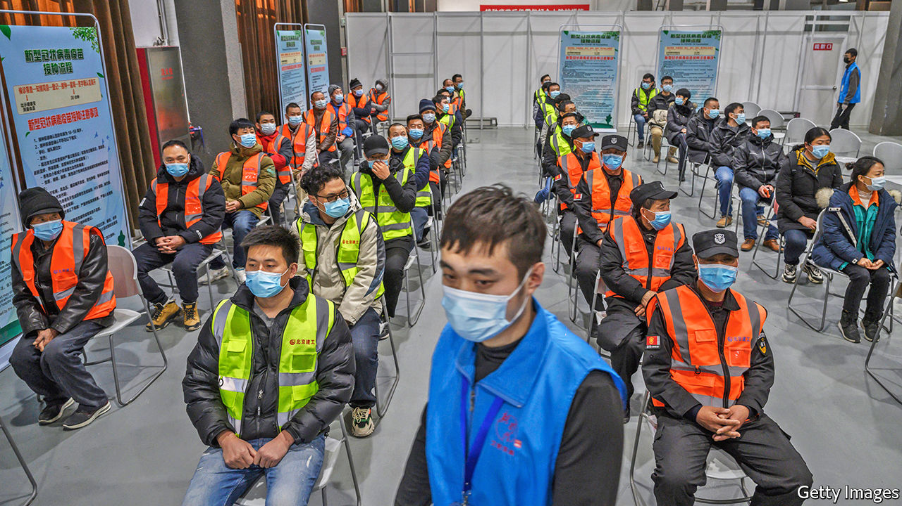
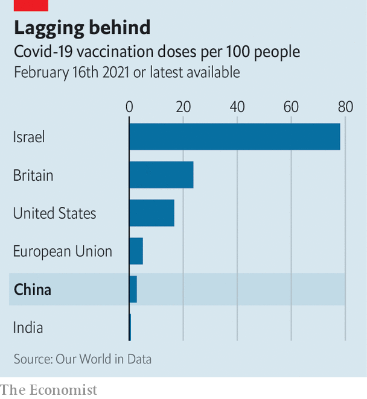

###### Sinovacillate

# China’s roll-out of covid-19 vaccines is slower than planned 

##### Production bottlenecks and a perceived lack of urgency don’t help 

 

> Feb 20th 2021 


IN ANY OTHER year, Mr Lai would have been among the millions who usually return to their ancestral homes for the spring festival, when families celebrate the lunar new year. But this year, to prevent outbreaks of covid-19, the government had urged citizens to stay put for the weeklong holiday, the last day of which was February 17th. So Mr Lai, a 40-year-old office worker in Beijing, was instead among the first in China, other than essential workers and employees of the state, to get vaccinated against the disease. Before the holiday, China had administered some 40m doses of Chinese-made vaccines to people such as medical and delivery staff, government officials, and students and workers going overseas. Now the capital is calling on all residents to volunteer for jabs.


China is second only to America in terms of the absolute number of shots it has administered (America has dispensed more than 57m doses). But per head, China is dawdling. Just 3% of people in China have received a jab, compared with 17% of Americans (see chart). The country has not yet begun to inoculate its elderly, lacking data on whether local vaccines are safe for them. Beijing is so far the only city to have begun a mass inoculation programme. It covers those aged 18 to 59. Late last year the central government had aimed to administer 100m doses before the spring festival. Why is it falling short?

 


China got off to a quick start last summer, under an emergency-use programme that involved giving shots to soldiers, health-care and aviation workers and the staff of state-owned firms. To the alarm of scientists overseas, the Chinese vaccines had not yet made their way through the big “phase three” trials that are normally required for new vaccines. Such trials are still under way, but, in December, Chinese regulators authorised a vaccine by Sinopharm, the country’s largest maker of such products, for general use. This month they approved a second one, by Sinovac, a smaller producer. The two firms aim to make 2bn vaccines this year. Under a two-shot regimen, that would be enough to cover 70% of China’s population.


It is not that people in China are resisting vaccination. A survey in December by Ipsos, a pollster, found that four in five were willing to get a shot, the highest proportion among the 15 countries they surveyed. And they are keen on China’s own vaccines. The government’s effective crushing of the virus, in contrast with the rampant spread of covid-19 in much of the West, has boosted the credibility of made-in-China approaches. Many people say that, given the choice, they would prefer Chinese vaccines to Western ones. That is remarkable in a country which has been rocked by vaccine scandals. The most recent one erupted in 2019 after infants were given expired doses of the polio vaccine.


Official propaganda has helped. State media have questioned the safety of the mRNA vaccines, such as those made by Pfizer and BioNTech, that are being used in the West. Chinese vaccines that use an inactivated virus have “more mature technology”, they insist. Mr Lai warns darkly that the mRNA sort could “alter a person’s DNA” (this is false).


Hesitancy in China appears to be not bottom-up, but top-down. If leaders are reluctant to roll out a mass programme nationwide, it is probably because there is still too little vaccine to go around, says Gavekal Dragonomics, a research company in Beijing. Ernan Cui, an analyst at the firm, has noted that although Sinovac is getting ready to produce over 1m doses a day, its factories were still only making less than half that number in January. It is hard anywhere to produce large quantities of vaccine quickly with inactivated viruses. It does not help that China also has to import most of the glass vials for its vaccines.


This has not deterred China from offering its vaccines abroad. Xi Jinping, the country’s leader, said last May that he would ensure that Chinese vaccines were made a “global public good”. Makers have already signed contracts to export half a billion doses to more than a dozen countries, including Indonesia, Brazil and Peru. According to state media, the government has also pledged to provide “vaccine aid” to 53 countries. It sees all this as an opportunity to give China’s pharmaceutical sector a shot in the arm, says Jennifer Bouey of Georgetown University. Some countries grumble that shipments from China are being delayed. But in some cases China may have no choice but to fulfil its commitments. Because it has all but eradicated the virus at home, it has had to look abroad for places to conduct phase three trials. In return, it has promised host countries priority delivery of its shots.


China may calculate that it can afford a leisurely inoculation campaign. Because of its success in eradicating the virus, there is little sense of urgency. In the Ipsos survey, a third of Chinese who said they preferred not to take the vaccine felt that the virus was not common enough to pose a threat. Few chafe at mask-wearing or at the tests they must take for some interprovincial travel. Almost all support China’s closed-border policy aimed at preventing the virus from being reseeded at home.


But China’s efforts to keep infections as close to zero as possible come with a cost. “Citizens will not tolerate a single case of infection either, now,” points out Huang Yanzhong of the Council on Foreign Relations, an American think-tank. As he notes, as long as China keeps its borders shut it will lack a clear incentive to vaccinate its citizens. That will mean herd immunity will take longer to achieve and delay China’s reopening to the world.


Virologists reckon that around 70% of the population needs protection, either from having caught the disease or through inoculation, to reach the herd-immunity threshold beyond which the epidemic abates. However this number is higher for new, more transmissible variants. For China to attain just 60% will take at least until the end of 2022, reckons the Economist Intelligence Unit, our sister company. That is a year longer than the briskest vaccinating countries will take to reach that level. If they open up while China remains shut, it will become harder for Chinese officials to convince citizens that their approach is sound. Sooner or later, says Mr Huang, “they will need to educate people to learn to live with this virus.” ■


Dig deeper


All our stories relating to the pandemic and the vaccines can be found on our . You can also listen to , our new podcast on the race between injections and infections, and find trackers showing ,  and the virus’s spread across  and .

