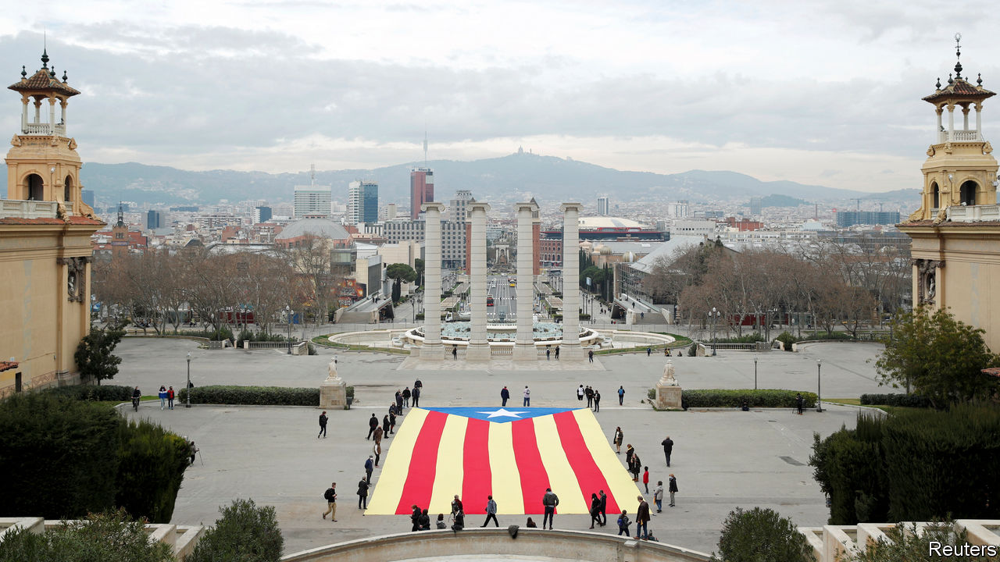

###### Spain’s regional splits

# Catalonia’s separatists score another victory, but a hollow one 

##### Low turnout and deep divisions blunt the independence-seekers’ success 

 

> Feb 15th 2021 


CATALANS PRIDE themselves on their seny, their hard-headed common sense. Yet when it comes to politics, as Jaume Vicens Vives, a great Catalan historian of the mid-20th century, pointed out, they have more often acted with its opposite: rauxa, or emotional impulsiveness. In the run-up to an election for the regional government on February 14th, many expected that practical matters such as the pandemic and the economic slump would be uppermost in Catalan minds. But the wounds of October 2017, when an unconstitutional referendum on independence for one’s of Spain’s most important regions led to the jailing of nine separatist leaders, are still raw. The Catalan authorities let the prisoners out on day release so that they could campaign. Once again, the emotional divide over independence dominated the election.


The separatist parties won 74 seats, increasing their slender majority in the 135-strong Catalan parliament by four. For the first time since launching their independence drive in 2012 they won a majority of the popular vote, with a total of 51%. But the import of that was blunted by a record low turnout of under 54% (down from 79% at the previous election, in 2017), depressed by the pandemic and political disaffection. The nationalist vote, meanwhile, was split among four parties with very different strategies. This allowed the Catalan affiliate of the Socialist Party of Pedro Sánchez, Spain’s prime minister, to win more votes than any other party, even though it took only 23%. For him it was a useful, if limited, victory.


Esquerra (the Republican Left of Catalonia), which now favours gradually building wider public support for independence, won 21% of the vote and 33 seats. It is now the best placed to preside over the Generalitat, the Catalan administration, dislodging its coalition partner, Junts (Together). As the party of Carles Puigdemont, a former president of the Generalitat who fled to Belgium in October 2017, Junts still flirts with unilateral action of the kind it took in 2017, when it declared independence after the referendum. The two parties have often been at loggerheads with each other and with the CUP, an anti-capitalist separatist group that increased its seats from four to nine. Negotiations over forming a new government may take weeks.


“It’s time to sit down and see how we settle this with a referendum,” said Pere Aragonès, an Esquerra leader who is likely to be the next president. He also wants an amnesty for the prisoners. Another referendum on independence would aggravate a conflict that splits Catalonia down the middle. More modestly, Mr Sánchez’s government, which has sometimes depended on Esquerra in the national parliament in Madrid, is likely to approve pardons for the separatist prisoners. It began desultory talks with Esquerra that could eventually lead to an agreement for even more regional autonomy, which might satisfy most Catalans while irritating other Spaniards. Mr Sánchez’s hand was strengthened by poor results in Catalonia both for Ciudadanos, a centre-right party that lost 30 seats, and the People’s Party, the main conservative opposition. Both were overhauled by Vox, a hard-right party, which won 8% of the vote.


The messy result of this week’s election prolongs rather than resolves Catalonia’s political drama. The region is “resigned and downcast”, says Jordi Alberich, an economist in Barcelona, the Catalonian capital. “The separatists are resigned to the fact that independence won’t happen, and the non-nationalists that there’s nothing to be done.” The relentless theatre of the independence drive has hurt the Catalan economy, which was overtaken in size by the Madrid region in 2017. “It’s very difficult to unwind this,” says Mr Alberich. “It takes a long time and that has a heavy day-to-day cost.” ■

