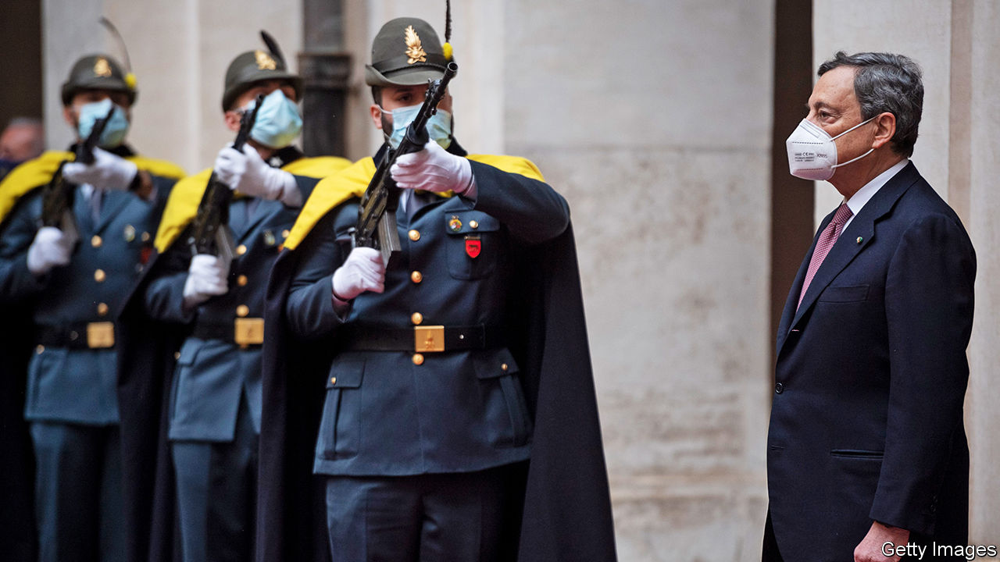
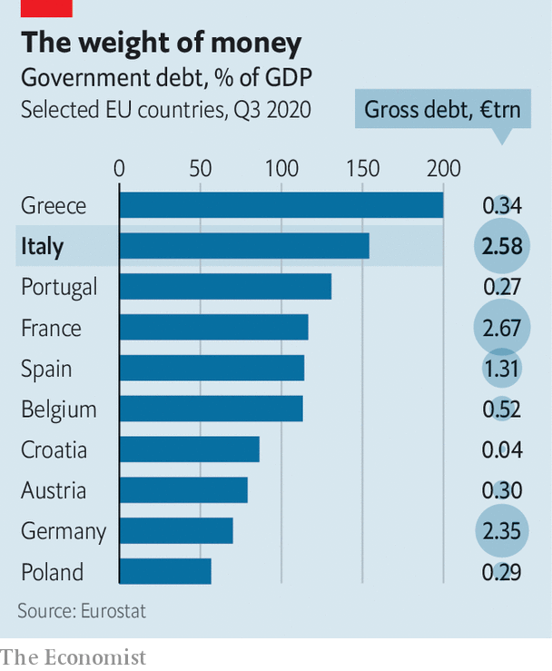

###### Whatever it takes

# Mario Draghi begins the toughest job in European politics 

##### But he will enjoy rare support from his countrymen, at least to begin with 

 

> Feb 20th 2021 


MARKETS HAVE a way of bowing before Mario Draghi, who on February 13th took charge of Italy’s 68th government in 75 years. Stocks soared the moment it was reported he had been asked to become prime minister. Three days after he took office, investors flocked to a bond auction, slashing Italy’s borrowing costs. It was reminiscent of the hot days in July 2012 when Mr Draghi, then president of the European Central Bank, vowed to do “whatever it takes” to preserve the embattled euro. The bond-buying scheme the ECB assembled to render Mr Draghi’s promise credible was never used: his words were enough to calm the financial furies.


But tackling Italy’s problems demands more than rhetoric. Ravaged by the pandemic, on current projections Italy will not regain its pre-crisis GDP until 2023. And its covid-19 woes are layered atop deeper pathologies of slow growth, low productivity and high debt that have largely defeated the efforts of successive governments. “We all know the reform priorities,” says Marco Valli, an economist at UniCredit, an Italian bank. “The question is, will Draghi be able to fast-track the badly needed ones?”


The cards may seem stacked against him. Italy has burned through six prime ministers in the past decade; not since 2008 have voters themselves chosen one. The obvious cautionary tale is that of another non-politician in whom Europeans invested high hopes: Mario Monti, a former EU competition commissioner elevated into the job in 2011 after soaring bond yields toppled Silvio Berlusconi. He lasted only 18 months in office, and his reforms to pensions were later watered down.


Yet there is a bullish case for Mr Draghi. The legacy of his bond-buying activism at the ECB, and that of Christine Lagarde, his successor, should keep markets calm as he pursues tricky reforms. For the moment, voters seem less restive; Mr Draghi takes office with sky-high approval ratings. And whereas Mr Monti faced tough calls to slash spending, Mr Draghi’s government will be charged with allocating Italy’s share of the €750bn ($900bn) covid-19 recovery plan agreed on by the EU last summer. This could amount to more than €200bn in grants and loans over six years.


This is essential to understanding what amounted to a government of national salvation unveiled by Mr Draghi on February 12th. Its members range from the radical left to the hard-right Northern League, a party whose populist leader, Matteo Salvini, blithely ditched its Euroscepticism in exchange for seats at Mr Draghi’s table. That bears witness to the drawing power of “Super Mario”, the man who saved the euro, but even more to the largesse coming Italy’s way. How Mr Draghi chooses to dispense it will be crucial.


He offered his first hints during an address to Italy’s Senate on February 17th. The new prime minister promised to tweak the recovery plan drafted by the government of Giuseppe Conte, his predecessor, especially the part dedicated to environmental objectives—to which 37% of the recovery funds must be devoted. Final plans must be submitted to the European Commission by the end of April. Mr Draghi said his government would pay close attention to whether Italy’s proposed investment projects could be completed by 2026, when the last of the funds will be disbursed, but added that they should fit into a strategy aiming at 2050, when the EU’s net carbon emissions are meant to reach zero.


Although 15 of the 24 places at Mr Draghi’s cabinet table will go to politicians from the various parties in his coalition, the ministries that will execute Italy’s recovery plan will mainly be led by technocrats. Three stand out. Roberto Cingolani, a physicist with a background in robotics and nanotech, will run a super-ministry devoted to ecological transition. Vittorio Colao, a former Vodafone boss, will oversee digital and technological matters. Daniele Franco, the new finance minister, comes from Italy’s central bank. All three have managerial as well as technical expertise. Such appointments, says Mr Valli, show that “Mr Draghi wants his people in charge” of the recovery fund. At the ECB he was often keener on executing good policy than in winning over critics.

 


In his Senate address Mr Draghi also promised to speed up vaccination, and to begin a comprehensive overhaul of the income-tax system. He pledged to promote female employment and to narrow one of Europe’s widest pay gaps between men and women. Other areas for reform were the judicial system and public administration. Much of this will please officials in Brussels, who saw in Mr Conte’s draft plan more ambition on spending proposals than the reform that Italy’s huge debt stock (see chart) makes imperative. Paolo Gentiloni, the European commissioner charged with overseeing the recovery plans, is himself a former Italian prime minister who understands the country’s roadblocks to reform.


After decades in public service (plus a stint at Goldman Sachs), Mr Draghi’s new job marks the 73-year-old’s first foray into democratic politics. But the “technocrat” label conceals as much as it describes. He displayed sharp political instincts during the euro crisis, preparing the ground for policy shifts like the start of quantitative easing, and he outflanked critics like Jens Weidmann, the hawkish head of the Bundesbank. German conservatives detested his dovishness but failed to halt his policies. On leaving office in 2019 Mr Draghi was showered with praise by Chancellor Angela Merkel, and was awarded Germany’s Order of Merit, its highest civilian honour. Most of Europe’s leaders, whom he will meet (virtually) at a summit on February 25th, know and respect him. “The gut feeling is that someone like Draghi won’t blow it,” says a German official.


All this should help him manage what is likely to be a short-lived administration (an election is due by June 2023.) Still, the snake pit of Italian politics poses a new sort of test. Apart from the League and Mr Berlusconi’s Forza Italia, Mr Draghi’s cabinet unites representatives of the heterogeneous Five Star Movement and three leftist parties. “Unity is not an option; unity is a duty,” the new prime minister warned parliament this week. But a quarter of the Five Star lawmakers failed to support him in his first Senate confidence vote. And squabbles have already erupted, over picking junior ministers and closing ski slopes. They will not be the last. ■

