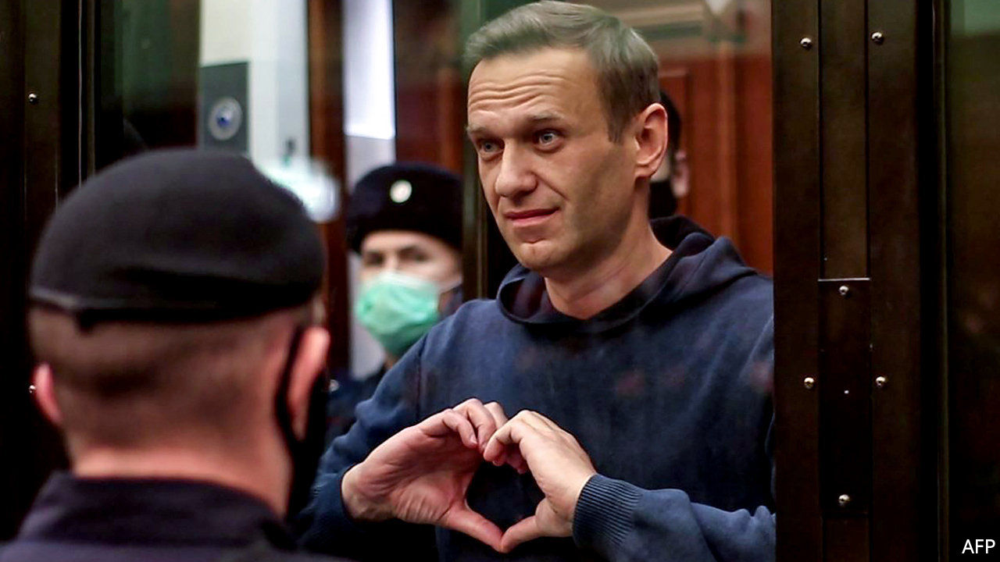

###### Sympathy for the devil

# The Kremlin’s criticism of Alexi Navalny is making him more popular 

##### These days the old Soviet methods are liable to backfire 

 

> Feb 20th 2021 


FIRST THEY ignored him. Then they smeared his underpants with Novichok, a nerve agent. When he survived that, they jailed him. And now they are trying to demonise him. After years of refusing to utter his name in public for fear of making him seem important, the Kremlin is levelling its most intense propaganda at Alexei Navalny, Russia’s main opposition leader. He is the subject of every prime-time news programme and talk show—and they are not being polite.


The scale and intensity of this propaganda assault are reminiscent of campaigns waged by Stalin’s henchmen in the 1930s against “enemies of the people” and, more recently, are comparable to the Kremlin’s information war against Ukraine in 2014. The narrative is tried and tested. As usual, it consists of two parts.


The first is to portray Mr Navalny as a Nazi who belittles Russia’s victory in the second world war. Since most Russians are proud of this victory, and Mr Putin portrays the state he rules as the successor of the Soviet Union that won it, the implied message is that Mr Navalny is a threat to the Russian constitutional order itself. What such attacks lack in truth or logic they make up for in vehemence. Vladimir Solovyev, a Kremlin mouthpiece, likens Mr Navalny to Hitler, while adding that “Hitler was a very courageous man and did not dodge military service like this codpiece Führer.” 


To provide more material for its propaganda machine, the Kremlin has mounted a show trial. Mr Navalny is accused of defaming a second world war veteran, who had appeared in a propaganda video last year, promoting changes to the constitution that allow Mr Putin to rule Russia beyond 2024. The charge hinges on Mr Navalny having said that everyone who took part in that video was a traitor.


The second part of the Kremlin’s narrative is that Mr Navalny is working for foreign intelligence services. According to Mr Putin’s people, he is part of a Western plot to destabilise Russia and somehow destroy its national identity. As evidence, they cite the presence of foreign ambassadors at his trial, and his team’s pleas to America and the EU to place sanctions on Mr Putin’s cronies. A demand on February 17th from the European Court of Human Rights that Mr Navalny be released immediately will doubtless serve as grist to that mill.


Mr Navalny, who now faces a large fine and additional time in prison on top of his current sentence of nearly three years, has counter-attacked. He mocked the judge by asking her to recommend a recipe for pickling cucumbers, since it was pointless to discuss the law with her.


The Kremlin’s campaign betrays its nervousness about Mr Navalny. His influence is growing, as shown by the success of a video he released about a vast secret palace that was allegedly built for Mr Putin by his cronies. In a recent poll by the Levada Centre, an independent pollster, some 36% of Russians reported having watched the film or being familiar with its contents, and another 30% had heard of it.


Such viewing figures represent a four-fold increase over Mr Navalny’s previous YouTube audience and shatter the Kremlin’s monopoly on information. Unable to counter his presence on social media and the internet effectively, the Kremlin has deployed its indiscriminate television artillery. Although television reaches mainly older people, it sends a strong signal to bureaucrats and state employees across the vast country.


Gregory Asmolov, an expert on information warfare and the internet at King’s College London, says the purpose of the mudslinging is to sow hatred and division. “Television propaganda helps to delegitimise people who support Navalny, and turns them into outcasts and enemies of the state and the people,” he says. This in turn helps to justify further repression.


Yet, perversely, the Kremlin is also helping to boost Mr Navalny’s movement. It is acting so outrageously that it is making it harder for ordinary citizens to acquiesce. And it is making the opposition’s supporters angrier, the sort of anger Mr Navalny has long sought to stoke. Propaganda is a powerful tool for prolonging an autocrat’s power. But it can also act as an irritant, driving calls for action against him. ■

