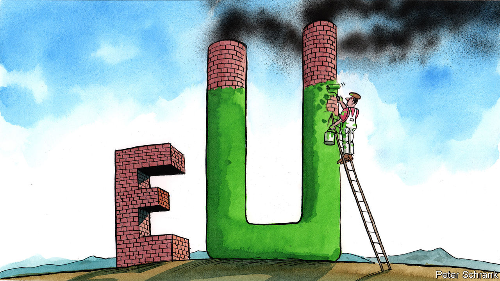

###### Charlemagne

# The rise of dirty politics in Europe 

##### A coming backlash to the green wave 

 

> Feb 20th 2021 


THE BOIS DE LA CAMBRE is the most handsome park in Brussels. Its 123 hectares offer mature forest and potential peace for the residents of the Belgian capital’s well-to-do southern suburbs. Naturally, the Belgians—among Europe’s biggest petrolheads—built a motorway through it. During the lockdown, the park was closed to traffic. Pedestrians were delighted. Drivers were furious, court cases came and a new front in the culture war was born.


Grumpy motorists are easy to find in Europe today. Head north to the Netherlands and they moan about speed limits. There, motorway traffic now crawls along at 100kph (62mph) after the government cut the daytime speed limit from 130kph to stop the country busting through its pollution limits. Mark Rutte, the country’s ever-flexible prime minister, declared the measure he had just introduced “rotten”. Over the border in Germany, the days of screaming down the autobahn at 200kph could be over, if the Greens end up in government and introduce a speed limit. Green politicians know it will cause a fight. “The speed limit is second amendment stuff,” says Daniel Freund, a Green MEP.


Car wars belie Europe’s reputation for eco-friendliness. Green parties are riding high in the polls and could return to power in Germany this year. Climate-denier cranks have been routed. Those who believe man has nothing to do with global warming are bracketed with folk who think the Moon landing was fake and Elvis is alive. Ambitious targets are set, and then made more stringent, as the EU positions itself as the class swot of environmentalism. A few years ago, reducing emissions to 40% below 1990 levels by 2030 was deemed enough. Now the demand is 55%. All EU countries have signed up to it, after persuasion and copious bribes via EU funding.


What must be done has been agreed on. The fight over how to do it is just beginning. Support for climate measures is broad but shallow, says Heather Grabbe of the Open Society European Policy Institute in Brussels, which polled eight European countries. Nearly all voters are happy to buy less plastic, though far fewer are keen to pay more for fuel or flights. And good intentions mask complacency. In each country a majority of voters expect life to continue broadly as normal, even if nothing is done by 2035. The size of the likely shift over the coming decades has not sunk in. Hard choices are yet to be made or a political price paid.


Already certain politicians of the right are jostling to provide voters with an easy way out. Policy platforms promising frequent flights, cheap petrol and a guilt-free carnivorous diet are appearing across fringe parties. Ahead of Dutch elections in March, the far-right Party for Freedom (PVV) promises to raise speed limits to 140kph. Populists have found their previous bread-and-butter issue, immigration, sinking from public consciousness as borders have been more or less closed. So now the likes of the Sweden Democrats, an anti-immigration party, and the similar Alternative for Germany are increasingly focusing on the environment. Most stop short of outright global-warming denial. Instead, they argue that too much is being done, too quickly, at too high a cost. “Nobody is against a green environment,” declares the PVV in its manifesto. Instead it opposes “pointless, unaffordable climate policy”. The PVV and its ilk are unlikely to get anywhere near office. Such parties achieve their aims, however, not by winning power but by dragging mainstream parties towards their positions. That is what happened with migration.


This makes it politically more dangerous for politicians to go green than at first glance. Get it wrong and punishment is swift. France provided an example of what not to do when, in 2018, it cut speed limits on country roads and raised taxes on fuel. The result was the gilets jaunes movement, which snowballed from a crowd of grumpy drivers into protesters waving mock guillotines in Paris. In Germany the Greens learned in 2013 that proposing to ban some things and charge more for others was not popular. In the land of sausage-munching drivers of gas-guzzling cars, the party proposed higher taxes on fuel and meat-free days in the cafeteria. Support plunged and the Greens are still trying to shrug off a reputation for being the party of prohibition.


Foot-dragging is already a problem, even before a proper backlash has begun. Germany agreed to phase out coal only by 2038, after dawdling from both the centre-left Social Democrats and the Christian Democratic Union, their centre-right coalition partners. The new CDU leader, Armin Laschet, is among the coal industry’s strongest supporters. The temptation to go even slower may grow as parties on the extremes offer voters an easy alternative. Pushing through environmental reforms in the wake of a catastrophic slump makes life even harder. Suppose the recovery is botched. Even if the real cause is miserly fiscal policy, voters may blame greenery for their woes. That could make reform harder to sustain.

Avoiding a car crash


When it comes to the environment, there will be losers. This is by design. Some behaviour—whether taking a third flight in a year, or zipping through a park in a Mercedes—must become inconvenient or expensive compared with greener options, because technology will not solve the problem fast enough. Some jobs will go. Politicians argue hopefully that if carbon taxes go up, then other taxes can go down; dirty jobs can be replaced by clean ones. But voters may feel they have heard all this before. A similar argument was put forward about globalisation. For years, voters were assured that it did not matter if jobs went abroad as new ones would replace them at home. The proceeds of extra growth would be shared. But the hoped-for redistribution disappointed. Some jobs were not replaced; some areas were left to rot. Politics went to pot. Voters are expected to accept this logic a second time and trust that governments will not betray them. If Europe’s leaders flunk it again, the consequences could be ugly. ■


For more coverage of climate change, register for The Climate Issue, our fortnightly , or visit our 

