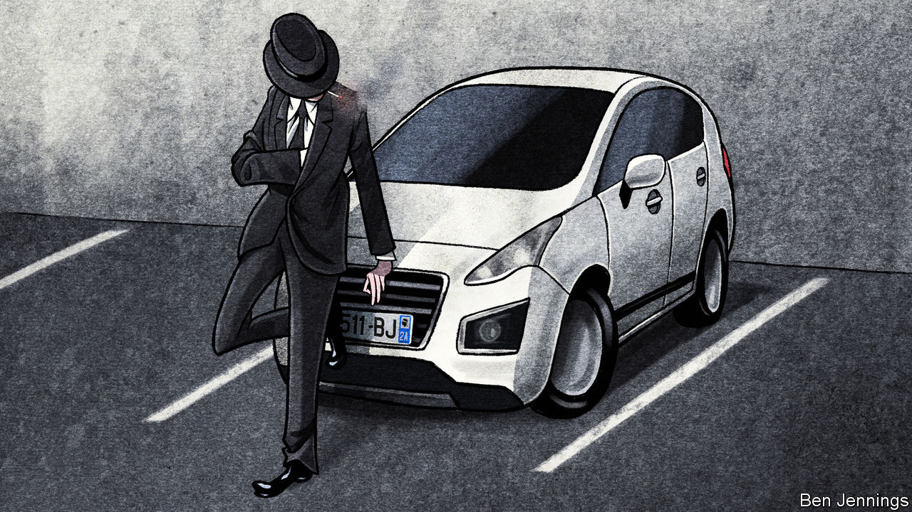

###### Protection plates

# Why Corsican number plates are popular 

##### Many French motorists associate the island with the mob 

 

> Feb 20th 2021 


JUST OVER a decade ago, France dropped a rule that had obliged motorists to change their car’s number plate each time they moved house to a new administrative département. The point was to ensure, in true bureaucratic style, that the vehicle’s plate matched the place of residence. Since 2009, however, car owners have been free to choose which département code they display, turning number plates into a test of sentimental attachment, with unexpected results.


The surprising favourite is Corsica, an island that is home to just 340,000 people. The 2A that represents one of the island’s two départements, along with its symbol of a bandanna-wrapped head, was the most sought-after plate, relative to the local population, over an eight-year period. Mountain regions were also popular. Paris did not get into the top ten.


This amour for Corsica, which became part of France in 1796 after a history of contested independence and conquest, may simply reflect the strong regional identity of the island’s diaspora. To display a 2A or 2B plaque is a badge of pride and belonging. Perhaps, suggest some, it is also a declaration of love for the “isle of beauty”, as it is known to French tourists, 2m of whom flock there in a normal year.


Or could it be that a Corsican number plate, consciously or not, is regarded as a form of implicit protection? The island has a history of violent nationalism, after all. The Corsican National Liberation Front waged a decades-long armed campaign for independence. No mainlander wants to attract too much attention there. Two decades ago Claude Erignac, the préfet, or central-government representative, was assassinated. Mob and clan rule on the island have a broad hold on the French imagination. Honoré de Balzac’s novel, “La Vendetta”, was about Corsican vengeance and family honour.


Even non-Corsicans in Paris are known to drive with Corsican plates. “They are convinced that their car won’t be damaged, and that they won’t be bothered on the roads,” suggests Benoit Ginet, founder of Eplaque.fr, an e-commerce number-plate business, which registered a disproportionate demand for those from the island in 2020. There may also be a form of superstition at work. “Motorists feel stronger with Corsican plates,” he suggests: “It’s a mark of serenity.” ■

