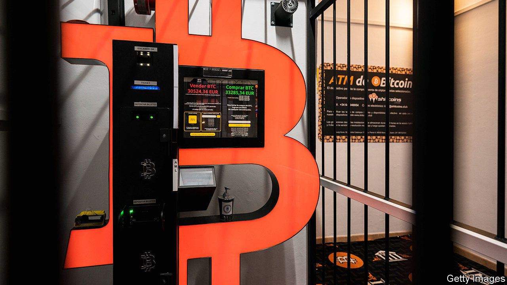

###### Token effort

# Bitcoin crosses $50,000 

##### But the real action on digital currencies is at central banks 

 

> Feb 20th 2021 


ANYONE WHO bought bitcoin a year ago must feel vindicated—and rich. The price of the cryptocurrency crossed $50,000 for the first time on February 16th, a five-fold increase over the past year. Wall Street grandees including BlackRock, Bank of New York Mellon and Morgan Stanley are mulling holding some for clients. Last week Tesla, an electric-car maker, said it had bought $1.5bn-worth of bitcoin and would accept it as payment for its cars.


Investors’ interest in bitcoin as an asset may be rising, but the inefficiencies and transaction costs associated with its use make it unlikely ever to be a viable currency. Here the action has been within central banks. As consumers have shifted away from using physical cash, and private companies—such as Facebook—have expressed an interest in launching their own tokens, many central banks have begun planning to issue their own digital currencies. The Bank for International Settlements, a club of central banks, last month said it expects one-fifth of the world’s population will have access to a central-bank digital currency (CBDC) by 2024.


China is the clear frontrunner. On February 17th it concluded the third big test of its digital currency, handing out 10m yuan ($1.5m) to 50,000 shoppers in Beijing. It has announced a joint venture with SWIFT, an interbank-messaging system used for cross-border payments. Sweden, another champion, has extended its pilot project.


The latest big central bank to get serious about a CBDC is the European Central Bank (ECB). Its public consultation, seeking views on the desirable features of CBDCs, concluded in January, garnering over 8,000 responses. Speaking to The Economist on February 10th, Christine Lagarde, its president, said she planned to seek approval from her colleagues to begin preparing for a digital euro. A decision is expected in April. Ms Lagarde hopes the currency will go live by 2025.


Much like other central banks, the ECB wants to offer consumers digital tender that is as safe as physical cash. Unlike bank deposits, a claim on central-bank reserves carries no credit risk. Digital-currency transactions could be settled instantly on the central bank’s ledger, rather than using the pipes of card networks and banks. That could provide a back-up system in the event that outages or cyber-attacks cause private payment channels to fail.


The bank also sees a digital currency as a potential tool to bolster the international role of the euro, which makes up just 20% of central-bank reserves globally, versus the dollar’s 60%. It could let foreigners settle cross-border transactions directly in central-bank money, which would be faster, cheaper and safer than directing them through a web of “correspondent” banks. That could make the digital euro attractive to businesses and investors.


Its main draw may be to offer a level of privacy that neither America nor China can promise, says Dave Birch, a fintech expert. The former uses its financial system to enforce sanctions; the latter seeks control. But getting the design right will be tricky: the European Union still wants to be able to track cash that is being laundered or hidden to dodge taxes. One fix could be to let users open e-wallets only once they have been vetted by banks, but for the use of the digital currency itself to be unmonitored.


A wildly successful digital euro could siphon deposits away from banks and threaten the availability of credit. Remedies being considered include capping the amount of currency users can hold or—as Fabio Panetta, a member of the ECB’s executive board, suggested on February 10th—charging penalties on use above a threshold. A digital euro could also involve “huge legal reform”, says Huw van Steenis of UBS, a bank. “Settlement finality”—which governs when a payment completes and cannot be reversed—varies across the euro zone’s 19 countries, and would need to be harmonised. Launching a CBDC will take more than token efforts. ■


