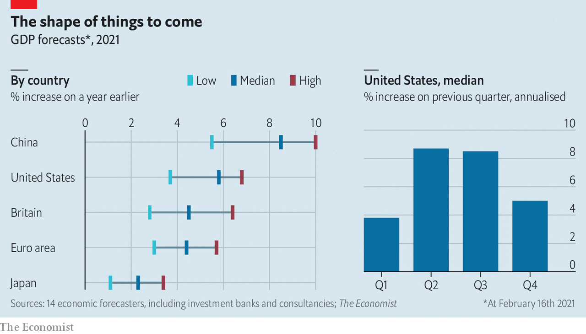

###### The shape of things to come

# Economic forecasters are pencilling in heady growth rates 

##### America is expected to grow at its fastest pace since 1984 

 

> Feb 20th 2021 

 


ECONOMIC FORECASTERS are pencilling in heady growth rates for the world’s big economies this year. GDP in America is expected to expand by close to 6% in 2021, the fastest pace since 1984. Growth is expected to be most rapid in the second and third quarters of the year, as vaccinations boost activity and fiscal stimulus takes effect. By contrast the bounce-back in the euro area and Britain is expected to be more modest this year. That reflects a delayed recovery: with economies still locked down, output is expected to contract in the first quarter. ■

