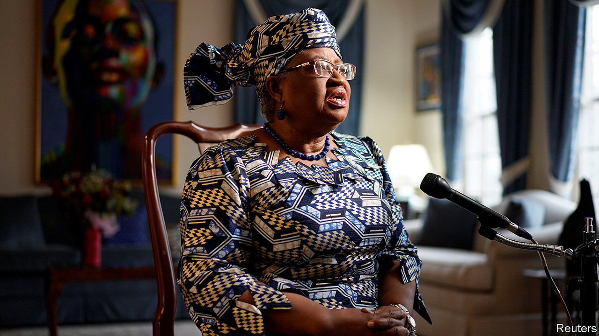

###### In search of a cure

# The WTO has a new chief. Is it time for new trade rules too? 

##### Ngozi Okonjo-Iweala is not alone in thinking the WTO could do more 

 

> Feb 20th 2021 


FIXING THE World Trade Organisation (WTO) is not enough for Ngozi Okonjo-Iweala, the first woman and first African to lead it. On February 15th, the day she was appointed as director-general, she announced that she wanted to help bring an end to the pandemic, too. The two are related; she hopes to encourage members to lift export restrictions on food and medical products, and even stimulate vaccine production. The former Nigerian finance minister and chairwoman of GAVI, a vaccine-finance agency, is not alone in thinking the WTO could do more.


When the pandemic first struck the WTO seemed largely irrelevant. That was partly by design: it permits trade restrictions if they protect health. Global Trade Alert (GTA), a watchdog, recorded 202 export restrictions on medical supplies and personal-protective equipment between January and September 2020. Members’ failure to alert the WTO of their actions was more egregious. Bernard Hoekman of the European University Institute calculated that over a similar period GTA recorded more than twice the number of trade measures reported to the WTO.


Now some are asking whether the WTO should do more to discourage trade restrictions. Members including Singapore and New Zealand have sought to limit export controls and lower import barriers for pandemic-related products. On paper the proposal offers gains for everyone: companies in producing countries would access bigger markets, and consuming countries would achieve greater security of supply. But the idea has not caught on among exporters, perhaps because they know that they would struggle to keep up their side of the bargain when crisis hits. Ms Okonjo-Iweala is keen to beef up the WTO’s monitoring efforts, which should be easier.


Another complaint has been that the WTO’s intellectual-property rules are too rigid, and protect pandemic profiteers over the poor. Médecins Sans Frontières, a charity, has pointed to Italian producers of 3D-printed ventilator valves threatened with patent-infringement lawsuits, or South African producers struggling to access raw materials for covid-19 tests. In emergencies the agreement on Trade Related Aspects of Intellectual-Property Rights (TRIPS) allows governments to issue “compulsory” licences to make health-related products without the permission of the patent holder. So far, though, none has.


In October South Africa and India therefore proposed to suspend TRIPS rules relating to copyright, industrial designs, patents and trade secrets, until most of the world’s population is immune. James Love of Knowledge Ecology International, a think-tank, says the waiver could help overcome the often intense pressure from rich-country governments on poorer ones not to use flexibilities written into the rules. Patent holders, of course, claim such waivers hurt their incentive to invest. (Whereas under a compulsory licence buyers would have to pay some royalty, under the proposed waiver they would not.)


The truth is that the waiver itself might not do much to expand vaccine production. Without companies facilitating the transfer of technology it would have “roughly zero net effect”, says Rachel Silverman of the Centre for Global Development, another think-tank. And today’s supply constraints reflect manufacturing bottlenecks rather than patent protection. As for other products, Bryan Mercurio of the Chinese University of Hong Kong says that if governments have not issued compulsory licences, often the problem is not with the existing trade rules but with their own domestic lawmaking.


In any case, the proposal has not gained much support among other WTO members and Ms Okonjo-Iweala does not seem to be advocating for it. On February 15th she pointed to existing TRIPS flexibilities, and warned about the risks of putting off investment in vaccines to combat the variants of covid-19. Ms Okonjo-Iweala wants to set up a longer-term framework for responding to pandemics instead. The question is whether it can look different to the one already in place. ■

