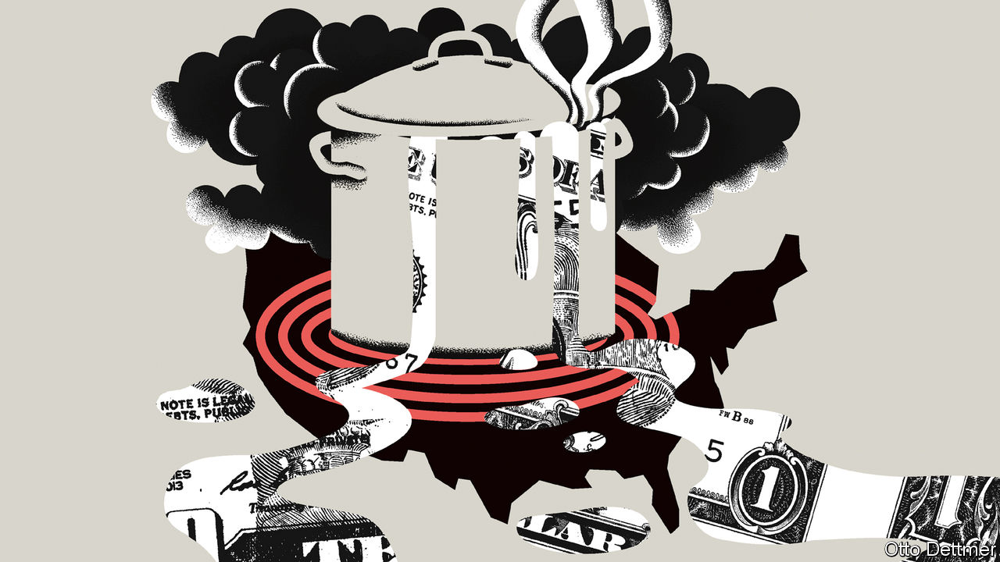

###### Free exchange

# What a hot American economy means for the rest of the world 

##### Trading partners will benefit. But the real uncertainty comes from the Fed 

 

> Feb 20th 2021 


WHEN AMERICA sneezes, the rest of the world catches a cold. But what happens when it runs a fever? After a trying 2020 in which GDP fell by 3.5%, America is poised to enjoy a robust rebound in 2021 simply by returning to something like normal as vaccination proceeds. Yet it might manage more than just that. If President Joe Biden’s covid-19 relief bill is enacted, total stimulus this year may exceed $2.5trn. That could easily push output above what the Congressional Budget Office estimates to be its “potential” level: that is, the amount the economy can produce without an increase in inflationary pressure. This possibility has some American economists on the lookout for signs of accelerating growth in prices and wages. America does not operate in a vacuum, however; should overheating occur, its effects will not be confined within its borders. Depending on how the recovery plays out, a hot American economy could be a boon for the rest of the world—or yet another source of concern.


In a closed economy that does not trade with the rest of the world, too little spending leads to job losses and downward pressure on prices, whereas too much should push up employment and, eventually, prices. In an open economy, however, some of the effects of the shifts in demand spill over to the rest of the world. A sharp drop in spending, for instance, may be associated with plunging demand for imports, in which case some of the pain of a slump is exported abroad. During the global financial crisis of 2007-09, troubles in financial markets wreaked havoc all over the world, but even countries relatively insulated from those woes felt a chill thanks to trade links with America and Europe. According to one estimate, about a quarter of the drop in American demand and a fifth of the fall in European demand was borne by other economies, and transmitted through trade.


A boost to demand ought to work in a similar way, but in the other direction. As Americans spend more, some of it leaks abroad: through purchases of foreign goods, for example, or spending on services—including tourism, which should begin to rebound as pandemic restrictions are lifted. An analysis of fiscal-policy spillovers published by the IMF in 2017 found that an American stimulus consisting mostly of spending (as opposed to tax cuts) and worth 1% of GDP raises the output of the average country by 0.33% in the first year. Countries with closer trade ties experience bigger effects; the fillip to Canada’s economy is estimated to be almost three times the average, for example. If the combination of reopening and stimulus invigorates the American consumer, the effects could quickly be felt all over the world. 


The degree to which it is felt, however, depends crucially on the policy response, both at home and abroad. Fiscal spillovers are more powerful when recipient countries are themselves operating below potential. American spending is thus more likely to spill over to the rest of the world if its recovery is much stronger than those of its trading partners. Ordinarily, spillovers provide a strong incentive for governments to co-ordinate their stimulus efforts—lest some tight-fisted economies (eg, those in Europe) free ride on the largesse leaking from more generous ones. Indeed, on February 12th Janet Yellen, America’s treasury secretary, urged her counterparts in the G7 group of countries to “go big” on stimulus, too. Countries that free ride could find themselves in hot water with Ms Yellen: the Biden administration has promised to be stern with countries that run large, persistent trade surpluses.


But if America does come close to overheating, then a reluctance to spend elsewhere may be less irksome than usual, as demand-starved countries serve as a release valve for the pressure building up at home. Growth in global trade seems to have enhanced its pressure-relieving capabilities, according to work by Jane Ihrig, Steven Kamin, Deborah Lindner and Jaime Marquez of the Federal Reserve. They reckon that the expansion in trade has served to weaken the link between changes in domestic demand and corresponding shifts in total output, with net exports bearing more of the burden of adjustment to changes in domestic spending. In the late 1990s, for instance, measures of domestic demand grew even faster than real GDP (which was itself growing at a rapid clip). Inflation remained relatively subdued, however, in part because America’s current account deficit swelled. Similarly, a surge in imports this year might dissipate potential inflationary pressures in America while giving a lift to its weaker trade partners.

Built to spillover


The biggest uncertainty about the global effects of a hot American economy is the reaction of the Fed. Recent work by Kristin Forbes of the Massachusetts Institute of Technology suggests that domestic inflation has become more responsive over time to global factors—including the amount of economic slack across the global economy as a whole. Yet wage inflation still seems to respond mostly to domestic conditions. The Fed might therefore shrug off price rises later this year, reckoning that short-run price pressures will not translate into sustained inflation until America’s job market, and the world economy, is fully recovered. A doveish Fed should make for a weaker dollar and easier financial conditions worldwide, adding to the boost that comes from Americans buying more goods from abroad.


But a really rip-roaring economy could test the Fed’s patience, particularly if a yawning current account deficit and soaring asset prices cause it to worry about a build-up of financial risk. The spectre of American interest-rate hikes could frighten global markets, and force emerging economies to adopt less stimulative fiscal and monetary policies. A bit of demand spilling over from America would seem insignificant in comparison. That the Fed will suddenly turn hawkish still seems unlikely. But if America’s temperature runs high enough, the rest of the world may break out in cold sweats. ■

