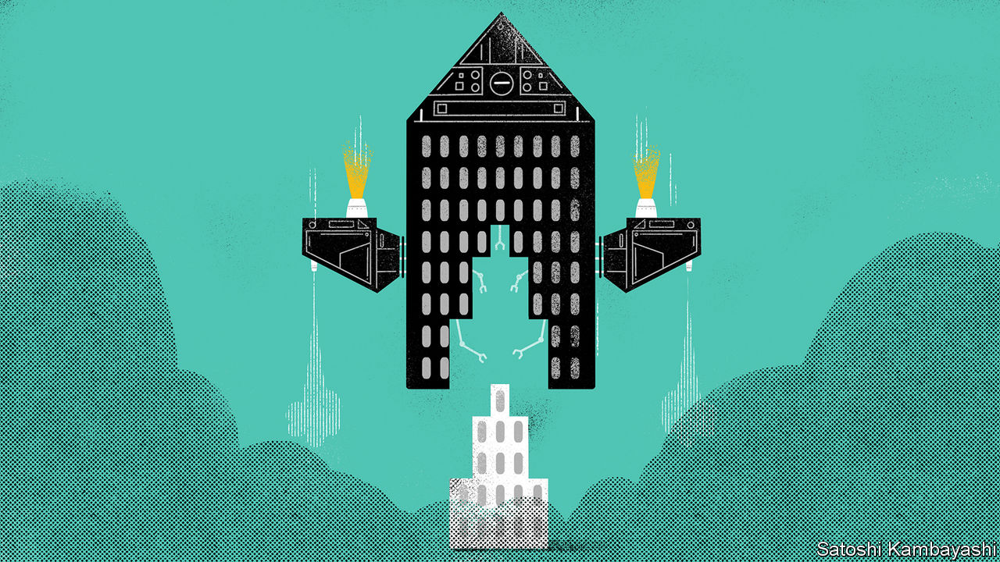
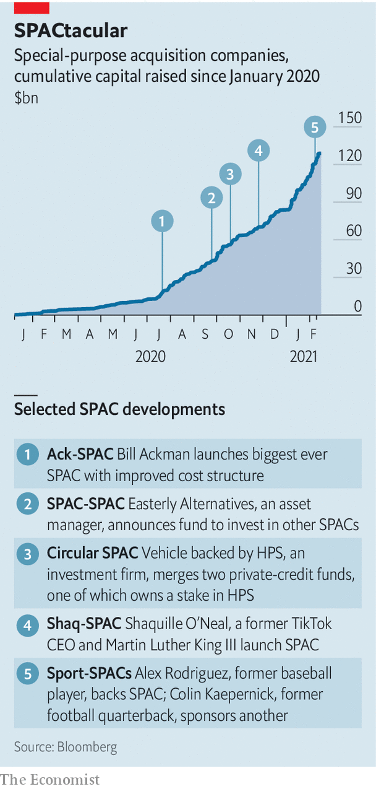

###### SPAC invasion

# Why SPACs are Wall Street’s latest craze 

##### Blank-cheque firms appeal to everyone, from sophisticated financiers to sportsmen 

 

> Feb 16th 2021 


WHAT LINKS Martin Luther King III, the son of the civil-rights leader; Shaquille O’Neal, a former basketball player; and Kevin Mayer, the former boss of TikTok? The unlikely trio sponsors a special-purpose acquisition company (SPAC), a listed pot of capital that seeks a firm to take public through a merger. Mr O’Neal is not the only sportsman turned SPACman. Colin Kaepernick, the former quarterback famous for kneeling during America’s national anthem to protest against racism, has teamed up with a private-equity firm to launch a “socially conscious” SPAC. Alex Rodriguez, a former baseball player, plans to raise up to $575m for a SPAC targeting sports-related firms.


Financiers are in on the action, too. Bill Ackman, the boss of Pershing Square, a hedge fund, launched a SPAC that raised $4bn in July, making it the biggest to date. Gary Cohn, a former Goldman Sachs banker and adviser to President Donald Trump, has one too. So do a number of private-equity giants, including Apollo, Ares, Bain, KKR and TPG.


Around 250 SPACs were launched last year in America, raising $83bn. Things have only sped up since: in January an average of five were created each working day, amassing more than $26bn in capital. Because they tend to raise more cash once they find an acquisition target—around five times that in the initially listed pot—SPACs may be looking to buy firms worth as much as $500bn, about 1% of the value of all listed American companies. Look beyond the frenetic growth and you find a spectrum of SPACs, ranging from the earnest to the exuberant.


The life of a SPAC tends to last at most two years. It begins with the sponsor taking the blank-cheque firm public. Investors typically pay $10 a share and also receive warrants, which give them the right to buy more shares at a later date. The sponsor then searches for an acquisition target that is looking to raise capital and go public. Once it is found, shareholders vote on the merger; often new investors are brought in to provide more capital. When the deal is done the sponsor receives a slice of the merged firm’s equity and typically a seat on the company’s board. The pot of capital is now cash to be used by the newly public firm.

 


Proponents say SPACs are cheaper than conventional initial public offerings (IPOs), but they still incur underwriting fees, and the sponsor’s share of the proceeds dilutes other shareholders. The path to going public can be shorter and less uncertain than an IPO, though. A firm merging with a SPAC knows exactly how much capital it will raise.


Though SPACs have been around as a financing vehicle for almost two decades, they were regarded warily for much of that time—as a route to be used only by firms shunned by sharp-suited investment bankers. The latest mania can be traced to a serendipitous deal struck in 2019 by Chamath Palihapitiya, a venture capitalist turned boss of a SPAC, and Sir Richard Branson, a billionaire businessman.


Mr Palihapitiya’s SPAC had raised $674m, wooing investors with promises of disrupting the IPO scene. Sir Richard had sought funding for Virgin Galactic, a space-venture company, from Saudi Arabia’s sovereign-wealth fund. But after Jamal Khashoggi, a journalist, was killed in a Saudi consulate in Turkey, Sir Richard suspended the plan. A year later Virgin Galactic merged with the SPAC. It received the $674m pot, and another $100m in investment from Mr Palihapitiya, and went public at a valuation of $2.2bn. Its market capitalisation is now $12bn. 


That success set off the trend. Today SPACs range from the tiddlers, with less than $50m in capital, to the titans, such as Mr Ackman’s $4bn SPAC. (The median SPAC raises $240m at the initial stage.) Some issue vast quantities of warrants and hand sponsors fat slices of firms; others are leaner. Some have target industries in mind; others are ambivalent. High-profile deals tend to spawn mini-trends. After Virgin Galactic went public several space deals took off; when Nikola, an electric-truck maker, merged with a SPAC, interest in electric-vehicle deals picked up; the enthusiasm for sports-SPACs follows the listing of DraftKings, a sports-betting platform, in April.


Their sudden popularity and the sheer variety of their size, scope and structure raise the question of which SPACs are sensible and which show signs of mania. A financier in charge of a big investment bank’s SPAC business sees a clear bifurcation. There are plenty of good SPACs with excellent management teams that can help turn mediocre companies into good ones. But the rest, perhaps a third to two-thirds, “don’t know the first thing about the businesses they are dealing with”.


That seems to be confirmed by a recent study by Michael Klausner and Emily Ruan of Stanford University and Michael Ohlrogge of New York University. The authors look at blank-cheque firms that made acquisitions between January 2019 and June 2020. They find that, in 25% of cases, the sponsor’s payout exceeded 12% of post-merger equity, compared with a median stake of 7.7%.


They also conclude that some SPACs deliver far worse returns for investors than others: companies that went public through the SPAC route fell in value by an average of 3% after three months, 12% after six months and by a third after 12 months. They lagged behind the wider market and even further behind an index of firms that listed via IPO.


However, about half the sample is made up of “high-quality” SPACs, defined as those run by former Fortune 500 bosses or set up by large private-equity firms. These perform much better, outperforming IPOs and the wider market over six months (though not over 12).


How might the craze play out? About three-quarters of SPACs launched last year are yet to do a deal. One scenario worth considering is that bumper issuance leaves many SPACs unable to find suitable targets. Investors can redeem their shares at cost until a target is bought (the proceeds from the SPAC’s IPO are kept in an escrow account in the meantime). The burden of failure—the SPAC’s set-up and search expenses—would therefore probably fall on sponsors. In order to avoid this, many might take any willing firm public. Voting and redemption mechanisms guard investors against dodgy deals, though they have not prevented investors from losing money so far.


Investors’ willingness to accept poor returns may wane as they become more familiar with SPACs. They certainly grasp that those like Mr Ackman’s, which will issue him 6.7% of the shares in the merged firm only once investors earn a 20% return, are more sensibly structured, valuing it more handsomely than the rest. (Its share prices are trading at 50% above their IPO level.) But they also still want to take a punt on Nikola and other electric-vehicle copycats, in the hope of finding the next Tesla. Seen this way, the mania around SPACs is simply an expression of wider exuberance. ■

