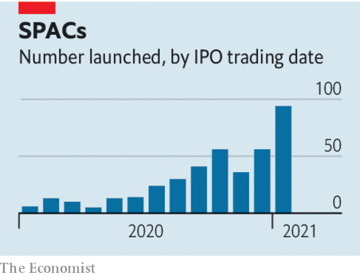

###### SPACS v IPOs

# The Spactacular boom on Wall Street 

##### Are SPACs a useful innovation, a mania, or both? 

 

> Feb 20th 2021 


IT IS EASY to mock SPACs. For decades these “special purpose acquisition vehicles”, publicly listed pots of capital raised by investors who seek out private firms to merge with, have ushered a small number of flaky and irrelevant companies onto public markets. The present SPAC boom on Wall Street began last year and, true to form, features celebrities-on-the-make, failed bosses looking for redemption and credulous investors keeping their eyes wide shut. Yet it is undeniable that something more serious is also now taking place. The amount of money raised by SPACs in the past 12 months has soared to over $120bn, according to Bloomberg. In a few weeks this year as much has been raised as in the first half of 2020. The boom is spreading to Europe, and Amsterdam is racing ahead of London as a favoured venue (see ). Serious companies are getting involved, too. Two of Asia’s leading digital firms, Gojek and Tokopedia, are said to be considering using a SPAC to list in New York, which would be an alternative to a conventional initial public offering (IPO).


In an IPO a firm hires bankers who help it sell shares at an agreed price to mainly institutional investors in an elaborate process set out by regulators. The SPAC approach turns that on its head. A group of investors float a shell company, giving it a pot of cash. It then hunts for an unlisted target firm and offers to merge with it, raising a second round of cash from investors as it does so. If you are a firm that wants to go public, a marriage with a SPAC is relatively quick and certain.


The SPAC boom partly reflects a rebellion among Silicon Valley types, who have long grumbled about having to go through an IPO. Banks charge fees of 5-7% of the capital raised. Bankers manage the IPO price, and stand accused of setting it artificially low in order to give a “pop” to the pals they deal with routinely in the public markets at the expense of founders and early backers. For over a decade many exciting firms have stayed sheltered in private markets, an option afforded them by well-funded venture-capital investors like Son Masayoshi of SoftBank. As a result, the value of cash raised by IPOs as a share of America’s overall stockmarket value had been in decline for years.

 


However, the pent-up demand to go public is being unleashed at last. As well as SPACs, some firms are trying a third technique to go public called a direct listing. Founders and employees sell shares on an exchange for whatever investors are willing to pay—an option made possible by high-frequency traders, like Citadel Securities, who helped Slack and Spotify, two tech stars, to debut in this way.


There are two big dangers. One is that the SPAC boom becomes a bubble. Financial markets show many other signs of froth, including the recent GameStop retail-investor frenzy and the surge in Bitcoin’s price. If interest rates were to rise suddenly as a result of inflation (see ), and the music were to stop in markets, the SPAC boom might end abruptly. That is unlikely to pose a risk to the financial system, but some firms would be left stranded at the altar. And SPAC investors might be clobbered.


The second danger lies within SPACs’ design, which can range from being efficient to being a rip-off. The typical SPAC creator receives “promote” shares—the median stake is 8% of the post-merger equity—for a trivial cost, meaning they make decent returns even if the merged firm’s shares sink after it goes public. Warrants (the right to buy shares at a given price in the future) are given to early backers as an incentive, and can also dilute the returns of outside shareholders. The presence of a cohort of badly designed SPACs is one reason why, on average, SPACs have underperformed both firms that debut via IPO, and the broader market.


Fixing these problems will require investors to be vigilant. They should demand that SPAC creators forgo their fat promote shares in favour of shares or warrants that pay out only once other investors have seen returns. The incentives doled out to early backers should be trimmed, and restricted to those who are prepared to hold on to their shares long after a target has been acquired. These changes would both improve the long-term returns for investors and also discourage more dubious ventures from being set up. Some SPACs, such as the one launched by Bill Ackman, a hedge-fund manager, have already adopted more sensible terms.


The SPAC boom has a whiff of the bubble about it—and some projects will end in tears. But with the right design, SPACs can become a familiar and useful device for investors. They give firms more options for going public and will encourage regulators and bankers to improve the IPO process. Rational risk-taking by investors, capital-raising by exciting firms and the expansion of public markets are all things that should be welcomed. Even if some SPACs crash and burn, the idea behind them is a buy.■

