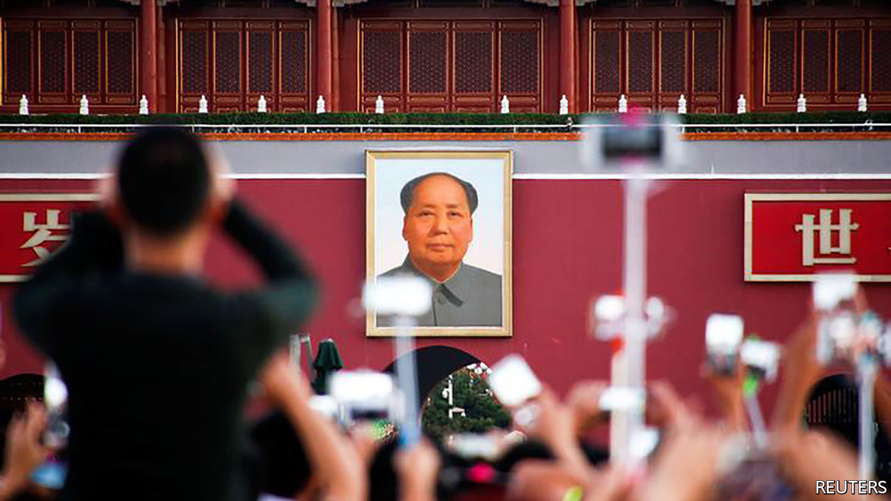
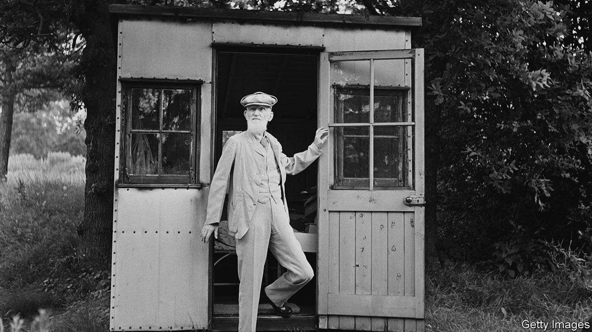

###### On nuclear weapons, J.B. Priestley, China, covid-19, protests, Moore’s law, sheds

# Letters to the editor 

##### A selection of correspondence 

 

> Feb 20th 2021 


Disarming features


The dangers of nuclear proliferation and confrontation cannot be understated (“”, January 30th). However, the Treaty on the Prohibition of Nuclear Weapons represents much more than a means of channelling “the frustration among nuclear have-nots.” It may not magically eliminate the world’s nuclear arsenal, but it does set a moral and legal starting point for long-term efforts towards disarmament, which nuclear powers have an obligation and special responsibility to take up.


The treaty outlaws the use, development, production, testing and stockpiling of nuclear weapons, formalises a strongly held taboo against their use and fills a legal gap. It provides a further disincentive against proliferation.


Given that the ultimate goal is to ensure that a nuclear detonation never takes place again, perhaps the treaty’s most obvious effect is the further stigmatisation of nuclear weapons. This makes it less probable that one will be detonated in the future.


ROBERT MARDINI

Director-general

International Committee of the Red Cross

Geneva


You noted that Japan’s development of reprocessing will bring it closer to a nuclear-weapons capability. The situation is significantly worse than you describe. In fact, France has reprocessed 47 tonnes of Japanese reactor plutonium, separating out weapons-usable plutonium and returning 11 tonnes of it to Japan. It now has enough plutonium to produce well above 1,000 nuclear weapons.


To say that Japan is a latent nuclear power is perhaps an understatement. It is months, not years, from a weapon should it choose to build one. The stockpiling of commercially produced plutonium is a serious proliferation problem.


BRUCE GOODWIN

Pleasanton, California


* Tom Lehrer had the last, best, and the most frightening, word: We’ll try to stay serene and calm, When Alabama gets the bomb!


AVINASH DIXIT

Princeton, New Jersey

 


Priestley’s prejudice


presented an idyllic view of J.B. Priestley’s “English Journey” (January 23rd). A closer reading proffers a darker side to this “hero” of left-wing politics, in his description of the Irish in Liverpool:


This message was not too dissimilar to that spewed by Enoch Powell some 30 years later, and Donald Trump much too recently.


A.D. PELLEGRINI

Bloomington, Minnesota

 


Chinese friends


I enjoyed your  on Chinese youth (January 23rd). I lecture in English to Chinese undergraduates at Cambridge and across China. Their desire to learn about our culture is so impressive. It stands in stark contrast to the lack of interest in China by the West’s young. In 2020 there were very few undergraduates studying Chinese at Cambridge University; there were more reading Anglo-Saxon. Youngsters must be encouraged to learn about China. Appreciation of its rich culture and the formation of friendships should not be inhibited by our political differences with its leadership.


NICHOLAS CHRIMES

Guest professor

Guangzhou University

 


Covid comparisons


One thesis of your article comparing California to Texas in the pandemic is that there is less difference than one might expect, despite their divergent strategies (“”, February 6th). Texas had 127 deaths per 100,000 people compared with 104 in California. That is a difference of one-fifth, quite significant given that the economic impacts of both strategies are similar. If two firms achieved that difference in profit in the same market we’d laud one over the other. If they swapped death rates it would amount to thousands of fewer deaths in Texas and thousands more deaths in California.


The pandemic perhaps reaffirms Stalin’s maxim that one death is a tragedy, a million deaths a statistic.


AARON MCKENNA

Dublin

 


Intense minorities


“” (January 23rd) mentioned that only 23% of the Russian public think political protests are possible, making a revolution unlikely. However, Erica Chenoweth, a political scientist at Harvard, has demonstrated that it takes only 3.5% of a population to protest to bring about change. The possibility of a Navalnyan revolution should not yet be written off in Russia. Revolutions are always impossible, until they are inevitable.


VIKTOR SUNDMAN

Stockholm


The extraordinary efforts of despots to prevent their citizens from voting “for the wrong people” (“”, February 6th), calls to mind a question posed by Bertolt Brecht after the East German uprising against Soviet rule: “Would it not in that case be simpler, for the government to dissolve the people and elect another?”


AUGUSTUS HANEY

New York

 


Moore’s law for lasers


The  on understanding light was excellent (January 9th). I agree with your assertion that there “is no grand sweep to laser development akin to Moore’s law for chips…different types of laser improve according to different measures and at different rates.” However, the fundamental economics of semiconductor lasers have indeed been improving at a rate similar to Moore’s law. Just as integrated circuits empowered a broad range of applications that improved at different rates, high-power semiconductor lasers have been getting better at an extraordinarily rapid rate (similar to Moore’s law) and are similarly enabling other solid-state lasers in a wide range of applications.


As Paul Romer argues, “We consistently fail to grasp how many ideas remain to be discovered…possibilities do not merely add up; they multiply.”


SCOTT KEENEY

Vancouver, Washington

 


A knack for shacks


Regarding the “” (January 23rd) as more people work from home, my former hen house on our property in rural Ontario has been transformed into my Zen house, with recycled windows and scrap lumber. From its picture window I can spy on an immature bald eagle in a distant tree-top, I can read my international weekly news magazine and write in my notebook, enjoy the peace and luxury of device-free surroundings in a bug-free space and think non-covid thoughts.


JANE DE JONG

Chatsworth, Canada


George Bernard Shaw’s garden shed, shown in a photograph in your article, was named “London”. This meant that when someone came to his home, his housekeeper would be able truthfully to say, “Sorry, he’s not here; he’s in London,” ensuring greater peace and quiet for his writing.


WILLIAM NEWSOM

Weston Bampfylde, Somerset


* Letters appear online only

