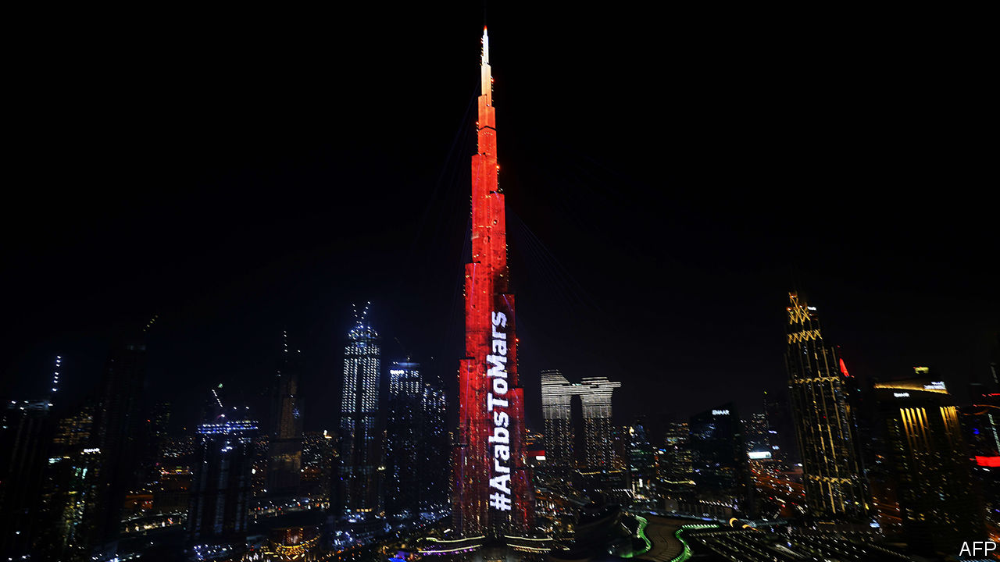

###### Hope and despair

# An Emirati probe journeys into outer space 

##### While an Emirati princess cannot leave her villa 

 

> Feb 20th 2021 


IT CERTAINLY looks like a video made by a hostage: a nervous close-up filmed in a dark room. On February 16th the BBC broadcast smuggled messages from Sheikha Latifa, a daughter of Dubai’s billionaire ruler, Mohammed bin Rashid al-Maktoum. The princess has twice tried to flee the emirate, accusing her father of abuse. He denies the allegations. Her second escape, in 2018, ended with her being seized off a yacht in the Indian Ocean. Now she alleges she is being held under house arrest, in what she terms “solitary confinement” without medical care. The UN’s top human-rights body said it would raise her case with the United Arab Emirates (UAE), of which Dubai is part.


The tapes overshadowed what was supposed to be a triumphant moment for the UAE. On February 9th a probe called Hope finished its seven-month journey of 493m km (306m miles) to Mars. Its arrival in Martian orbit made the UAE’s space agency only the fifth to reach the red planet, and the first from the Arab world. After two months of course corrections and instrument calibrations it will begin to study Mars’s atmosphere, with the first batch of data due for release in September.


Dubai’s Burj Khalifa, the world’s tallest building, was lit up in red for the occasion (pictured). A popular image on social media showed the rulers of Abu Dhabi and Dubai, the UAE’s capital and its business hub, strolling hand in hand with Mars in the background and a space shuttle blasting off over their shoulders. The shuttle, of course, is a now-defunct bit of American engineering. The Hope probe was not a strictly Arab endeavour either. Under half of the 450-person team is Emirati, with most of the others drawn from American universities. It was assembled in Colorado and lofted into space aboard a Japanese rocket.


Science is often a team sport: American astronauts relied on Russian rockets to reach orbit after the shuttle was retired. And the Emiratis say they have learned new skills that will help build an indigenous space industry. “Five or ten years from now I’d like to see Emirati companies and Emirati engineers building components for space programmes, not only in the UAE but overseas,” says Omran Sharaf, the project manager for the Mars mission.


Even in scientific endeavours, though, politics are never far off. Signs on Dubai motorways that typically warn of collisions or fog instead proclaimed, in Arabic, “congratulations to the Arabs, the Hope probe reached Mars”. The UAE is hardly the first Arab country to try to export an ideology across the region. In the 20th century Egypt sought to spread Arab nationalism, and Saudi Arabia an austere strain of Islam. However, whereas they were natural leaders—one the most populous Arab country, the other the custodian of Islam’s holiest sites—the UAE has just 1m citizens and will mark its 50th birthday only in December.


The UAE posits itself as a post-ideological country, the sort that would make a national celebration of launching a spacecraft to propel science education. That is its own kind of ideology, one that resonates in less functional Arab states. In Lebanon, for example, some noted the contrast with their own country. Since the Hope probe began its journey, Beirut was devastated by a massive explosion and politicians have spent months bickering over cabinet posts in a bankrupt state. Other Arabs joked about modest infrastructure projects in their countries which have dragged on for far longer than six months.


Mr Sharaf describes the Mars mission as a challenge to other Arab states: “If the UAE can reach Mars in less than 50 years, then you can do more, given your history.” That is a compelling message. But the UAE also has room to improve, in the areas of human rights and liberty, as the saga of Sheikha Latifa shows.

