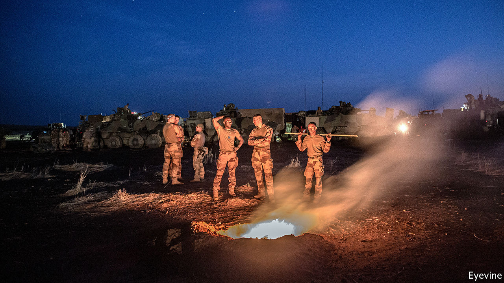
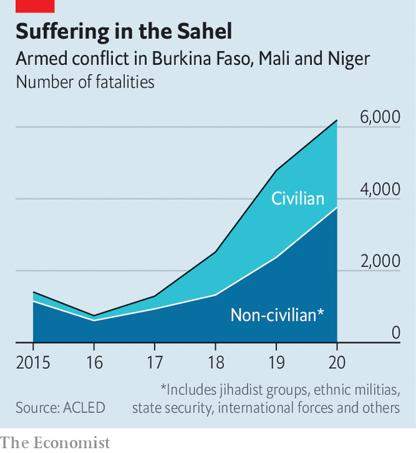

###### Which way out?

# France’s forever war in the Sahel 

##### With violence rife across the region, France has few good options to bring back the troops 

 

> Feb 17th 2021 


AT MIDDAY ON January 2nd the roar of motorbikes cut through the quiet near Tchoma Bangou and Zaroumadareye, two villages in western Niger. Next came the rat-tat-tat of gunfire. Then the screaming, as jihadists slaughtered at least 100 people.


That weekend in Bounti, in central Mali, men gathered to celebrate a wedding. As the smell of grilled mutton wafted into the air, two French jets swooped in, bombing the gathering and killing 19 people. The French government insists it was a jihadist meeting. Eyewitnesses disagree.


That grim weekend laid bare the conundrum of France’s military intervention (called Operation Barkhane) in Burkina Faso, Mali and Niger, three of Africa’s poorest countries. Last year conflict claimed some 6,200 lives, a 30% jump over 2019 (see chart). Fighting has forced almost two million people from their homes; 31m are in need of food. Outside military help is essential to shore up the region’s weak states, but it is excruciatingly hard to get right. French troops have been in the Sahel in force since 2013, when they stopped armed northern separatists and jihadists from sweeping towards Bamako, Mali’s capital. They have stayed to fight jihadists.

 


Last year France sent another 600 soldiers, taking its total to 5,100, in the hope of gaining the upper hand. It has also drafted in commandos from European allies. Thousands of UN blue helmets patrol Mali, while soldiers from the five countries in the region, known as the G5 Sahel, are also battling jihadists.


The French surge has had some successes. Last year French and allied forces killed scores of fighters, particularly those from Islamic State in the Greater Sahara (ISGS), as well as some of the jihadists’ leaders. Yet groups such as Jama’at Nasr al-Islam wal Muslimin (JNIM), which is linked to al-Qaeda, are proving to be resilient. Overall, says an American defence official, “we don’t see anything that is dramatically turning the tide in favour of governments.”


One reason may be that they have been too focused on military solutions. Even as French forces have proved able to “cut the grass” by killing jihadists, they have been unable to “stop jihadism from expanding”, argues Ibrahim Yahaya Ibrahim of the International Crisis Group, a Brussels-based NGO. The militants recruit most easily from neglected villages without schools and clinics. France and its partners are supporting development, too, but many of the projects have failed.

 


This leaves France with the challenge faced by others who have recently fought insurgencies in places such as Afghanistan and Iraq. It is that of trying to improve security—which is almost impossible to do without development—and also drive development—which cannot happen without better security. And France needs to show progress, or at least find an honourable way out, in case public support falters.


When Emmanuel Macron, France’s president, spoke with the leaders of five Sahelian countries (including Chad and Mauritania) on February 16th, he warned them of “significant changes” to France’s presence in the region, though he also said that these would not happen immediately. For the first time a poll has shown that a small majority of people in France opposes the intervention in the Sahel. Mr Macron, who faces a presidential election next year, may also have had an eye on anti-France protests in the region.


Yet governments in the Sahel want French troops to stay because they have little hope of holding back the jihadists without them. Regional forces have improved markedly, thanks in part to Western training. In 2019 jihadists attacking a barracks in Boulikessi in Mali killed at least 40 soldiers. Two weeks ago jihadists attacked the same barracks. This time Malian troops repelled them for the loss of six of their own.


Even so, Mali’s army remains weak. Aly Tounkara of the Centre for Security and Strategic Studies in the Sahel, a think-tank in Bamako, reckons that it could take another ten years before they are ready to replace the French. Local forces also have an appalling human-rights record. Last year more civilians were killed by security forces than by jihadists, reckons José Luengo-Cabrera of the OECD, a rich-country think-tank. Such abuses drive angry young men into the arms of extremist recruiters.


Politicians such as Mali’s interim prime minister, Moctar Ouane, or Burkina Faso’s prime minister, Christophe Dabiré, are pushing for another approach: negotiating with the enemy. Talks are not on the cards with the most bloodthirsty outfits, such as ISGS, the group blamed for the slaughter on January 2nd. But back-channel communications are already open with JNIM thanks to a prisoner swap last year. In central Mali three local peace agreements were recently signed between rival ethnic groups. Few believe that could have happened without jihadist involvement.


In Burkina Faso the government has already negotiated with JNIM in some places, says Héni Nsaibia of Menastream, a consultancy. One example of a deal may be Djibo, a city in northern Burkina Faso. For months it was blockaded by jihadists. Then, almost overnight, buses and trucks began travelling freely.


Ferdaous Bouhlel of the University of Tours argues that, beneficial as local deals are, it is only national agreements that can stem widespread violence. Iyad Ag Ghali, JNIM’s leader, has said he is willing to talk to the Malian government, but only after French and UN forces have left. Whether this is a bottom line, or simply a negotiating ploy, is not clear.


Publicly France says it does not negotiate with terrorists. France’s foreign-intelligence chief, Bernard Émié, recently called jihadist leaders in the Sahel the “direct heirs to Osama bin Laden”. In private, however, some French officials admit that their opposition to Sahelian governments talking with some members of jihadist groups is not absolute. Even so, agreeing to talks is far easier than reaching a deal. The chances of failure are enormous. But after years of bloodshed many in the Sahel, if not quite in Paris, are willing to try. ■

