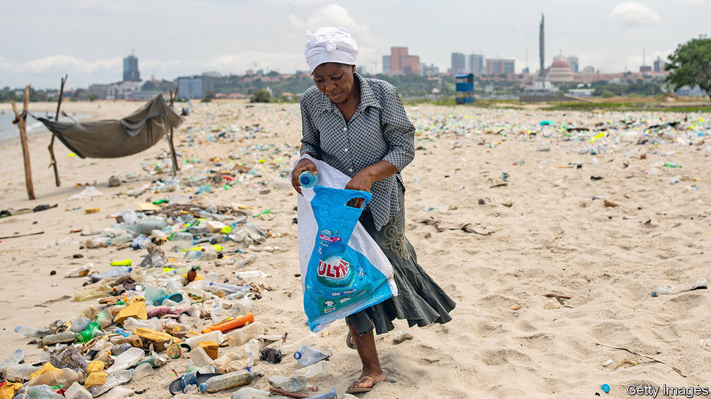
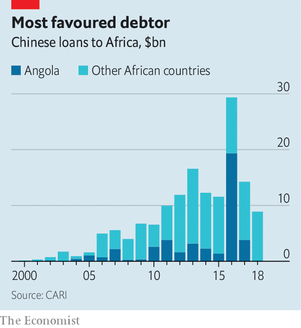

###### Oil, toil and spoils

# João Lourenço’s reforms in Angola are pleasing the IMF 

##### What about ordinary Angolans? 

 

> Feb 20th 2021 


JOSÉ EDUARDO DOS SANTOS ruled Angola for 38 years. During his presidency Angola fought an on-off civil war that ended in 2002, just as an oil boom was starting. As the price of black gold soared, Luanda, the capital, became one of the world’s most expensive cities, a place where developers imported palm trees from Miami and melons cost $100 each. Though most of the country lives on less than $2 per day, bigwigs in the ruling party, the MPLA, stashed billions of dollars abroad.


By the time João Lourenço took over in 2017, the oil boom was over. The former defence minister pledged to clean house and overhaul the economy. The Angolan leader can point to some successes. But prolonged hardship and public scepticism about his anti-graft efforts are raising doubts about his ability to reform one of sub-Saharan Africa’s largest economies.


How he fares will depend partly on Vera Daves de Sousa. At 37 she has been alive for less time than Mr dos Santos was president. The youngest finance minister in Africa—and one of just three women—took the role in October 2019, months before covid-19 hit the fragile economy.


Hers is a monumental task. Oil accounts for nearly all of Angola’s exports and two-thirds of government revenues. Low prices and declining production have brought a collapse in GDP and soaring debts. GDP per person is almost a quarter lower than in 2014. The IMF estimates that debt repayments due in 2020 exceeded government revenues and that the ratio of public debt to GDP reached 134%. It is likely that 2021 will be the sixth consecutive year in which the economy shrinks.

 


Angola has, however, recently gained some “breathing space”, Ms Daves de Sousa says. Its key talks have been on a “case by case” basis with Chinese lenders, she says. From 2000 to 2018 Angola received almost 30% of all loans from China to African governments (see chart). Today $20bn—roughly half of Angola’s external debt—is owed to Chinese lenders; $15bn of that is owed to the China Development Bank. It and another large Chinese creditor have agreed that Angola can delay principal repayments until mid-2023. These deals will “deliver substantial cash-flow savings” in the short term, says the IMF.


The fund, which has since 2018 agreed to lend $4.5bn to Angola, is also encouraged by the country’s fiscal policies. Ms Daves de Sousa has cut wasteful spending. In fact, she says, the IMF told her to go easy in some areas, protecting funding for health and education. Given the fund’s reputation for promoting austerity, this was “a positive surprise”, she says.


Her privatisation plans have also been welcomed. Under Mr dos Santos there was little separation between party, state and economy. Sonangol, the state oil company, owned businesses in nearly every industry. The finance minister wants it to sell shares to the public and for 194 state firms or assets to be sold. There have been delays; just 34 sales have taken place. But, says Ms Daves de Sousa, private firms must be the “main driver” of growth and diversification away from oil. When The Economist asks whether the MPLA is still Marxist, she laughs: “In our hearts, yes; in reality, no.”


Most Angolans have yet to see much benefit. Annual inflation is around 25%. Last year there were protests in some cities. People want an end to suffering, but also for the president to live up to his promises on tackling corruption.


Angolan prosecutors have gone after some of those at the very top of the old regime, including the “royal family”. In August, José Filomeno dos Santos, son of the former president, was one of four men found guilty of trying to defraud the central bank. Authorities have frozen assets of Isabel dos Santos, the former head of Sonangol, and daughter of the ex-president. (She denies any wrongdoing.)


Yet for many Angolans the anti-corruption drive appears selective and excludes people close to the current government. This, coupled with a brutal crackdown on some protests, suggests that there are limits to how much an outfit like the MPLA can change. Mr Lourenço has consolidated his position within the ruling party. He is pleasing outsiders with some of his economic policies. But it is hard to stay popular with ordinary Angolans when the cost of food is soaring. The danger for the president is that, having raised expectations, he cannot, or will not, fulfil them. ■

