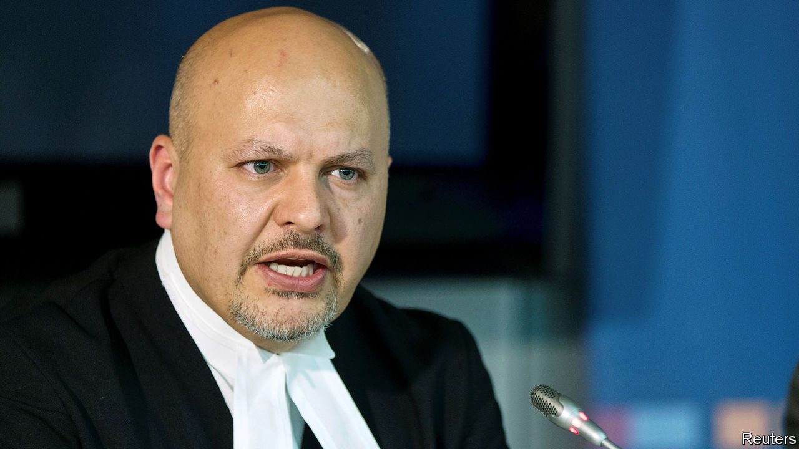

###### The case against the prosecutor

# Karim Khan, the International Criminal Court’s new chief prosecutor 

##### He is a controversial choice 

 

> Feb 20th 2021 


BORIS JOHNSON’S government was cock-a-hoop. The election on February 12th of Karim Khan, a British barrister, as chief prosecutor for the International Criminal Court (ICC) in The Hague was surely a sign that Britain still had diplomatic heft post-Brexit. Mr Khan’s appointment would be “pivotal in ensuring we hold those responsible for the most heinous crimes to account,” beamed Dominic Raab, the foreign secretary. Others say Mr Khan’s appointment is less a diplomatic coup for Britain than for Kenya, whose government has done much to damage the ICC’s credibility.


Victims of human-rights abuses around the world have been ill-served since the court began operating in 2002. Mr Khan’s two predecessors, Luis Moreno Ocampo and Fatou Bensouda, managed to secure just five significant convictions between them in 18 years. Mr Khan has many of the attributes a successful prosecutor needs: he is, admirers say, combative, wily and “frighteningly clever”. He also has decades of experience in international criminal law, most recently heading a UN investigation into atrocities committed by Islamic State. His candidacy was backed by, among others, six African NGOs.


But he has critics, too. Last month 22 African human-rights groups, most of them Kenyan, opposed Mr Khan’s candidacy. Their concerns stemmed mainly from his role as chief defence counsel for William Ruto, now Kenya’s deputy president, in one of the most troubled trials before the ICC. In 2012 the court accused Mr Ruto and Uhuru Kenyatta, now Kenya’s president, of orchestrating ethnic violence in which more than 1,000 people were killed after a disputed election five years earlier.


Both cases collapsed. Charges against Mr Kenyatta were dropped in 2014. The case against Mr Ruto was halted two years later, after prosecution witnesses recanted their testimony or simply vanished. The ICC judges refused to acquit him, citing evidence of witness intimidation and “intolerable political meddling”. They also made it clear that the case could be revived.


There is no suggestion, of course, that Mr Khan did anything wrong in defending Mr Ruto. Every defendant is entitled to a lawyer, and lawyers have a duty to represent their clients to the best of their ability. Nor is there any reason to believe that Mr Khan was anything but appalled that witnesses were intimidated. Judges in the case praised him for reporting witness-tampering to the police. Even so, the Ruto case raises a number of questions.


The first is: what would Mr Khan do if the Ruto trial were revived? Even assuming that Mr Khan asks to be recused from all matters involving the Kenyan deputy president, as is routine in such matters, would a pall still be cast over the court? “It is not about bias but about the perception of bias,” says one Kenyan lawyer.


In this regard, Mr Khan has not always helped himself. Critics in Kenya believe that over the course of Mr Ruto’s trial he overstepped the boundaries of a legal advocate. In 2016, after the collapse of the case, he addressed a celebratory rally called by the ruling party at which Mr Kenyatta promised that no Kenyan would ever be tried before a foreign court again. In a television interview Mr Khan criticised the ICC’s prosecution, suggesting it was aimed at “regime change in Kenya”.


Mr Khan’s conduct of the defence won him admiration among Kenya’s ruling politicians. In turn he has them to thank for his new position. Mr Khan’s two predecessors were both appointed by consensus among the ICC’s members. In the middle of last year the ICC’s selection committee released a shortlist that did not include Mr Khan. The Kenyan government objected and demanded that the selection process be opened up again. The committee duly complied, allowing Mr Khan and others a late tilt at the job.


For Mr Khan’s stint in office to be judged a success, he will have to show zeal and steel in pursuit of big-time human-rights abusers. George Kegoro, the executive director of the Kenya Human Rights Commission, an NGO, has doubts. He called the appointment a “major reversal” for international justice and warned that it would “break the court”. Mr Khan’s first challenge will be to provide the necessary assurance that the ICC will be able to protect future whistle-blowers who testify against murderous bigwigs after the killing of Meshack Yebei, a witness in Mr Ruto’s case, whose mutilated body was found in 2015.


It would be unreasonable to expect Mr Khan to win over all his critics. But he could make a start at rebuilding trust in the ICC by looking at its past failures. Some Kenyan prosecution witnesses who remain anonymous today still worry that their lives could be at risk if they were ever identified. “Everyone involved in that process is very worried,” says Mutula Kilonzo junior, a Kenyan senator and lawyer. Beefing up the court’s protection programmes to allay these fears ought to be Mr Khan’s first step. Only by looking backwards can he hope to ensure that future witnesses are able to testify with confidence. ■

