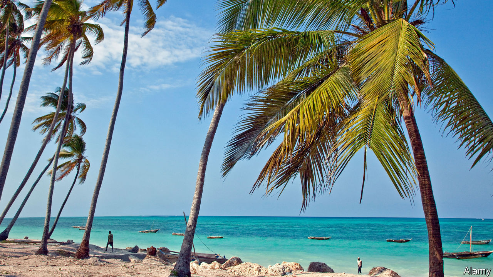

###### Tree trade

# The complications of buying land in Zanzibar 

##### Why property moguls are coconut shy 

 

> Feb 18th 2021 


THE ISLAND of Zanzibar has more than 4m coconut trees, and each one has an owner, says Viliai Farahani, a local chief known as a “sheha”. It is his responsibility to remember who owns every tree in and around his village. Standing outside his bungalow, he squints in the sun and points to a swaying palm in the distance. “That one belongs to Hamishim Shamba,” he says, “and that small one over there belongs to Hamisi Makami.” A man known as Haji Mucha used to own a cluster of trees to the east of the village, he explains, but he died and passed them on to his daughter.


That is not unusual. In Zanzibar, the largest island in a semi-autonomous archipelago off the coast of Tanzania, coconut palms (and other fruit trees) are handed down through generations. Whereas all land is owned by the government and may only be leased for up to 99 years, fruit trees can be bought and sold. A withered mango tree on the edge of a road might well be a family heirloom. Coconut trees are the most plentiful and the most useful. Coconuts are the second most important cash crop, after cloves. Islanders also use the leaves to thatch roofs.


But Zanzibaris’ tradition of passing on trees also makes it complicated for newcomers to lease land. Sometimes they negotiate leases that include the fruit trees on the land, in which case it becomes the government’s job to compensate the tree owners. If the trees are excluded, the new leaseholders may be landed with a headache. Although it is relatively easy to acquire a beachside plot and a permit to build on it, it can take years to identify and pay off the owners of every single coconut tree.


“When we leased the land we started noticing these little trees growing,” says Joyce Nyambura Boswell, a Kenyan hotel owner. “The girls went and sat under them, and somebody came and said, ‘Hey, this is my tree. The land belongs to you but the tree is mine.’” Soon more tree magnates turned up, each demanding payment. For three years people squabbled over who owned the 50-odd coconut trees on the land. Sometimes Ms. Boswell ended up paying three times for one arboreal asset. Luckily they were cheap: about $30 each.


In the past 15 years the cost of land in Zanzibar has rocketed, and so has that of trees. “People can demand all they want if it’s prime land,” reflects one hotel manager in the beachside town of Bwejuu. Mr Farahani reckons that a coconut tree on a stretch of Zanzibar’s most desirable ground could now go for up to $2,000.


Resorts are springing up near Zanzibar’s white-sand beaches to cater for tourists, mostly from Russia. Their number was growing rapidly before the pandemic. Some people grumble that these developments risk ruining a magnificent coastline. But in the short run, at least impoverished locals are making good profits off their ransom trees. They have realised they can get richer by selling their trees to hoteliers than by flogging overpriced coconuts to tourists on the beach. ■

