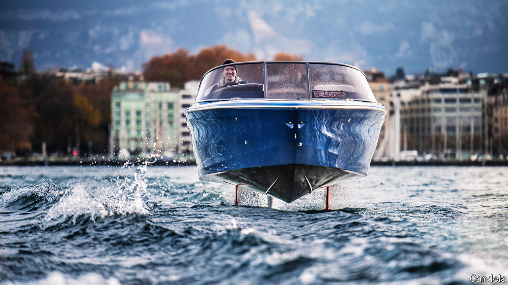

###### Teslas making waves

# A new generation of electric motorboats take to the water 

##### Clean and quiet 

 

> Feb 17th 2021 


LIKE ELECTRIC cars, electric boats are not a new idea. In the early 1900s Clara Ford preferred driving her electric car around Detroit instead of one of the noisy gasoline-powered Model Ts her husband Henry had begun making. Around the same time, posh electric launches cruised silently along the River Thames in Britain, using dockside stop-offs to top up their batteries with electricity and their bars with champagne.


These days, thanks to worries about climate change, electric cars are making a comeback (in eco-minded Norway, they account for more than half of new cars sold). Now electric boats are following. A number of manufacturers are vying to become the marine equivalent of Tesla, the Californian company which builds some of the most fashionable and fastest electric cars.


Rand, a Danish firm, has developed a range of traditional-looking electric motorboats. Zin Boats, a Seattle-based company, has two electric models, a tender and a five-seater speedboat. For more leisurely cruising, Serenity Yachts, a Cayman Islands boat-builder, offers a 19.4-metre hybrid with 30 solar panels on the roof. In electric mode the panels will power the craft along at a steady pace provided, of course, the sun is shining.


Candela, a Swedish company, is taking a different approach. Its six-seater Candela Seven (pictured) uses hydrofoils to raise its hull completely out of the water. This reduces friction, says Gustav Hasselskog, Candela’s founder. That, in turn, cuts energy use by around 80%, which should help reassure any skippers with range anxiety.


The hydrofoils also operate like the ailerons on an aircraft’s wing. Computer software similar to that which helps pilots fly jet fighters automatically turns the foils in different directions to stabilise the boat and prevent it from tipping over. The hydrofoils can be retracted when the boat comes into dock or runs up to a beach. 


With a top speed of 30 knots (56kph) and little wake, the Candela Seven can also be used for waterskiing. So far, 20 of the 30 speedboats ordered have been delivered. At €265,000 ($322,000) a pop, this shows early adopters of electric motorboats, like the buyers of the first Teslas, are happy to pay premium prices.■


For more coverage of climate change, register for The Climate Issue, our fortnightly , or visit our 

