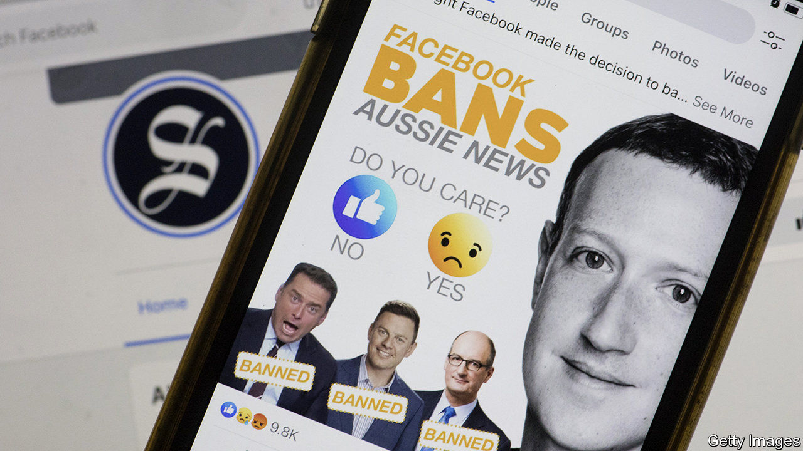

###### 

# Business this week 

#####  

 

> Feb 20th 2021 


In an unexpected move, Facebook blocked news content on its sites in Australia, and also stopped people outside the country from viewing Australian news publications on its platforms. The social-media giant took the action after the lower house of parliament passed a bill that would force it to pay for news content that has been shared by users; it says the law is unclear about what constitutes “news”. 


Facebook’s defiant tone was a stark contrast to Google’s global agreement to pay News Corporation for content from its publications, which include the Wall Street Journal and the Sun in Britain. Google was also under threat from the proposed law in Australia and had warned that it would shut its search engine there.


Bernard Arnault, the chairman of LVMH, a French luxury-goods group, is joining the growing list of business leaders who have set up a special-purpose acquisition company. A SPAC is a shell company that lists on a stock exchange with the intent of merging with an existing company, enabling the firm to raise capital without the slog of an IPO. They became popular in America in 2020, but are now taking off in Europe, too. Mr Arnault’s investment company is launching its SPAC with other investors to look for deals in financial services. See .


Ngozi Okonjo-Iweala was appointed as the new director-general of the World Trade Organisation. She is the first African and the first woman to hold the job. The Trump administration had opposed the nomination of Ms Okonjo-Iweala, a former Nigerian finance minister, claiming that she lacks experience. But her only rival, Yoo Myung-hee, South Korea’s trade minister, withdrew her candidacy in early February, soon after Joe Biden took office. See .


China displaced America as the European Union’s biggest trading partner last year, according to official data, with both exports and imports growing. America remains the EU’s biggest export market (followed by Britain), but overall trade slumped between the two after their economies tanked during the pandemic.


Official statistics confirmed that Britain’s GDP contracted by 9.9% in 2020, the worst performance in the G7. The economic recovery that began mid-year stalled when the second wave of the pandemic took hold. The Treasury’s average of forecasts suggests that the economy will grow by 4.4% this year and 5.7% in 2022, depending on what happens with covid-19.


Japan’s economy shrank by 4.8% in 2020. The country’s economic output picked up towards the end of the year, helped by a surge in exports.

An expensive error


An American judge ruled that a group of creditors that mistakenly received $500m from Citigroup did not have to repay the money to the bank. The creditors are in dispute with Revlon, a cosmetics company and a client of Citi’s. The bank sent $900m to creditors last August, though it had meant to recompense them with only a small interest payment. Some $400m has been returned, but the judge found that the creditors had grounds to think the payment was intentional, as the idea that Citi could make such a blunder was “borderline irrational”. The bank is appealing against the decision.


Jaguar Land Rover laid out an ambitious plan to rebrand its Jaguar cars as all-electric by 2025. Under its new chief executive, Thierry Bolloré, the company plans to offer battery-powered versions of all its models by 2030. All three of its British factories will stay open.


The state of New York filed a lawsuit against Amazon, claiming it had been “deficient” in ensuring the safety of its warehouse workers during the pandemic and had not adequately disinfected its facilities. The online retailer had tried to stop the suit, arguing that workers’ safety is covered by federal, not state, law. It says it has spent $11.5bn on covid measures. New York’s suit is the latest in a series of state challenges to the way Amazon conducts its business.


Air France-KLM reported an annual net loss of €7.1bn ($8.1bn). The French-Dutch airline group said the current tightening of travel restrictions in some European countries because of covid-19 made for a challenging start to this year.

What’s on the menu?


An Israeli startup that is developing 3D printers for meat undertook a successful fundraising round that will allow it to distribute its products to restaurants this year. Redefine Meat combines 3D meat modelling, food formulations and food printing to build complex-matrix “meat” on its machines, made from proteins found in legumes and grains and fat from plants. The steaks resemble the texture and taste of choice cuts of beef, but with no cholesterol. Bill Gates this week called on rich countries to switch to “100% synthetic beef” in order to lower greenhouse-gas emissions from the cattle industry.

