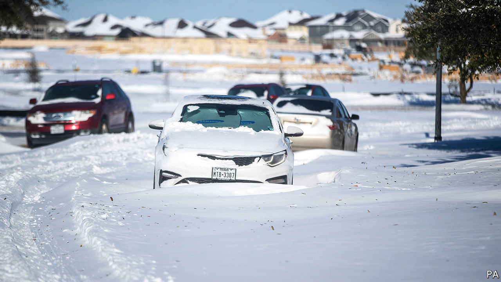
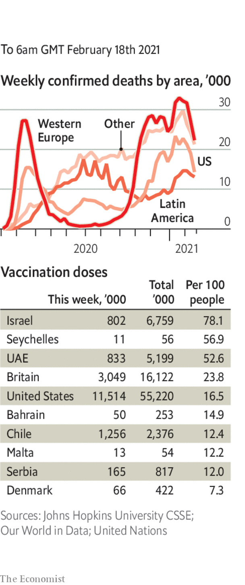

###### 

# Politics this week 

#####  

 

> Feb 20th 2021 


 A winter storm that covered three-quarters of America’s Lower 48 with snow brought havoc to southern states. A federal emergency was declared in Texas; temperatures plummeted to -2F (-19C) in Dallas. Millions of Texans were left without power, as were tens of thousands of people in other states. Many blamed antiquated energy grids for not being able to cope with the surge in demand for electricity. See .


Donald Trump’s impeachment trial for “incitement of insurrection” ended quickly. Fully 57 senators, including seven Republicans, agreed that he had whipped up the mob that stormed Congress on January 6th. But the vote fell short of the two-thirds majority required in the Senate to convict the former president. See .


Mario Draghi was sworn in as Italy’s prime minister, having secured the support of almost all of the country’s main political parties. The former head of the European Central Bank named a new cabinet in which many of the key positions are held by technocrats like himself. His task is to draw up a plan of reform that can unlock more than €200bn ($240bn) in EU covid-recovery money. See .


England dished out its first £10,000 ($13,900) fines to travellers who broke strict new quarantine rules after returning from a “red list” of 33 countries. Confusingly, the rules are different in Scotland, which now quarantines all international arrivals. One flight that was subject to Scottish rules had only a handful of passengers, despite having 60 seats booked. The others may have taken flights to England and then travelled overland to Scotland, to avoid being cooped up in costly hotels.


Protests continued in Myanmar against a military coup. Many civil servants have stopped work. Public services and many financial transactions are hamstrung. The authorities have arrested democrats, threatened truant bureaucrats with prison and tried to disperse crowds with water cannons and rubber bullets. See .


A court in India acquitted a journalist, Priya Ramani, of libel, after she accused a former government minister of sexual harassment. The case is seen as a milestone for India’s #MeToo movement. Separately, the police arrested Disha Ravi, a green activist, after she posted hints for environmental protesters on how to gain attention. They accused her of “spreading disaffection”.


A trial began in Hong Kong of nine people for alleged offences related to protests in 2019. The accused include well-known veterans of the territory’s pro-democracy movement, such as Martin Lee and Jimmy Lai. Mr Lee and Mr Lai, as well as five others, pleaded not guilty to charges involving illegal assembly.


Jake Sullivan, Joe Biden’s national security adviser, expressed “deep concerns” about the reluctance of China to release data related to the outbreak of covid-19 in Wuhan. He reiterated that China should fully co-operate with an investigation by the World Health Organisation.


Carlos Menem, Argentina’s president from 1989 to 1999, died aged 90. A Peronist by political lineage, he adopted some liberal economic policies, lowering trade barriers, cutting subsidies and privatising state firms. But he failed to protect ordinary Argentines’ livelihoods, and allowed rent-seekers to flourish. With his mutton-chop sideburns and fast cars, Mr Menem was probably the most glamorous resident of the Casa Rosada since Evita Perón. See .


The Biden administration said that asylum-seekers could cross America’s southern border to have their applications heard. Donald Trump had insisted they wait in Mexico.


Brazil’s president, Jair Bolsonaro, signed four decrees to make it easier to pack heat. Ordinary Brazilians will be allowed to buy as many as six guns (up from four) and carry two at once.


America vowed to punish the perpetrators of a rocket attack in Iraq’s Kurdistan region that killed a contractor with the American-led military coalition and wounded several others, including an American soldier. A pro-Iranian group claimed responsibility for the attack.


The UN called for an additional 3,700 peacekeepers to be sent to the Central African Republic to bolster a force that is already 15,000-strong. Rebels are advancing on the country’s main cities.


Gunmen in Nigeria abducted 42 students and staff from a school, the latest such incident in a country plagued by kidnapping for ransom and political hostage-taking. In December 344 students were taken from another school, but later freed by security forces.


Guinea said that three people died after contracting Ebola, a virus that is usually fatal if not treated quickly. They are the first cases in west Africa since more than 11,000 people died in an outbreak in the region that raged from 2013 to 2016.


Seif Sharif Hamad, the vice-president of Zanzibar, died after catching covid-19. Zanzibar is a semi-autonomous part of Tanzania. John Magufuli, Tanzania’s president, insists his country is free of the virus and that vaccinations against it are dangerous and do not work.

Coronavirus briefs

 


New recorded infections in India have tumbled from nearly 100,000 a day in September to under 10,000. In England a study found that infections have fallen by two-thirds since early January. California reported fewer than 5,000 new daily cases for the first time since November.


The world’s first “human challenge” study of covid-19 got the go-ahead in Britain. Volunteers aged 18-30 will be exposed to the coronavirus to establish how much of it is needed to cause infection.


The hours needed to shut and disinfect New York’s subway system at night have been reduced from four to two, a sign, said an official, that the city “is starting to return to normalcy”.


North Korea reportedly tried to hack Pfizer’s computers to find details of its vaccine. Strange for a country that officially claims not to have had any cases of covid-19.

