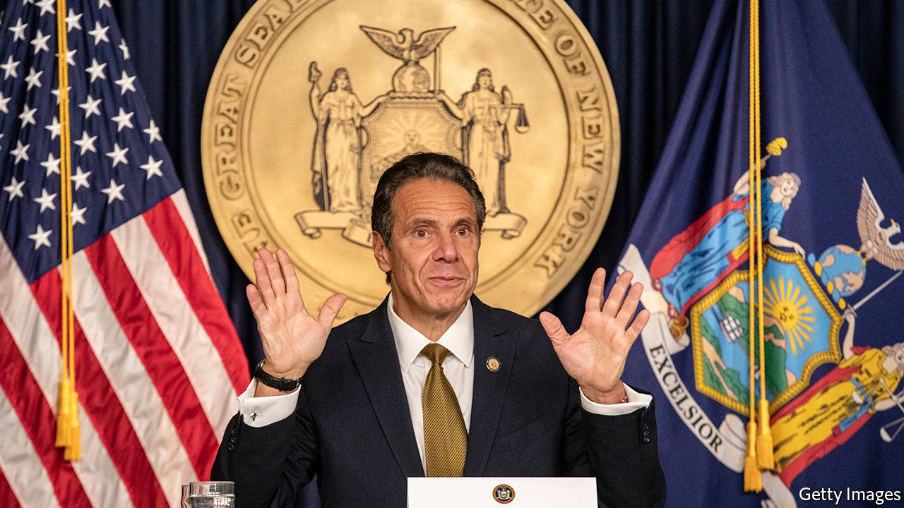

###### Under pressure

# Andrew Cuomo faces a reckoning for a pandemic-related cover-up 

##### New York state undercounted deaths in nursing homes 

 

> Feb 20th 2021 


AT THE HEIGHT of the pandemic last spring Andrew Cuomo’s daily briefings were “must-see-TV”. Millions sought comfort from New York’s governor dishing out science-based facts. He talked about his 88-year-old mother to stress the need to protect the elderly. He joked about having to endure his daughter’s boyfriend during the lockdown. He begged the federal government for ventilators. When it sent him 400, he said in one briefing: “What am I going to do with 400 ventilators when I need 30,000? You pick the 26,000 people who are going die because you only sent 400 ventilators.” The maths was dodgy, but his point was sharp. Mr Cuomo also shared stark PowerPoint presentations with statistics on how many were sick, how many were in hospital, how many were on ventilators and how many were dead.


But New Yorkers learned last month that some of the data were not accurate. Letitia James, the state’s attorney-general and a close ally of Mr Cuomo, released a damning 76-page report saying his administration had understated the number of covid-19-related deaths in state nursing homes by as much as 50%. Nearly 15,000 people died in nursing homes and long-term care facilities, over 5,000 more than originally disclosed. It also revealed that a state directive requiring the admission of covid-19 patients to homes may have put residents at risk. But it was not until the New York Post, a tabloid, revealed on February 11th that Mr Cuomo’s top aide privately apologised to lawmakers for withholding the nursing-home death toll that he began to feel some heat. According to the newspaper, the aide said the administration “froze” because they did not want the then president, Donald Trump, to “turn this into a giant political football”.


The fact that the report was released by an ally “is an emperor-has-no-clothes moment,” says John Kaehny of Reinvent Albany, a government watchdog. His group is calling for full transparency on the state’s response to covid-19. “The governor is in trouble,” says Doug Muzzio, a political scientist at Baruch College. Mr Cuomo usually controls the narrative, but not this time. On February 15th he held a 90-minute press briefing in an attempt to retake the reins. He stopped short of apologising, but admitted that mistakes were made.


Several lawmakers want to strip the governor of emergency powers granted last March (a near-empty gesture, as the powers expire in April). Some Republicans want Mr Cuomo to resign (unlikely). New Yorkers still seem happy with his handling of the covid-19 crisis, according to a new poll. More than 60% of voters say he has done a good job. The poll was taken just before the New York Post’s revelation, but after the attorney-general’s scathing report.


The governor is in his third year of his third term. The scandal may well put an end to any fourth-term hopes. On February 17th, Ron Kim, a Democratic state assemblyman, told CNN that Mr Cuomo threatened to “destroy” him when he refused to back down from statements he had made criticising the governor.


Mr Cuomo is used to getting his own way. The state constitution affords him most of the say over budgets. He has unilateral power to withhold state funding from programmes, agencies and authorities. But there is not much transparency in how he gets things done. Many Albany insiders, observers and politicians were perplexed to see the world fawn over the Empire State’s governor.


In a way Mr Cuomo was born to lead New York. He learnt much about Albany politics at the knee of his father Mario, a former governor. His experience, probably unparalleled in the 230-year history of New York state, and the inherent powers of his office have created a political mammoth able to crush anyone. Nine of his senior officials who apparently disagreed with him on policy have resigned or retired recently; he remains. Mr Cuomo declared during his first term: “I am the government.” That is looking somewhat less certain than it was.■


Dig deeper


All our stories relating to the pandemic and the vaccines can be found on our . You can also listen to , our new podcast on the race between injections and infections, and find trackers showing ,  and the virus’s spread across  and .

