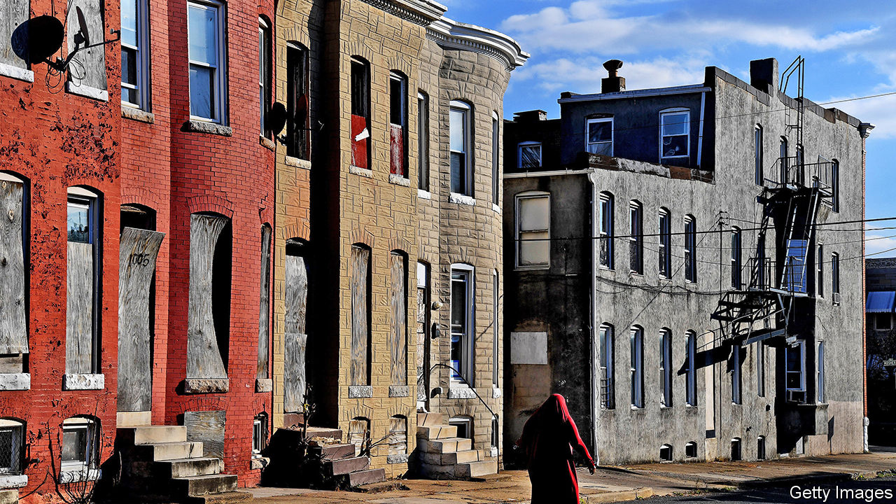

###### Rescued charm

# Baltimore’s abandoned homes are being recycled 

##### New lives for old floorboards 

 

> Feb 18th 2021 


NINETEENTH-CENTURY brick rowhouses on McKean Avenue, a once humming, now rather desolate street in west Baltimore where many homes have been demolished or abandoned, can be had for as little as $12,000. A more popular way to snap up a bit of historic Baltimore is to spend nearly a quarter of that at Room &amp; Board, a furniture chain based in Minneapolis, on a McKean media cabinet, fashioned from roof-decking planks from the city’s razed houses.


The planks come from the Baltimore Wood Project, which was established by the US Forest Service as a joint venture with local non-profits and the city, to show how discarded wood can be kept out of landfill. A lot of wood waste, which releases carbon dioxide and methane as it rots, has little sale value, but old buildings can yield precious salvage. The yellow pine that was used to build Baltimore’s rowhouses came from old-growth forests, and is more dense and rot-resistant than faster-growing new lumber; a century of oxidation has given it a handsome, dark patina. Furniture-makers and interior designers play up its provenance, designing items around its joist- and plank-shaped pieces, some of them pocked with nail holes and saw marks. They also advertise the fact that the venture trains formerly unemployed Baltimoreans, many of them former prisoners, in deconstruction and salvaging techniques.


Maryland’s biggest city, once a booming factory and port town, is fertile ground for such a project. Its rowhouses, constructed in sprawling grids and quickly filled by immigrants from Europe during the brisk industrial growth of the late 19th and early 20th centuries, began to empty in the second half of the 20th century, as its shipping and steel industries declined. Since 1950, when Baltimore was America’s sixth-biggest city, a third of its residents have left; today it is the 30th-biggest. In the poorest neighbourhoods, more than half of adults are unemployed. Some 16,000 buildings are officially designated empty; the true number may be twice that. Entire streets of still-handsome houses are boarded up. The city is planning to demolish thousands of them. 


Projects like the Baltimore Wood Project, which the Forest Service hopes will take root in other cities, are likely to remain small-scale. Deconstructing a house in order to save the materials from which it is built is more expensive and time-consuming than going at it with a wrecking ball. In some long-empty houses with broken rooftops, all the wood has been lost to rot. In the past six years, as the project has salvaged wood from around 850 houses, many more have been reduced to rubble.


But the project has shown that conservation efforts can pay. Last year Brick + Board, the non-profit established to sell the salvaged wood, became a for-profit: it now sells reclaimed wood from other towns and cities, as well as Baltimore brick and the white marble stoops that were once found at the front doors of even the most modest old rowhouses. These steps, one of Baltimore’s most distinctive architectural hallmarks, are likely to stay in the city. Their most enthusiastic buyers are gentrifiers, who reuse them in neighbourhoods less blighted by decline.

