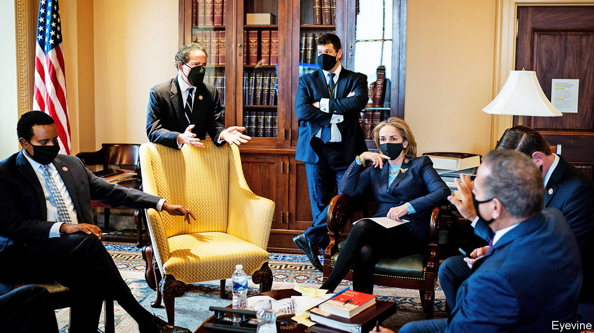

###### Impeachment

# Donald Trump lives to fight and incite another day 

##### The Republicans who defied him are already suffering a backlash 

 

> Feb 18th 2021 


MITCH MCCONNELL’S denunciation of Donald Trump on February 13th was as withering as it was unexpected. Despite having just voted with 42 of his Republican colleagues to acquit Mr Trump of inciting an insurrection on January 6th, the Republican Senate leader suggested he was guilty as charged. “President Trump is practically and morally responsible for provoking the events of that day.” Headline writers promptly fell over themselves to label this the start of a “Republican civil war”. But if Mr McConnell and the conservative mainstream are really in that fight, they are very much at a pre-Valley-Forge stage, shivering over their wounds, as winter closes in.


Mr Trump’s acquittal was a more accurate measure of his command of the Republican field. The case brought against him by House Democrats—impressively led by Representative Jamie Raskin of Maryland—was devastating. The video footage they played, depicting the president’s demagoguery and the violence it provoked, was so horrifying it reduced some Republicans to tears. The fact that only seven then mustered the courage to join the entire Democratic caucus in voting against Mr Trump suggests that the impeachment power is now in effect defunct.


Those honourable seven, it must be added, were all to some degree shielded from Mr Trump’s wrath. Bill Cassidy and Ben Sasse were newly re-elected; Richard Burr and Pat Toomey are retiring; Susan Collins, Lisa Murkowski and Mitt Romney (of Maine, Alaska and Utah) have home-state appeal that makes them unusually resistant to Mr Trump’s bullying.


The 43 Republicans who voted to give Mr Trump the insurrection “mulligan” that Mike Lee of Utah had claimed he deserved mostly did so on a technicality. They claimed a former president could not be impeached, a view contradicted by most legal advice, as well as the precedent established by an earlier Senate vote.


Notably, this quavering Republican majority included almost every conservative with presidential ambitions, including Marco Rubio and Tim Scott, as well as dedicated Trump stooges such as Ted Cruz and Josh Hawley. It would seem none is planning to run against Trumpism: they are banking on being post-Trump, not anti-Trump. Polling of Republican voters supports their calculation. Over 80% still back Mr Trump; more than half say he did everything he could to stop the insurrection. Meanwhile, the backlash against the seven Republicans who voted against Mr Trump has been vicious.


Messrs Burr, Cassidy and Sasse have all been censured by their state parties. “I’m getting a lot of feedback from people saying the only reason they supported Senator Cassidy is because President Trump supported him,” said Blake Miguez, a Republican leader in Louisiana’s state legislature. “I predict that his next five years will be some of the most miserable a senator from Louisiana has ever experienced.” Mr Cassidy, a doctor and faithful Christian, has sought to mollify his constituents by explaining that, contrary to what they may have heard, Mr Trump was guilty as charged. No cigar, it would seem.


Mr McConnell, though tempted to vote against Mr Trump, appears to have concluded that this would have doomed his chances of returning as Majority Leader in 2023. His criticism of the president looks like he is trying to have it both ways. It also seems to have backfired. On February 16th Mr Trump released a statement attacking Mr McConnell as a “dour, sullen and unsmiling political hack” and threatening to unseat him as Senate leader. It could have been even worse for the veteran Kentuckian. Mr Trump reportedly cut some additional insults at the urging of his aides, including a contention that Mr McConnell had “too many chins”. ■

